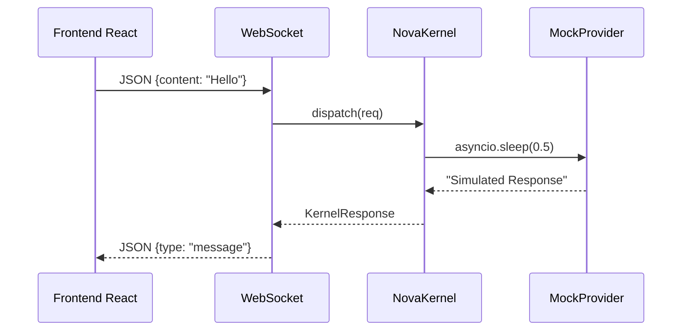
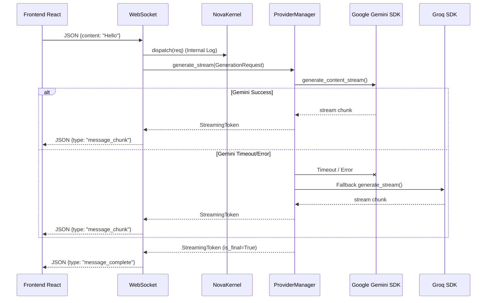

# NOVA Real Provider Flow

This document outlines the transition from the architectural mock to the real production LLM stream.

## Old Mock Flow

```mermaid
sequenceDiagram
    participant UI as Frontend React
    participant WS as WebSocket
    participant Kernel as NovaKernel
    participant Mock as MockProvider
    
    UI->>WS: JSON {content: "Hello"}
    WS->>Kernel: dispatch(req)
    Kernel->>Mock: asyncio.sleep(0.5)
    Mock-->>Kernel: "Simulated Response"
    Kernel-->>WS: KernelResponse
    WS-->>UI: JSON {type: "message"}
```

## New Production Flow (Gemini + Groq)

```mermaid
sequenceDiagram
    participant UI as Frontend React
    participant WS as WebSocket
    participant Kernel as NovaKernel
    participant PM as ProviderManager
    participant Gemini as Google Gemini SDK
    participant Groq as Groq SDK
    
    UI->>WS: JSON {content: "Hello"}
    WS->>Kernel: dispatch(req) (Internal Log)
    WS->>PM: generate_stream(GenerationRequest)
    PM->>Gemini: generate_content_stream()
    
    alt Gemini Success
        Gemini-->>PM: stream chunk
        PM-->>WS: StreamingToken
        WS-->>UI: JSON {type: "message_chunk"}
    else Gemini Timeout/Error
        PM-xGemini: Timeout / Error
        PM->>Groq: Fallback generate_stream()
        Groq-->>PM: stream chunk
        PM-->>WS: StreamingToken
        WS-->>UI: JSON {type: "message_chunk"}
    end
    
    PM-->>WS: StreamingToken (is_final=True)
    WS-->>UI: JSON {type: "message_complete"}
```
