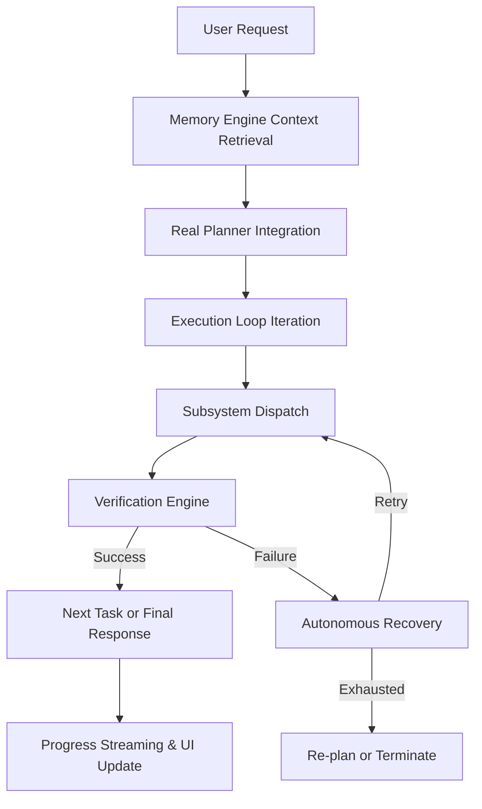

# NOVA Autonomous Agent Architecture

The NOVA system has successfully been transformed from an isolated collection of subsystems into a cohesive, fully autonomous agent. The central orchestrator is the `KernelPipeline`, which intelligently maps natural language intents to actionable, multi-step workflows with full autonomous verification and recovery.

## 1. Execution Architecture
The core execution loop follows a strict pipeline: `Input -> Memory Injection -> Planning -> Iterative Execution Loop -> Verification -> Response -> Memory Storage -> Output`. 

## 2. Planner Architecture
The heuristic string-matching mock Planner was removed. `PlannerCore` now dynamically resolves the `AIProviderManager` to directly prompt the active LLM. The LLM translates user inputs into structured JSON `Plan` objects containing:
- `intent`: Primary detected intent and confidence.
- `goal`: Overall risk level and objective.
- `tasks`: Sequential steps mapping directly to `Browser`, `Desktop`, `Vision`, `Voice`, `Search`, and `Memory` tools.

## 3. Verification Pipeline
After any subsystem performs an action (e.g. `DesktopActionType.KEYBOARD_TYPE`), the orchestrator yields to the `VerificationManager`. If an action does not result in the expected state, it fails the verification loop and is flagged for Autonomous Recovery.

## 4. Autonomous Recovery
The execution orchestrator is wrapped in a fault-tolerant `try-except` loop. 
- Actions are given a `retries = 3` limit. 
- If verification fails or a hard exception is thrown, the loop traps the error, logs the failure, and re-attempts the action.
- When retries are exhausted, the loop triggers fallback routines (such as LLM generation fallbacks or alternative task strategies).

## 5. Vision Integration (Fallbacks)
To decouple the engine from brittle HTML CSS selectors or rigid desktop coordinates:
- **Browser/Desktop**: If a standard locator fails, the fallback sequence initiates a `ScreenCaptureManager` full-screen capture.
- **OCR Pipeline**: `VisionEngine` extracts text.
- **Execution**: The system parses the bounding boxes for the target element visually, and executes standard OS-level clicks on the calculated coordinates.

## 6. Memory Integration
- **Pre-execution**: `MemoryEngine` retrieves working memory, conversation history, and semantic facts, injecting them directly into the Planner's system prompt to grant the LLM persistent context.
- **Post-execution**: Following a successful workflow, the orchestrator triggers the Memory Engine to summarize the transaction and store any new user facts or preferences extracted from the response.

## 7. Progress Streaming
The system now implements real-time progression visibility. Throughout the lifecycle, the `KernelPipeline` emits `KernelEventType.STREAM_CHUNK` events over the `KernelEventBus`. The WebSocket server listens to these events to instantly render status updates (`"Planning..."`, `"Opening browser..."`, `"Generating answer..."`) in the UI Chat and Dynamic Island.
