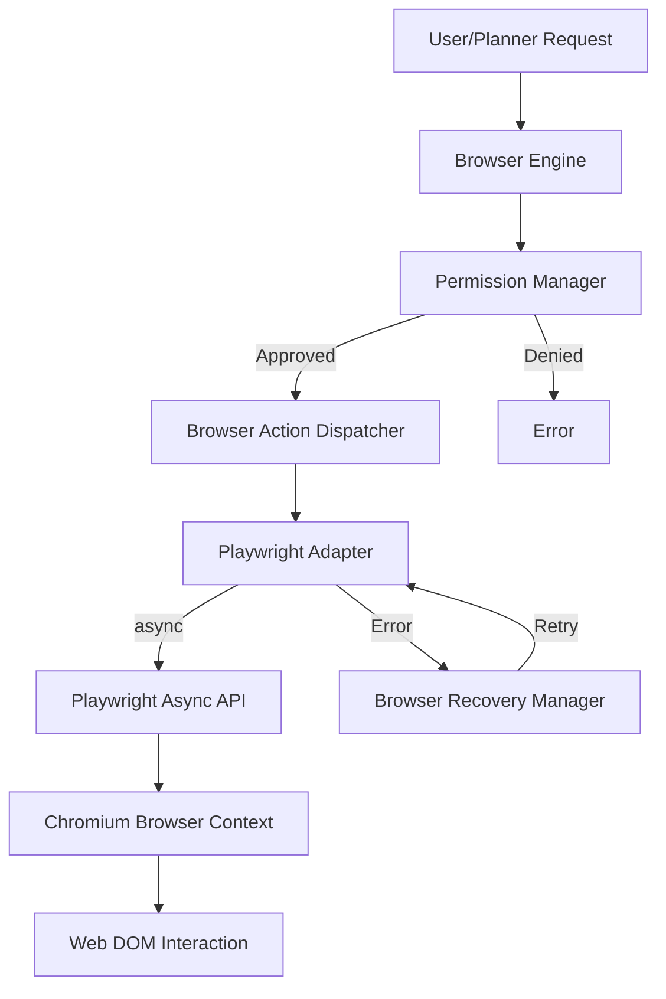

# Playwright Browser Implementation Architecture

NOVA has successfully replaced the architectural mock adapters with real Playwright execution.

## Component Flow

## Session Lifecycle
1. **Initialization**: The `PlaywrightBrowserLauncher` is invoked on the first browser action. It boots an async chromium process, creates a persistent `BrowserContext`, and allocates an active `Page` (Tab).
2. **Execution**: The `BrowserActionDispatcher` matches incoming `BrowserAction` schemas against a registry of singleton manager objects (e.g., `PlaywrightDOMManager`, `PlaywrightNavigationManager`).
3. **Recovery**: If a selector cannot be found or a network timeout occurs, the Playwright adapter will raise an exception. The `BrowserExecutor` traps this, hands it to the `BrowserRecoveryManager` for intelligent backoff, and ultimately fails gracefully without crashing the NOVA runtime if the page is truly broken.
