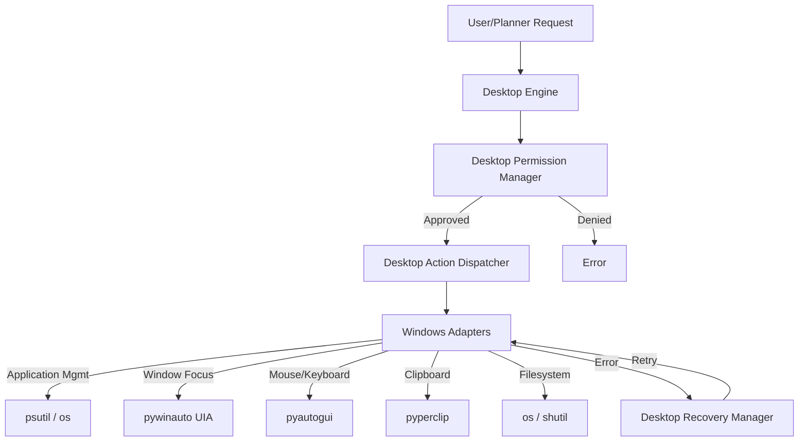

# Desktop Implementation Architecture

NOVA has successfully replaced the mock OS abstractions with a native Windows Desktop Automation layer.

## Component Flow

## Security & Threading
1. **Thread Pooling**: The `asyncio.to_thread` executor is heavily leveraged across all adapter endpoints. Because `pyautogui` and `pywinauto` perform blocking system calls that sleep/wait for UI animations, wrapping them in thread pools prevents the primary `uvicorn` event loop from stalling.
2. **Permission Gatekeeping**: Every action passes through `DesktopPermissionManager.check()`. If the AI attempts to mutate state (e.g. `FILE_DELETE`) without explicitly being assigned an `AUTOMATION` or `DANGEROUS` role, the operation throws a hard `PermissionError` which cascades up to the kernel as a failed execution result.
