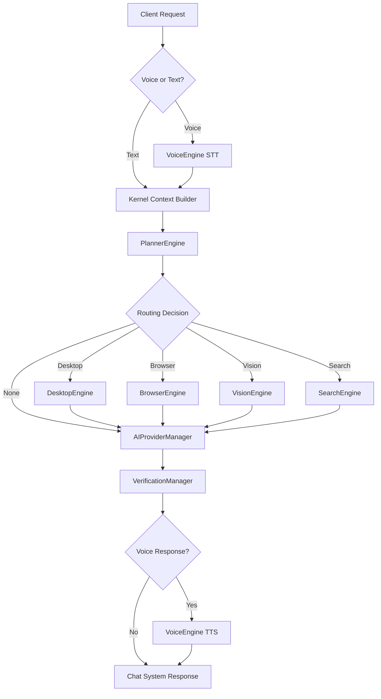

# Full System Integration

## Overview
NOVA's architecture has been completely unified. The `KernelPipeline` now acts as the sole orchestrator. No subsystem calls another directly. 
All requests (Text or Voice) enter through the `Kernel` and follow a deterministic execution flow.

## Unified Execution Pipeline

## Dependency Injection (DI)
All runtime engines are instantiated and registered precisely once via the `DependencyInjectionContainer` during the bootstrap sequence (`main.py` -> `bootstrap_di()`). 
This guarantees:
1. True Singleton scope for expensive engines (Planner, ProviderManager).
2. Clean separation of concerns (Engines only depend on interfaces they resolve at runtime, avoiding circular imports).
