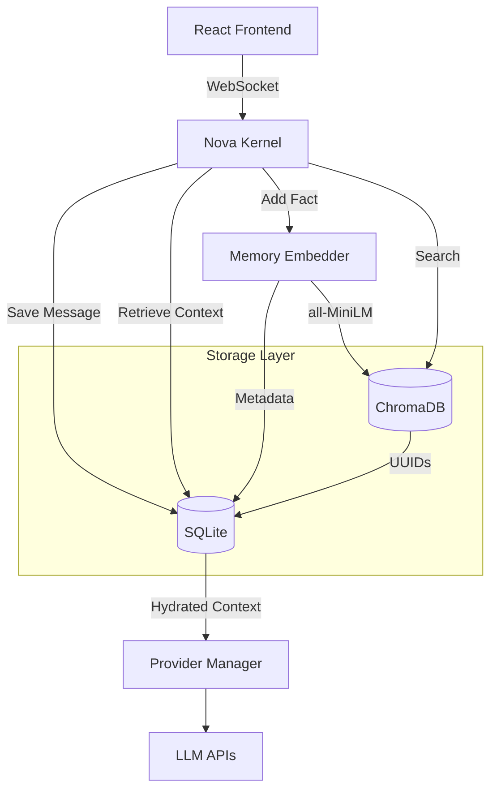

# Hybrid Memory Implementation Architecture

NOVA has successfully migrated off of the mock state dictionaries and onto a robust Hybrid Memory architecture. 

## Component Flow

## Storage Responsibilities

**SQLite Stores:**
- `conversations`
- `messages`
- `memory_metadata` (timestamps, importance, relationships)

**ChromaDB Stores:**
- Semantic Embeddings (Dense Vectors)
- Raw Text Snippets
- Base Metadata (Types, Tags)

## Lifecycle Operations
1. **Adding Memory**: The text is chunked and embedded by `MemoryEmbedder`. The raw vector is saved to `ChromaDB` using the memory's UUID. The full metadata object is saved to `SQLite` using the same UUID.
2. **Retrieval**: When the Kernel requests context, the query is embedded and searched against `ChromaDB`. The matching UUIDs are then used to fetch the full context block directly from `SQLite`.
