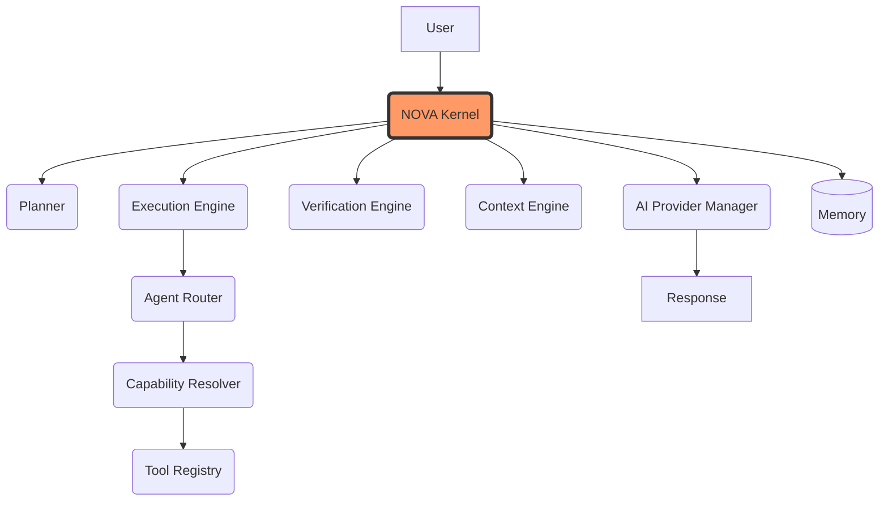

# SYSTEM ARCHITECTURE

Project: NOVA

Document Type: System Architecture Specification

Version: 1.0.0

Status: Active

Priority: Critical

Depends On:

PROJECT_CONSTITUTION.md

VISION.md

PRODUCT_REQUIREMENTS.md

Audience:

System Architects

Software Engineers

AI Coding Agents

Future Contributors

---

# Purpose

This document defines the complete software architecture of NOVA.

It describes how every module communicates, how requests flow through the system, and how responsibilities are separated.

This document intentionally focuses on architecture rather than implementation.

All implementation must conform to this architecture.

---

# Architectural Philosophy

NOVA follows a layered, modular, event-driven architecture.

Each component has one clearly defined responsibility.

No component should contain business logic that belongs to another layer.

The architecture prioritizes:

Reliability

Scalability

Maintainability

Replaceability

Observability

Security

Future extensibility

---

# High-Level Architecture

The complete system revolves around the **NOVA Kernel**, the central orchestration unit. No subsystem operates independently or calls another subsystem directly.

# Layer Responsibilities

## 1. User Layer

Responsible for:

Voice

Text

Files

Screenshots

Clipboard

Notifications

Hotkeys

The User Layer never communicates directly with the operating system.

All requests pass through the Planner.

---

## 2. Interface Layer

Responsible for presenting information.

Contains:

Dynamic Island

Chat Window

Settings

Notifications

History

Logs

The Interface Layer never performs business logic.

It only renders state.

---

## 3. AI Core Layer

The AI Core is the intelligence of NOVA.

Contains:

Planner

Reasoning Engine

Memory Engine

Context Engine

Prompt Manager

Verification Engine

Learning Engine

Conversation Manager

This layer decides.

It never directly performs desktop actions.

---

## 4. Execution Layer

The Execution Layer converts plans into executable workflows.

Responsibilities:

Task Queue

Scheduling

Parallel Execution

Retries

Timeouts

Cancellation

Progress Tracking

Recovery

Verification Requests

The Planner creates plans.

The Execution Layer executes them.

---

## 5. Agent Layer

Each Agent owns one domain.

Examples:

Desktop Agent

Browser Agent

Vision Agent

Email Agent

Calendar Agent

Search Agent

Notification Agent

Plugin Agent

Memory Agent

Coding Agent

Every Agent exposes a standardized interface.

No Agent communicates directly with another Agent.

Communication always passes through the Execution Layer.

---

## 6. Tool Layer

Tools perform actual work.

Examples:

Filesystem

Keyboard

Mouse

Clipboard

Windows API

Browser Automation

OCR

Search API

Email API

Terminal

Git

Each Tool performs one task only.

Tools contain no AI.

---

## 7. Infrastructure Layer

Responsible for:

Operating System

Internet

Databases

SQLite

Browser

Installed Applications

External APIs

Cloud Models

Infrastructure never contains business logic.

---

# Core Design Principles

Every module must satisfy the following rules.

Single Responsibility

Loose Coupling

High Cohesion

Dependency Inversion

Replaceable Components

Event Driven Communication

Verification Before Completion

Graceful Failure Recovery

No Circular Dependencies

No Shared Mutable State

---

# Request Lifecycle

Every request follows the same lifecycle governed entirely by the NOVA Kernel.

User Request

↓

NOVA Kernel (Creates Session)

↓

Planner (Intent Detection / Execution Plan)

↓

Execution Engine (Queues & Schedules)

↓

Agent Router (Selects Agent)

↓

Capability Resolver (Maps Intent to System Capability)

↓

Tool Registry (Fetches Executable Tool)

↓

Tool Execution

↓

Verification Engine (Confirms Success/Failure)

↓

Context Engine (Collects & Compresses Environment State)

↓

AI Provider Manager (LLM Inference)

↓

NOVA Kernel (Aggregates Response)

↓

Memory Update

↓

User

No module may bypass this lifecycle or orchestrate it themselves.

---

# Module Communication Rules

Planner

↓

Execution Engine

↓

Agent

↓

Tool

↓

Verification

↓

Execution Engine

↓

Planner

↓

UI

Direct communication between unrelated modules is prohibited.

---

# Separation of Responsibilities

Planner

Thinks.

Execution Engine

Coordinates.

Agents

Solve domain-specific tasks.

Tools

Perform actions.

UI

Displays information.

Memory

Stores knowledge.

Verification

Confirms outcomes.

No responsibility overlaps.

---

End of Part 1

# SYSTEM ARCHITECTURE

## Part 2 — Execution Architecture

---

# Execution Philosophy

The AI Planner is responsible for thinking.

The Execution Engine is responsible for execution.

Agents are responsible for domain expertise.

Tools are responsible for interacting with external systems.

Verification is responsible for confirming successful completion.

Every layer has exactly one responsibility.

---

# Complete Request Pipeline

Every user request shall follow this architecture.

User

↓

Interface Layer

↓

Planner

↓

Context Engine

↓

Memory Engine

↓

Reasoning Engine

↓

Execution Plan

↓

Execution Engine

↓

Agent Manager

↓

Selected Agent

↓

Tool Registry

↓

Tool

↓

Operating System / Browser / Internet

↓

Verification Engine

↓

Execution Engine

↓

Planner

↓

Response Generator

↓

Interface

---

# Execution Engine

## Purpose

The Execution Engine converts execution plans into monitored workflows.

It is the central coordinator of every operation inside NOVA.

The Planner never executes tasks directly.

---

## Responsibilities

The Execution Engine shall:

• Execute task plans

• Maintain task queues

• Schedule tasks

• Execute independent tasks in parallel

• Execute dependent tasks sequentially

• Track execution progress

• Monitor execution state

• Handle retries

• Handle cancellations

• Handle timeouts

• Trigger verification

• Report execution status

• Generate execution logs

---

# Execution States

Every task shall have one of the following states.

Queued

Planning

Waiting

Executing

Paused

Retrying

Verifying

Completed

Cancelled

Failed

Timed Out

These states shall be exposed to the Dynamic Island.

---

# Task Queue

The Execution Engine maintains a priority queue.

Priority Levels

Critical

High

Normal

Background

Low

Higher priority tasks may interrupt lower priority tasks only when safe.

---

# Scheduler

The Scheduler determines execution order.

Rules

Independent tasks

↓

Parallel

Dependent tasks

↓

Sequential

Long running tasks

↓

Background

Urgent user requests

↓

Priority Queue

---

# Parallel Execution

Example

User:

Prepare my coding workspace.

Execution Plan

Launch VS Code

Launch Brave

Launch Spotify

Open Documentation

Sync Git Repository

Open Terminal

Independent tasks execute simultaneously whenever possible.

---

# Sequential Execution

Example

Download File

↓

Verify Download

↓

Open File

↓

Summarize File

↓

Email Summary

Each task depends on the previous one.

---

# Retry Engine

Purpose

Recover from temporary failures.

Retry Strategy

Attempt

↓

Failure

↓

Analyze Error

↓

Alternative Strategy

↓

Retry

↓

Verify

↓

Complete

Retries shall never loop infinitely.

Maximum retries shall be configurable.

---

# Timeout Manager

Every task receives an execution timeout.

When exceeded:

Cancel Task

↓

Collect Logs

↓

Notify Planner

↓

Alternative Strategy

↓

Retry

or

Ask User

---

# Cancellation Manager

Users may cancel any running workflow.

Cancellation must:

Stop active tasks

Release resources

Notify agents

Update UI

Generate logs

Return safe state

---

# Progress Manager

Every execution reports progress.

Examples

Searching...

Opening Browser...

Downloading...

Analyzing...

Generating PDF...

Sending Email...

Verifying...

Completed.

Progress is continuously displayed inside Dynamic Island.

---

# Agent Manager

Purpose

Manage every specialized AI Agent.

Available Agents

Planner Agent

Desktop Agent

Browser Agent

Memory Agent

Vision Agent

Email Agent

Calendar Agent

Notification Agent

Plugin Agent

Search Agent

Coding Agent

Future Agents

The Agent Manager decides which agent receives each task.

---

# Agent Communication Rules

Agents never communicate directly.

Correct

Planner

↓

Execution Engine

↓

Agent Manager

↓

Browser Agent

↓

Execution Engine

↓

Planner

Incorrect

Browser Agent

↓

Desktop Agent

Direct communication is prohibited.

---

# Agent Contract

Every Agent exposes the same interface.

Input

Task

Parameters

Context

Execution ID

Permissions

Output

Status

Execution Time

Logs

Warnings

Errors

Verification Result

Output Data

This allows the Planner to treat every agent consistently.

---

# Tool Registry

Purpose

Maintain every available Tool.

Examples

Filesystem

Keyboard

Mouse

Clipboard

Browser

OCR

Internet Search

Email

Calendar

Git

Terminal

Notifications

Windows API

The Planner never directly knows which Tool performs work.

The Tool Registry resolves this automatically.

---

# Tool Selection

Planner

↓

Desktop Agent

↓

Tool Registry

↓

Filesystem Tool

or

Keyboard Tool

or

Terminal Tool

↓

Execute

This allows tools to be replaced without changing the Planner.

---

# Verification Engine

Every task requires verification.

Example

Launch Brave

↓

Verify Process Running

↓

Verify Window Exists

↓

Report Success

If verification fails:

Retry

Alternative Strategy

Request User Assistance

Abort Safely

---

# Event Bus

Purpose

Allow modules to communicate without direct dependencies.

Example Events

VoiceDetected

TaskStarted

TaskCompleted

TaskFailed

MemoryUpdated

BrowserOpened

EmailSent

NotificationReceived

PluginLoaded

DynamicIslandUpdated

Modules subscribe only to events they require.

---

# Logging System

Every execution generates logs.

Log Types

Information

Warning

Error

Performance

Security

Agent

Tool

Verification

Execution

Logs support debugging and future learning.

---

# Architecture Principles

No circular dependencies.

No duplicated responsibilities.

Every module is replaceable.

Every action is verified.

Every failure is recoverable whenever possible.

Every module communicates through defined interfaces.

No module bypasses the Execution Engine.

---

End of Part 2