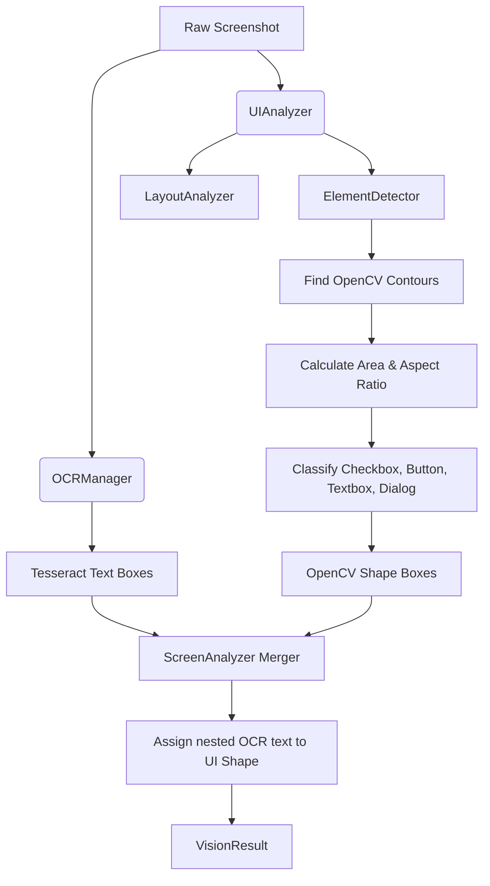

# Vision UI Element Detection Implementation

This document details Phase 2 of the NOVA Vision Engine, which implements heuristic-based computer vision parsing using OpenCV.

## 1. Execution Flow
The `ScreenAnalyzer` acts as a dual-pipeline orchestrator:

## 2. ElementDetector (OpenCV Heuristics)
Instead of relying on a slow or heavy YOLO model, this phase uses deterministic geometric parsing:
1. Grayscale & Canny Edge Detection (`cv2.Canny`).
2. Dilation to connect broken lines (`cv2.dilate`).
3. Contour generation (`cv2.findContours`).
4. Polygon approximation (`cv2.approxPolyDP`).

Elements are classified by checking aspect ratio and pixel area:
- **Checkbox**: Aspect ratio ~1.0, small area (100-600px).
- **Button**: Rectangular (aspect ratio 1.5 - 8), medium area (800-25000px).
- **Textbox**: Long rectangle (aspect ratio > 4), medium area (2000-30000px).
- **Dialog**: Massive area (>40000px).

## 3. Data Merging
Because `ElementDetector` cannot read text, and `OCRManager` cannot understand shapes, `ScreenAnalyzer` merges them.
If an OCR bounding box's center point falls inside an OpenCV shape box, the OpenCV shape adopts the OCR text. Any OCR boxes that don't fall inside a shape are designated as standalone "labels".

## 4. Schema Extensions
The `VisionBoundingBox` schema was extended to include programmatic interaction hints:
- `element_id`: Unique tracking ID.
- `element_type`: 'button', 'checkbox', 'textbox', 'label', 'panel', 'dialog'.
- `clickable`: Derived from the element type.
- `editable`: Derived from the element type.
- `visible`: Set to true for rendered contours.
- `enabled`: Set to true implicitly.
