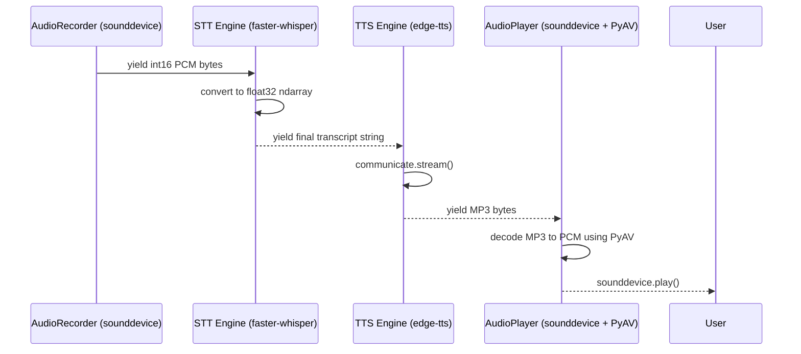

# Voice Engine Real Implementation

The Phase 1 Voice Engine replaces the mocked architecture with actual hardware recording and local ML inference. 

## Data Flow

## Supported Actions
1. **AudioRecorder**: Uses `sounddevice.RawInputStream` running a block size of 100ms. It asynchronously yields chunks using Python's `queue` to avoid blocking the event loop.
2. **AudioPlayer**: Converts standard compressed formats (MP3) back into raw NumPy arrays via `av` (PyAV). Runs synchronously in a background thread to prevent GUI lockups.
3. **SpeechRecognizer**: Leverages `faster-whisper` in CPU mode with `int8` quantization.
4. **SpeechSynthesizer**: Streams from `edge-tts`.
