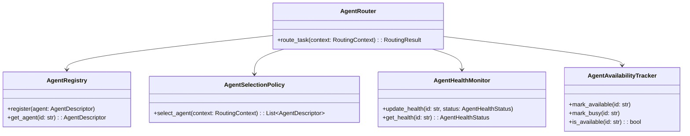
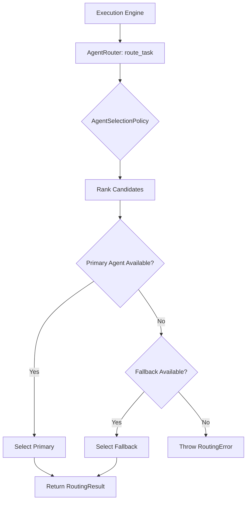
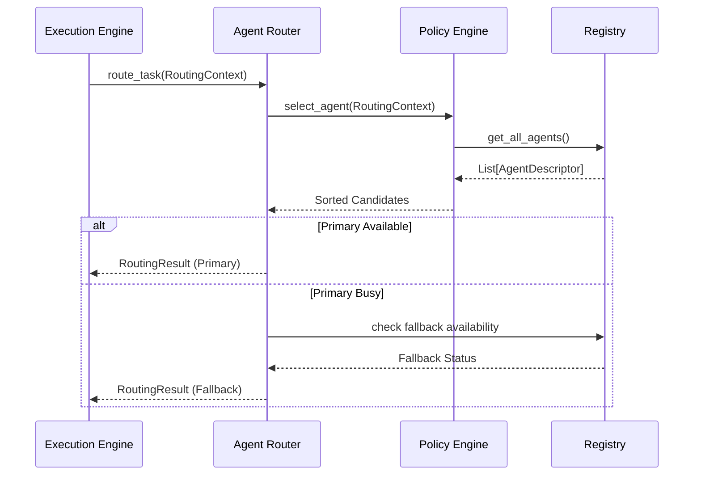
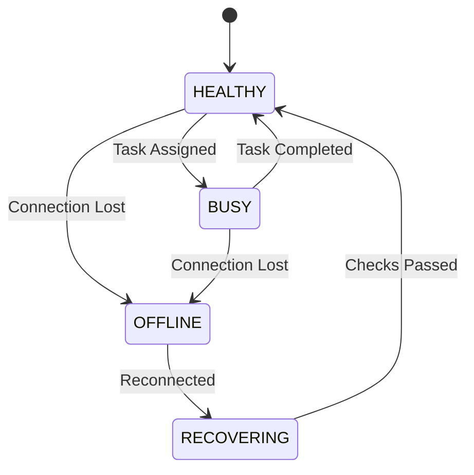

# NOVA Agent Router Architecture

## 1. Overview
The Agent Router is a critical orchestration component in the NOVA AI Operating Layer. It sits between the Execution Engine and the Agent/Tool execution layer. Its sole responsibility is to decide **WHICH** agent is best suited to receive and execute a specific task.

The Agent Router never plans tasks, never interprets raw user prompts, and never executes tools directly.

## 2. Responsibilities
- Receives tasks from the Execution Engine.
- Evaluates tasks against registered Agent Capabilities.
- Applies routing policies to rank available agents.
- Evaluates agent health and availability before dispatch.
- Triggers fallback logic when primary agents are offline or busy.
- Emits routing metrics and logs decisions for observability.

## 3. Internal Components
- **AgentRouter (Core):** Orchestrates the routing pipeline and handles fallback dispatching.
- **AgentRegistry:** In-memory store of all available AgentDescriptors (Desktop, Browser, Search, etc.).
- **AgentSelectionPolicy:** Ranks candidates using a scoring algorithm based on requirements, capabilities, and availability.
- **AgentHealthMonitor:** Tracks `AgentHealthStatus` (Healthy, Busy, Offline, etc.).
- **AgentAvailabilityTracker:** Flags agents that are currently executing tasks to prevent concurrency conflicts.
- **RoutingLogger & Metrics:** Captures routing decisions for systemic analysis.

## 4. Folder Structure
```text
backend/agents/router/
├── schema.py       # Data structures (AgentDescriptor, RoutingContext, etc.)
├── registry.py     # AgentRegistry and default agents list
├── health.py       # AgentHealthMonitor, AgentAvailabilityTracker
├── policy.py       # AgentSelectionPolicy ranking logic
├── core.py         # Main AgentRouter orchestrator
```

## 5. Mermaid Class Diagram


## 6. Mermaid Flow Diagram


## 7. Mermaid Sequence Diagram


## 8. Mermaid State Diagram


## 9. Dependency Graph
- Depends on: Pydantic, execution layer abstractions.
- Consumed by: `ExecutionManager`.

## 10. Public API
- `AgentRouter.route_task(context: RoutingContext) -> RoutingResult`
- `AgentRegistry.register(agent: AgentDescriptor)`

## 11. Extension Points
- **Custom Policies:** New ranking algorithms can be injected into `AgentRouter` by inheriting from `AgentSelectionPolicy`.
- **Dynamic Agents:** Plugin agents can be hot-loaded into the `AgentRegistry`.

## 12. Design Decisions
- **Strict Decoupling:** The router does not execute tasks. It merely returns a UUID which the Execution Engine will use to interface with the `AgentManager`.
- **Availability First:** A highly capable but busy agent will yield to a moderately capable but available agent.

## 13. Performance Considerations
- Agent ranking is an $O(N \log N)$ operation bounded by the number of registered agents. Since $N$ is typically small (< 20), this is extremely fast.

## 14. Future Improvements
- **LLM-Based Routing:** Enhance the static heuristic policy engine with an LLM classifier for complex edge cases.
- **Load Balancing:** Round-robin dispatching for multi-instance agents.
