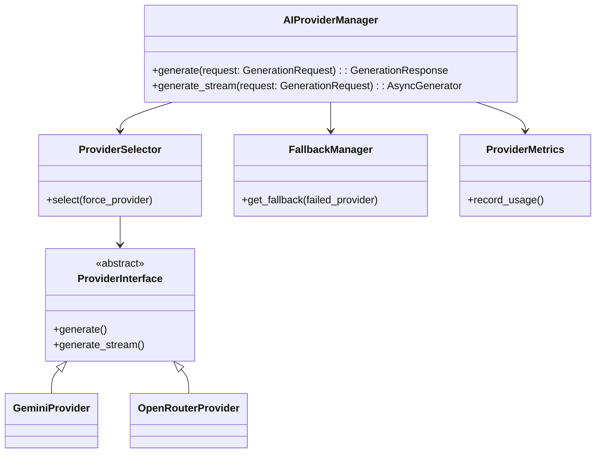
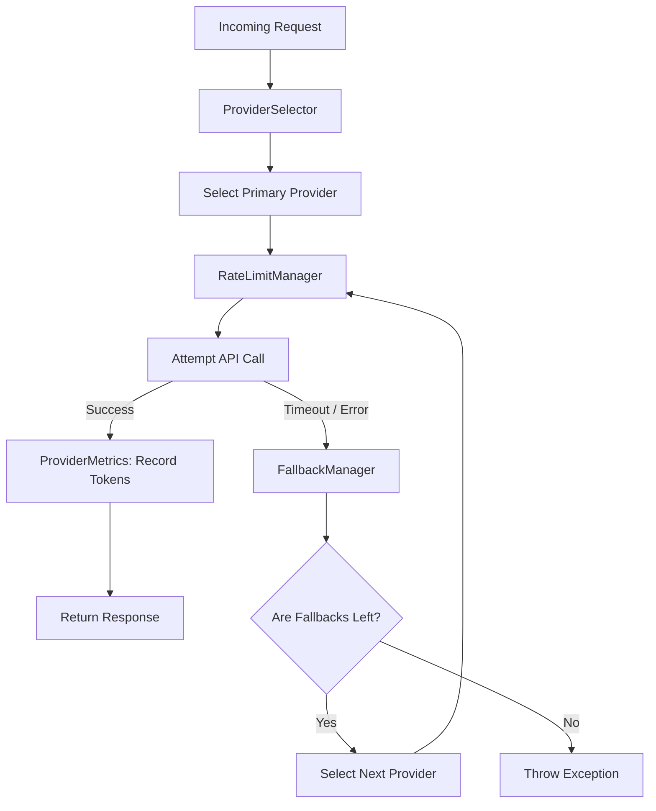
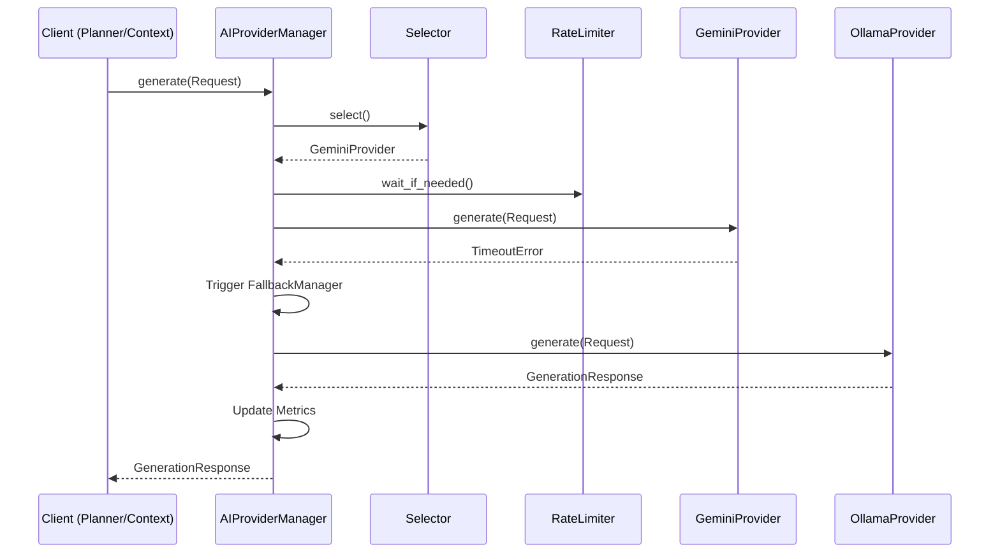
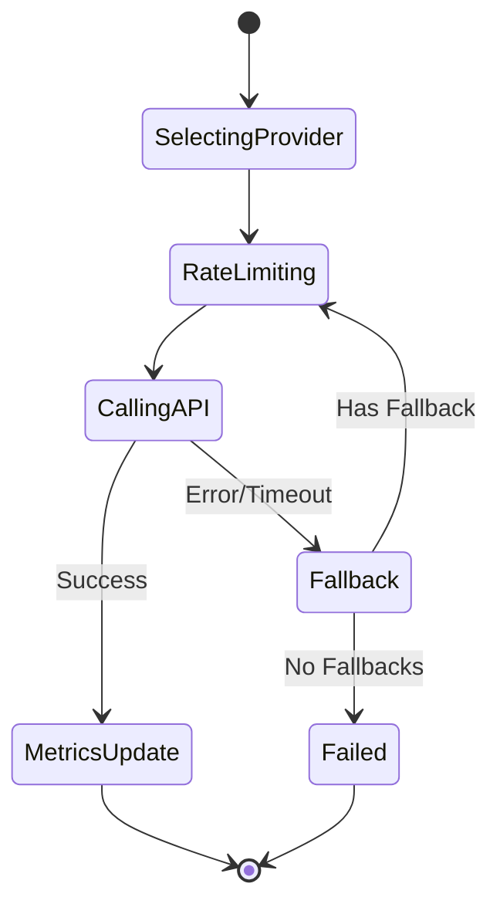

# NOVA AI Provider Manager Architecture

## 1. Overview
The AI Provider Manager is the exclusive subsystem responsible for communicating with all external LLM (Large Language Model) providers. No other subsystem in the NOVA architecture is permitted to make direct API calls to LLMs. This centralization ensures consistent rate limiting, uniform cost tracking, standardized streaming, and highly reliable failover logic.

## 2. Responsibilities
- **Provider Registration:** Maps `ProviderType` to concrete API adapters (Gemini, OpenRouter, Ollama, etc.).
- **Model Selection & Routing:** Selects the optimal provider based on configuration or priority logic.
- **Failover & Resilience:** Catches network failures, timeouts, and API errors, seamlessly failing over to a fallback provider without crashing the runtime.
- **Streaming Orchestration:** Safely processes AsyncGenerators for token streaming while tracking stream timeouts.
- **Rate Limiting:** Regulates outbound requests to prevent HTTP 429 errors.
- **Metrics & Tracking:** Accurately calculates token usage (prompt, completion, total) and estimated costs dynamically.

## 3. Internal Components
- **AIProviderManager (Core):** The central orchestrator combining all internal managers.
- **ProviderRegistry:** Dictionary storing active `ProviderInterface` implementations.
- **ProviderFactory:** Instantiates concrete providers.
- **ProviderSelector:** Chooses the primary provider based on request params or system priority.
- **FallbackManager:** Determines the next best provider in the priority queue when the primary fails.
- **StreamingManager:** Wraps and manages `AsyncGenerator` streams to enforce safety and timeouts.
- **RateLimitManager:** Simulates / enforces RPM/TPM limits.
- **ProviderMetrics (Tokens & Cost):** Aggregates usage data dynamically per provider.

## 4. Folder Structure
```text
backend/providers/
├── schema.py         # GenerationRequest, GenerationResponse, StreamingToken
├── interface.py      # ProviderInterface ABC
├── registry.py       # ProviderRegistry
├── factory.py        # ProviderFactory
├── adapters/         # Concrete API implementations
│   ├── gemini.py
│   ├── openrouter.py
│   ├── ollama.py
│   └── mock.py
├── health.py         # Health monitoring
├── metrics.py        # TokenUsageTracker, CostTracker
├── rate_limit.py     # RateLimitManager
├── fallback.py       # FallbackManager
├── selector.py       # ProviderSelector
├── streaming.py      # StreamingManager
├── core.py           # AIProviderManager (Orchestrator)
```

## 5. Mermaid Class Diagram


## 6. Mermaid Flow Diagram


## 7. Mermaid Sequence Diagram


## 8. Mermaid State Diagram


## 9. Dependency Graph
- Depends on: Pydantic, Python asyncio.
- Consumed by: Planner Engine, Context Engine, and anywhere LLM inference is required.

## 10. Public API
- `AIProviderManager.generate(request: GenerationRequest) -> GenerationResponse`
- `AIProviderManager.generate_stream(request: GenerationRequest) -> AsyncGenerator[StreamingToken, None]`

## 11. Design Decisions
- **Decoupled API Adapters:** Real API adapters (`gemini`, `openrouter`) inherit from a strict `ProviderInterface`, ensuring `AIProviderManager` core logic never needs to know the difference between providers.
- **Failover Logic:** Fallback relies on a strict priority array. If `Gemini` goes down, it hits `OpenRouter`. If `OpenRouter` fails, it falls back to local `Ollama` inference.

## 12. Performance Considerations
- The manager adds near-zero overhead. The bottleneck will exclusively be network HTTP transport to the provider endpoints.

## 13. Provider Failover Flow
As verified in the test suite:
1. `Gemini` is invoked.
2. `Gemini` throws an Exception or Times Out.
3. `AIProviderManager` catches the exception, suppresses it, logs the error, and decrements retry count.
4. `FallbackManager` looks up the next provider (`Mock` or `Ollama`).
5. Request is dynamically re-routed to the fallback provider seamlessly.

## 14. Future Improvements
- **Cost-based Routing:** Expand `ProviderSelector` to dynamically choose the cheapest provider that satisfies the token requirements of the prompt.
