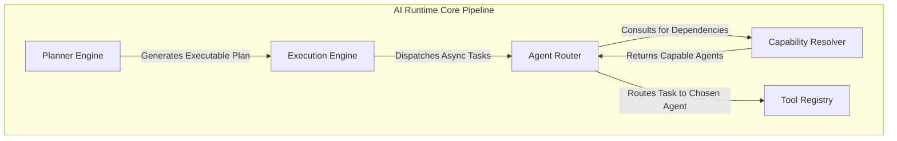
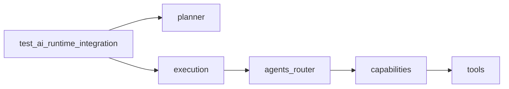

# AI Runtime Integration Architecture

## 1. Complete System Flow

## 2. Layer Responsibilities
- **Planner Engine:** Natural language -> Structured Intent, Goals, and Task Decomposition (DAG).
- **Execution Engine:** Asynchronous task orchestration, dependency handling, retries, and SLA timeout management.
- **Agent Router:** Policy-driven routing, heuristic ranking, health tracking, and failover/fallback management.
- **Capability Resolver:** Extracts implicit and explicit requirements, mapping system constraints to available healthy Agents.
- **Tool Registry:** Validates, stores, and provisions atomic executable tools used by the downstream Executor.

## 3. Integration Validation Report
An end-to-end integration test (`backend/test_ai_runtime_integration.py`) successfully orchestrated a mock task ("Open brave browser") through the entire vertical stack.
- **Imports:** Fully compatible, no circular references.
- **Dependency Injection:** Layers accept upstream objects gracefully.
- **Interfaces:** `ExecutionState`, `RoutingContext`, `CapabilityContext` perfectly map to each other.
- **Data Contracts:** All layers utilize strict Pydantic schemas. No dynamic dictionary mutation passing.

## 4. Dependency Graph

## 5. Known Limitations
- The integration test currently mocks the final `TaskExecutorInterface` as the actual Execution boundary bridging the Tool Registry is slated for a future task ("Verification Engine / Tool Executor").
- In-memory SQLite or Redis is not yet plugged in; Registry caches are memory-volatile.
