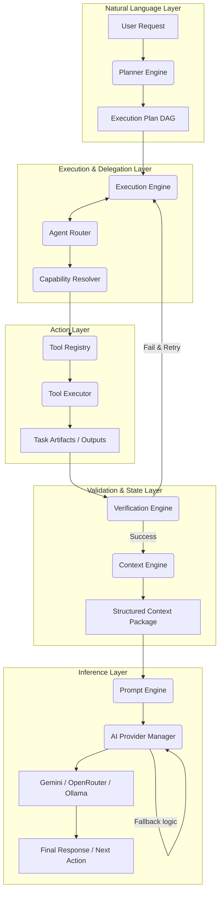
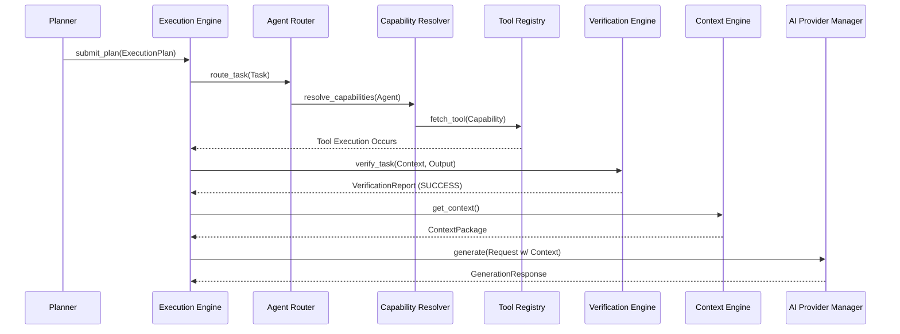

# NOVA AI Runtime Full Pipeline Architecture

## 1. Overview
The NOVA AI Runtime represents the absolute core of the Operating Layer. It strictly decouples natural language understanding, logical execution, task delegation, and capability mapping into isolated horizontal layers. 

This document traces the complete end-to-end lifecycle of a task from initial User Request to the final AI Provider LLM call.

## 2. End-to-End Pipeline

1. **Planner Engine**
   - Receives the initial, unstructured user query.
   - Detects intent and constructs a structured DAG (Directed Acyclic Graph) `ExecutionPlan`.
   - *Crucially, the Planner never executes actions.*

2. **Execution Engine**
   - Digests the `ExecutionPlan`.
   - Creates tracking contexts, schedules queues, and orchestrates Retries, Timeouts, and Progress tracking.

3. **Agent Router**
   - Evaluates the tasks inside the Execution Queue.
   - Scores available system Agents (e.g., Desktop Agent vs Browser Agent) based on load, priority, and defined policies.
   - Delegates the task to the selected optimal Agent.

4. **Capability Resolver**
   - The selected Agent declares what it needs to do (e.g., "I need to open a URL").
   - The Resolver maps this abstract semantic intent to a strict system capability (`cap_browser_navigate`).

5. **Tool Registry & Executor**
   - Given a resolved Capability, looks up the exact, validated concrete Tool implementation.
   - Executes the underlying logic / Python script / API call.

6. **Verification Engine**
   - Receives the output or artifact of the Executed Tool.
   - Runs deterministic Rules and heuristic Strategies to prove the tool actually accomplished the task.
   - Rejects unverified completions and loops back to Execution Engine via Retry rules.

7. **Context Engine**
   - Before requesting the next step from the LLM, collects everything (Memory, FileSystem, Browser State).
   - Ranks, filters, and compresses the context safely below the LLM token limits.

8. **AI Provider Manager**
   - Merges the optimized Context into a prompt (Prompt Engine integration pending).
   - Handles the physical HTTP request to Gemini / OpenRouter / Ollama.
   - Manages failovers, rate limits, and token metrics.

## 3. Mermaid Full Architecture Diagram

## 4. Runtime Sequence Diagram

## 5. Layer Dependency Graph
- **Planner** depends on schemas, relies on APM (indirectly) for intent analysis.
- **Execution Engine** is the orchestration hub, depending on Router, Resolver, and Registry.
- **Verification Engine** acts as the gatekeeper.
- **Context Engine & AI Provider Manager** act as the underlying foundational primitives serving all other layers.

## 6. Integration Validation
Through automated test suites (`test_ai_runtime_integration.py` and modular unit tests across all engines):
- Data structures (`Pydantic` schemas) flow synchronously.
- Abstract base classes and interfaces guarantee that swapping a mock LLM for Gemini requires zero changes to the Planner or Execution modules.
- Strict Dependency Injection prevents circular dependencies between the orchestration (Execution Engine) and the primitives (Context / Providers).
