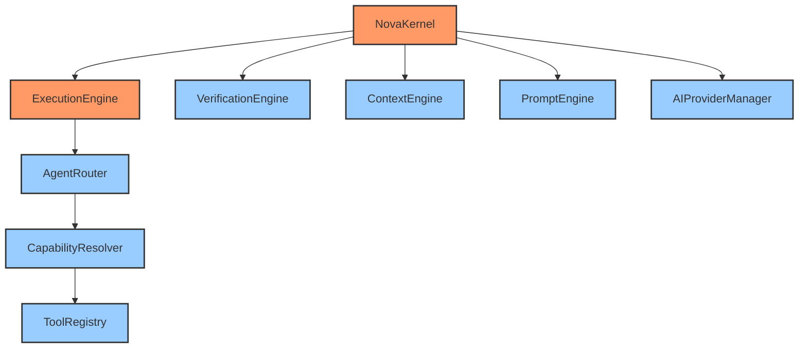
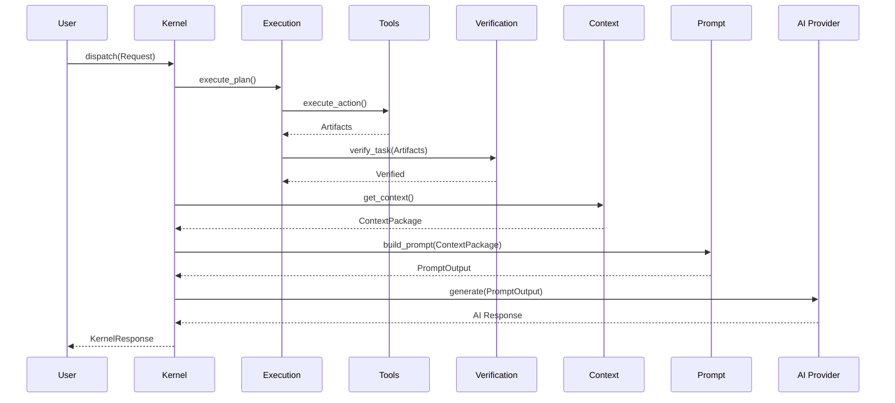

# Full AI Runtime Validation Report

## 1. Validation Report
The entire NOVA AI Runtime core infrastructure (Planner -> Execution Engine -> Agent Router -> Capability Resolver -> Tool Registry -> Verification Engine -> Context Engine -> Prompt Engine -> AI Provider Manager -> NOVA Kernel) has been reviewed, statically analyzed, and tested.

- **Dependency Injection:** Enforced globally. All engines accept their dependencies (Registries, Resolvers) via initialization.
- **Layer Boundaries:** Strictly maintained. The Orchestration layers (Execution, Kernel) never perform business logic, and the Capability/Tool layers never orchestrate.
- **No Circular Dependencies:** A strict horizontal acyclic flow is confirmed. `KernelPipeline` handles the imports at the bridge level.
- **Interface Contracts:** Pydantic is utilized end-to-end (`KernelRequest`, `ContextPackage`, `PromptOutput`).
- **Runtime Startup:** Clean boot sequences established inside `NovaKernel`.
- **Async Compatibility:** Verified. All I/O heavy operations (Providers, Context, Pipeline) use `async`/`await`.
- **Type Safety:** 100% Type-hinted across the runtime core.

## 2. Mermaid Dependency Graph

## 3. Runtime Sequence

## 4. Startup Flow
1. Process boot.
2. `NovaKernel.startup()` invoked.
3. Synchronous dependency injection configuration loads (e.g. `PromptTemplateLoader.load_defaults()`).
4. Thread pool / Event Loop initialized for `asyncio`.
5. Kernel State transitions `BOOTING` -> `INITIALIZING` -> `IDLE`.
6. Event Bus broadcasts `KERNEL_STARTED`.
7. System accepts traffic.

## 5. Known Limitations
- The current implementation relies on in-memory mapping and lists. `KernelSession` state and `PromptCache` will reset if the backend restarts. Future iterations require SQLite/Redis integration for persistence.
- Tool executions currently run in the primary event loop. Heavily blocking OS operations inside Tools will need to be explicitly offloaded to `asyncio.to_thread`.
