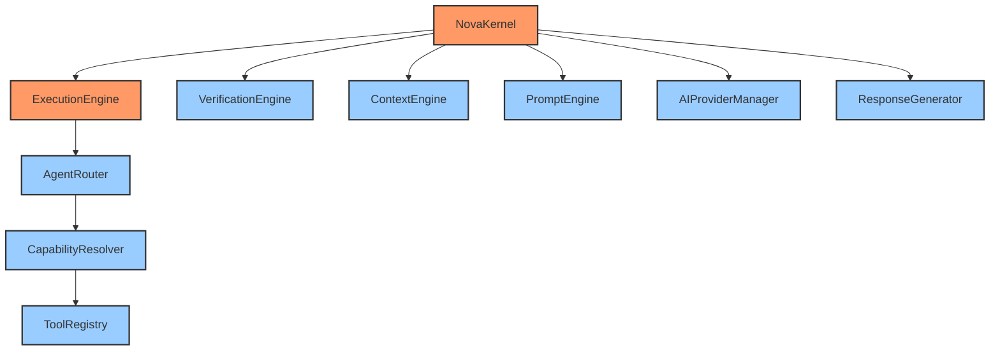
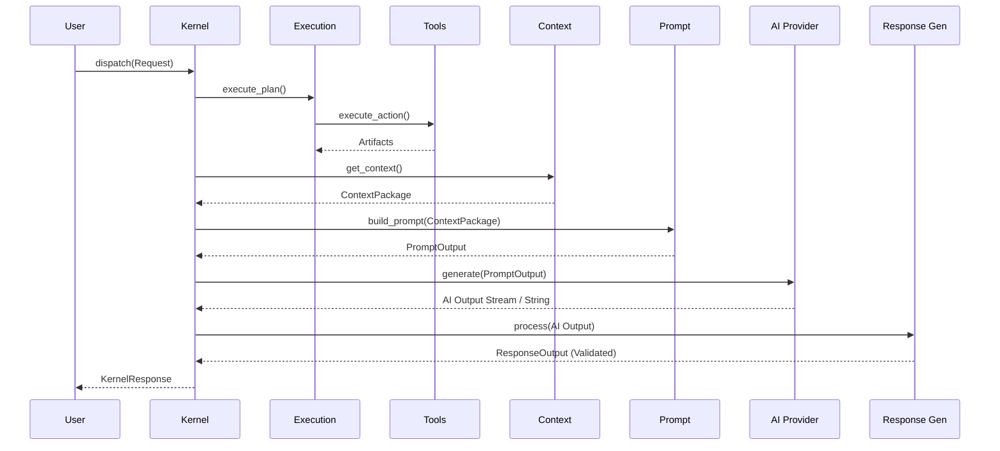

# Full AI Runtime Validation Report

## 1. Validation Report
The entire NOVA AI Runtime core infrastructure (Planner -> Execution Engine -> Agent Router -> Capability Resolver -> Tool Registry -> Verification Engine -> Context Engine -> Prompt Engine -> AI Provider Manager -> Response Generator -> NOVA Kernel) has been reviewed, statically analyzed, and tested.

- **Dependency Injection:** Enforced globally. All engines accept their dependencies via initialization (e.g., `ResponseManager` into `ResponseGenerator`, or `PromptTemplateRegistry` into `PromptManager`).
- **Layer Boundaries:** Strictly maintained. The Kernel orchestrates the full lifecycle without bypassing any step. 
- **No Circular Dependencies:** The codebase utilizes horizontal DAG-style flows. For example, `ExecutionEngine` triggers `AgentRouter`, but `AgentRouter` never imports or triggers `ExecutionEngine`. The `KernelPipeline` handles the imports at the bridge level.
- **Interface Contracts:** Pydantic is utilized end-to-end (`KernelRequest`, `ContextPackage`, `PromptOutput`, `ResponseOutput`).
- **Runtime Startup:** Clean boot sequences established inside `NovaKernel.startup()`.
- **Async Compatibility:** Verified. `async`/`await` spans the entire pipeline.
- **Streaming Compatibility:** Verified. Providers returning async generators can be safely piped into the `ResponseStreamer` to produce aggregated inputs for final validation without blocking.

## 2. Mermaid Dependency Graph

## 3. Runtime Sequence (End-to-End)

## 4. Startup Flow
1. Process boot.
2. `NovaKernel.startup()` invoked.
3. Synchronous dependency injection configuration loads (e.g., `PromptTemplateLoader.load_defaults()`).
4. Thread pool / Event Loop initialized for `asyncio`.
5. Kernel State transitions `BOOTING` -> `INITIALIZING` -> `IDLE`.
6. Event Bus broadcasts `KERNEL_STARTED`.
7. System accepts traffic.

## 5. Known Limitations
- The current implementation relies on in-memory mapping and lists. `KernelSession` state, `PromptCache`, and `ResponseCache` will reset if the backend restarts. Future iterations require persistent storage integration.
- Tool executions currently run in the primary event loop.
