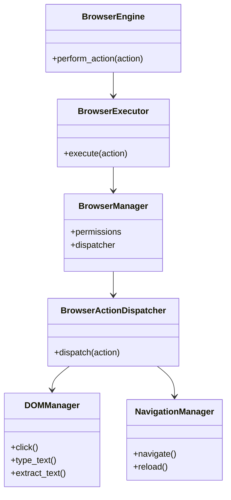
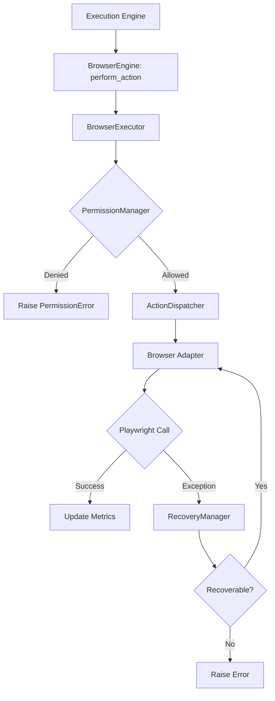
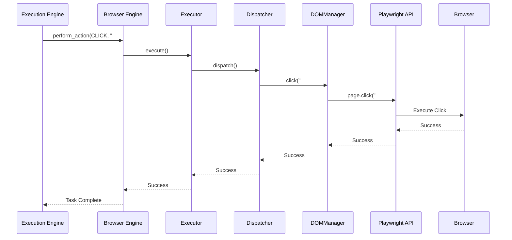
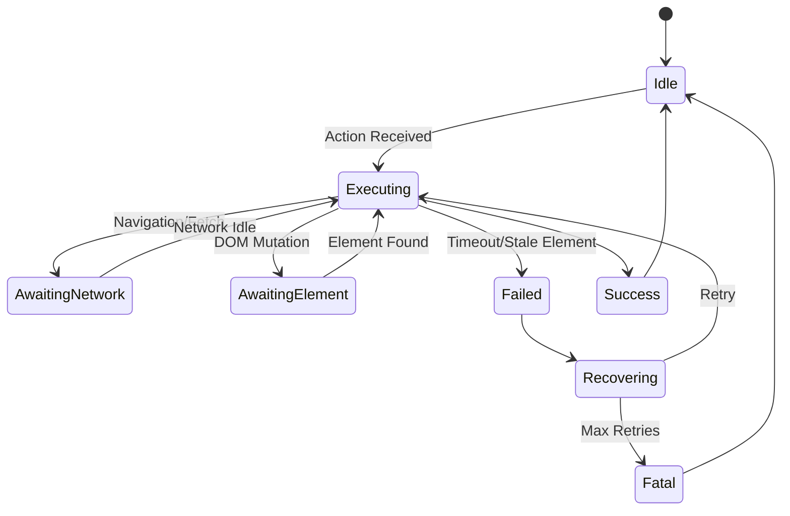

# NOVA Browser Automation Architecture

## 1. Overview
The NOVA Browser Automation Engine is the strictly controlled gateway to Web Interaction. It isolates the AI runtime from the raw Playwright/Browser environment, enforcing safety policies, permission checks, and robust recovery sequences for flaky web elements.

## 2. Responsibilities
- **Playwright Abstraction:** Masks the complexities of raw browser driving behind a clean, async Python interface.
- **State Management:** Tracks tabs, loaded URLs, and DOM changes to provide the AI with context.
- **Permissions:** Validates actions against `BrowserPermissionLevel` (e.g., blocking file downloads unless explicitly allowed).
- **DOM Traversal & Action:** Executes precise clicks, hovers, extractions, and keystrokes based on element selectors.
- **Session Recovery:** Catches stale elements, navigation timeouts, and crashes, triggering automated retries before reporting failure.

## 3. Internal Components
- **BrowserEngine (Core):** Public API and orchestrator.
- **BrowserManager:** Wires adapters to the Action Dispatcher.
- **BrowserExecutor:** Action lifecycle wrapper (Auth -> Execute -> Recover -> Log).
- **BrowserActionDispatcher:** Routes `BrowserActionType` payloads.
- **BrowserPermissionManager:** Enforces security perimeters.
- **BrowserRecoveryManager:** Handles standard web automation exceptions (Timeouts, ElementNotInteractable).
- **Adapters:**
  - `BrowserLauncher`, `TabManager`, `NavigationManager`, `DOMManager`, `NetworkMonitor`, `DownloadManager`, `UploadManager`, `CookieManager`, `ScreenshotManager`, `PDFExporter`, `JavaScriptExecutor`.

## 4. Folder Structure
```text
backend/browser/
├── schema.py        # BrowserAction, Permissions, Sessions, Metrics
├── adapters.py      # DOMManager, TabManager, DownloadManager, etc.
├── dispatcher.py    # Dispatcher, PermissionManager, RecoveryManager
├── core.py          # BrowserEngine, BrowserExecutor, BrowserManager
```

## 5. Mermaid Class Diagram


## 6. Mermaid Flow Diagram


## 7. Mermaid Sequence Diagram


## 8. Mermaid State Diagram


## 9. Dependency Graph
- Depends on: Pydantic, Playwright (future).
- Consumed by: Execution Engine.

## 10. Public API
- `BrowserEngine.perform_action(action: BrowserAction)`

## 11. Browser Session Lifecycle
1. Engine launched; creates `BrowserSession` with specific `BrowserPermissionLevel`.
2. Browser binary executes (`BrowserLauncher`).
3. Tabs are instantiated; DOM events are streamed back to memory.
4. Engine processes linear actions until completion.
5. Context is destroyed upon session termination.

## 12. Playwright Adapter Architecture
The adapters simulate synchronous behavior over async calls, completely hiding the complex `playwright.async_api` from the NOVA business logic.

## 13. Performance Considerations
- All functions are async to prevent blocking the Kernel.
- DOM node extraction must be limited to prevent memory bloat inside Python strings.

## 14. Future Improvements
- Visual DOM element location using Computer Vision instead of raw HTML selectors.
- CDP (Chrome DevTools Protocol) integration for deeper network inspection.
