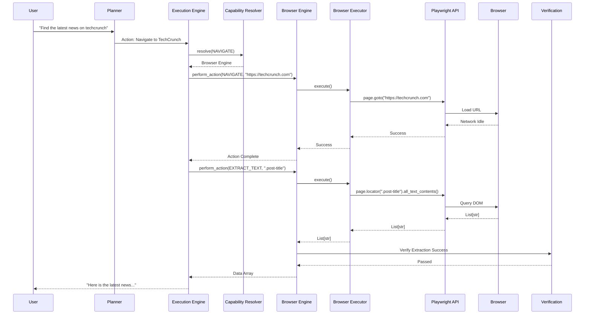
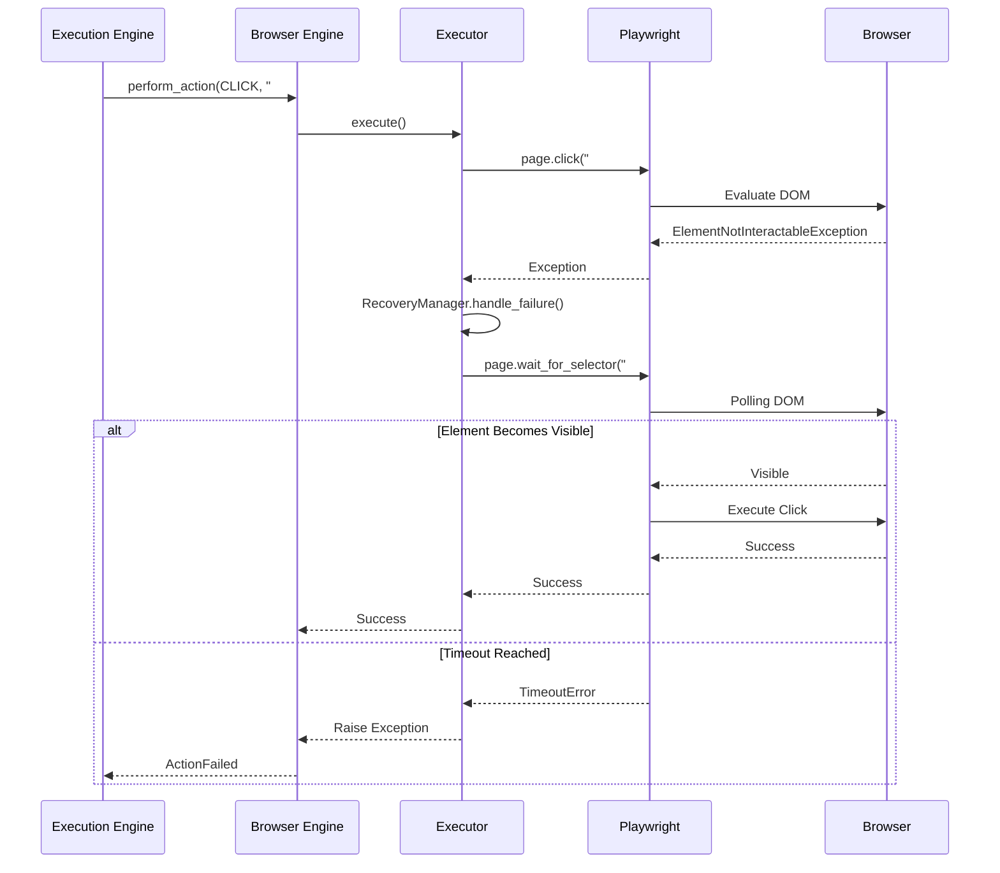
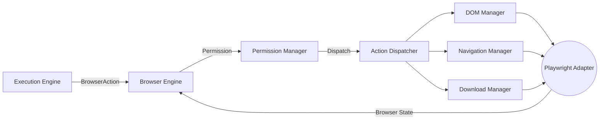

# NOVA Browser Pipeline Validation

This document illustrates the execution flow for translating abstract AI intentions into complex DOM manipulations via the Browser Engine.

## 1. End-to-End Execution Sequence

## 2. Browser Recovery Flow

## 3. Data Flow Diagram

