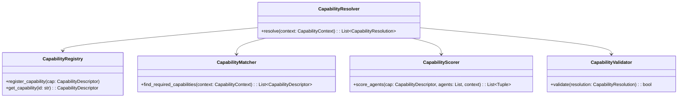
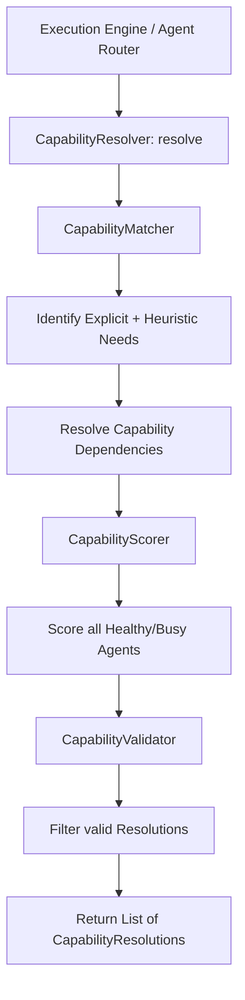
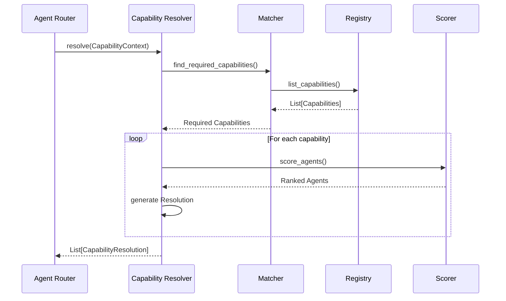
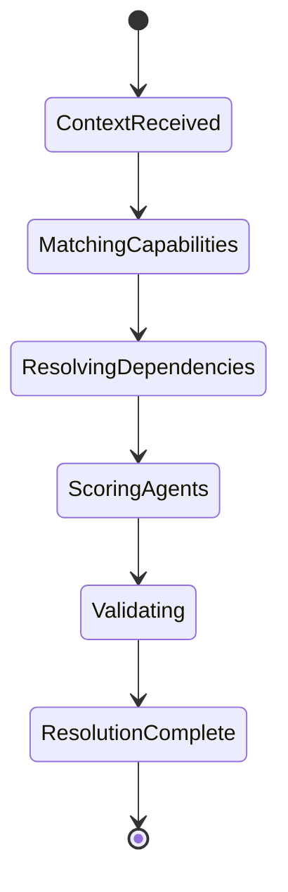

# NOVA Capability Resolver Architecture

## 1. Overview
The Capability Resolver is a core component within the NOVA AI Operating Layer. It exists directly downstream of the Agent Router and upstream of the Tool Registry. Its sole responsibility is to evaluate a task, determine exactly which capabilities are required, and resolve those capabilities to registered, healthy agents that can provide them.

The Capability Resolver NEVER executes tasks and NEVER directly triggers tools.

## 2. Responsibilities
- Receives tasks from the Agent Router/Execution Engine.
- Identifies required capabilities using explicit matching and natural language heuristics.
- Resolves capability dependencies.
- Calculates dynamic capability match scores for all registered agents based on priority, health, and metadata.
- Outputs `CapabilityResolution` models outlining the preferred agent and fallbacks.

## 3. Internal Components
- **CapabilityResolver (Core):** Orchestrates the overall resolution pipeline.
- **CapabilityRegistry:** Central store for all `CapabilityDescriptor` definitions (e.g., `LaunchApplication`, `InternetSearch`).
- **CapabilityIndex:** Provides fast lookups and inverted indexing (by category).
- **CapabilityMatcher:** Parses task contexts to identify primary and dependent capabilities.
- **CapabilityScorer:** Applies heuristic weighting to rank registered agents against a specific capability.
- **CapabilityValidator:** Validates that the resulting `CapabilityResolution` objects meet systemic thresholds.

## 4. Folder Structure
```text
backend/capabilities/
├── schema.py               # Data structures (CapabilityDescriptor, CapabilityResolution)
├── registry.py             # CapabilityRegistry
├── index.py                # Fast lookup utility
├── default_capabilities.py # Static system default definitions
├── scorer.py               # Rank generation logic
├── matcher.py              # Context parsing and dependency resolution
├── validator.py            # Sanity checks for Resolution output
├── core.py                 # Main Orchestrator and Logging
```

## 5. Mermaid Class Diagram


## 6. Mermaid Flow Diagram


## 7. Mermaid Sequence Diagram


## 8. Mermaid State Diagram


## 9. Dependency Graph
- Depends on: Pydantic, Agent Router schemas (for AgentDescriptor).
- Consumed by: Tool Registry, Execution layer integrations.

## 10. Public API
- `CapabilityResolver.resolve(context: CapabilityContext) -> List[CapabilityResolution]`
- `CapabilityRegistry.register_capability(capability: CapabilityDescriptor)`
- `CapabilityRegistry.search_capability(keyword: str) -> List[CapabilityDescriptor]`

## 11. Extension Points
- **New Capabilities:** Easy to add via `register_capability`.
- **Advanced Scoring:** Overriding `CapabilityScorer` allows ML-based capability matching.

## 12. Design Decisions
- **Loose Coupling:** The capability layer intentionally relies on names and IDs for agent matching rather than tight memory references, ensuring high testability and modularity.
- **Fail-Safe Validation:** Resolutions that drop below a confidence threshold or find zero agents are flagged but don't strictly crash the pipeline unless handled as fatal upstream.

## 13. Performance Considerations
- Iterating over all agents for every required capability operates in $O(C \times A)$ time where $C$ is capabilities and $A$ is agents. With typical local limits, this takes under 2ms.

## 14. Future Improvements
- **Semantic Matching:** Replace substring and category matching with local embeddings to accurately match ambiguous natural language capabilities to predefined definitions.
