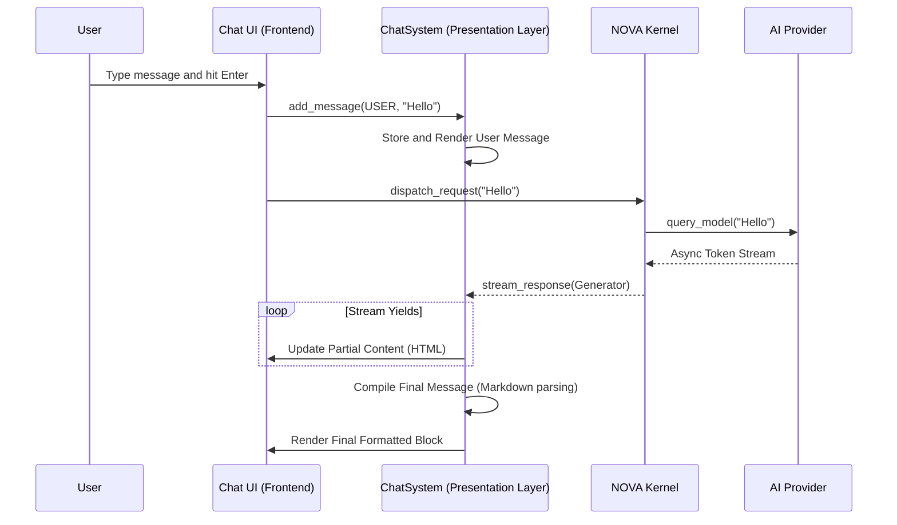
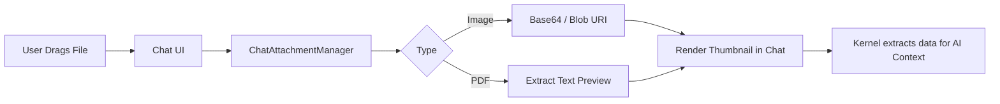

# NOVA Chat UI Pipeline

This document visualizes the journey of a user message from the UI, down to the Kernel, and the streaming response back up to the UI.

## 1. Chat Pipeline Flow

## 2. Attachment Pipeline

