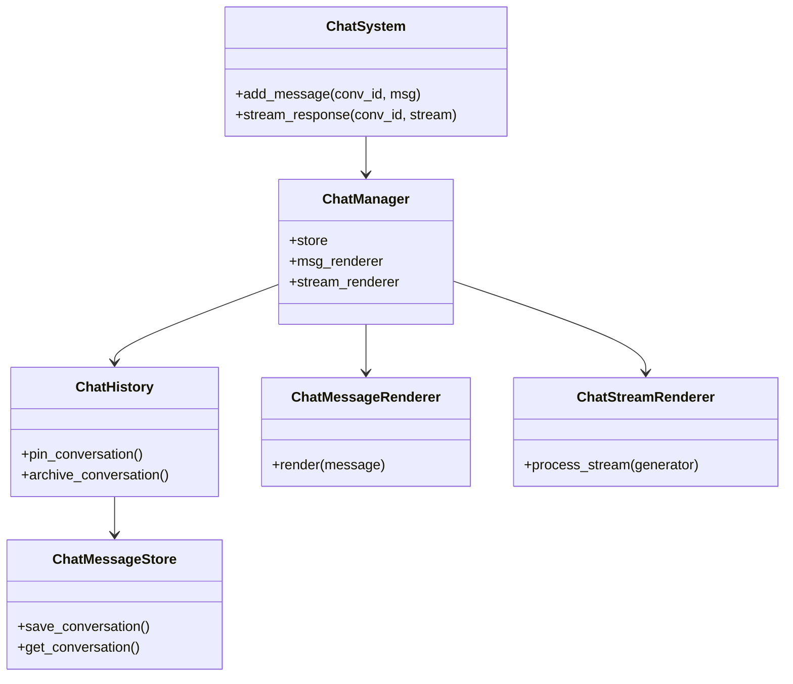
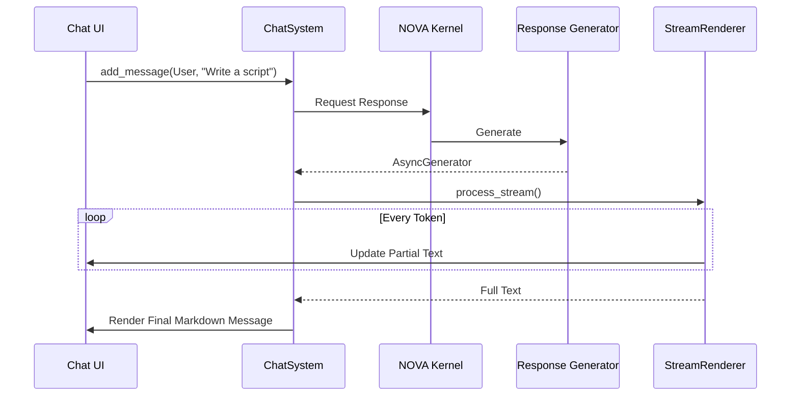
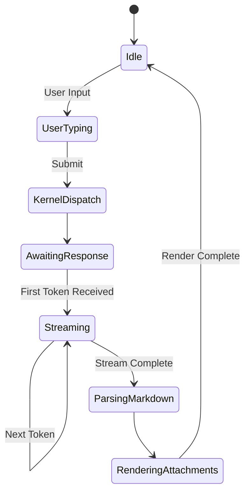

# NOVA Chat System Architecture

## 1. Overview
The NOVA Chat System is the primary conversational interface for the AI Operating System. Like the Dynamic Island, it is purely a presentation layer. It manages chat history, attachment rendering, and UI streaming, but relies completely on the NOVA Kernel and Execution engines to actually generate responses, execute tools, and retrieve memories.

## 2. Responsibilities
- **Conversation State:** Manages `ChatConversation` groups, pinning, archiving, and folders.
- **Message Rendering:** Parses raw Markdown, LaTeX, and Code Blocks into UI-safe HTML structures.
- **Streaming Pipeline:** Captures `AsyncGenerator` streams from the `ResponseGenerator` to update the UI in real-time (60fps typing effect).
- **Attachment Management:** Normalizes user uploads (Images, PDFs, CSVs) and routes them into the Kernel for actual vision/data processing.
- **Local Search:** Fast UI-layer text search across active chat tabs.

## 3. Internal Components
- **ChatSystem (Core):** Top-level API.
- **ChatManager:** Dependency injection container.
- **ChatHistory & ChatMessageStore:** In-memory state and CRUD operations for UI chat objects.
- **ChatMessageRenderer:** Parses full messages.
- **ChatStreamRenderer:** Handles partial tokens.
- **ChatAttachmentManager:** Validates and stores UI references to files.
- **ChatExportManager:** Dumps chats to Markdown/JSON.
- **ChatSearchManager:** Local search over the `ChatMessageStore`.
- **ChatStateManager:** Holds the active tab/conversation pointer.

## 4. Folder Structure
```text
backend/chat/
├── schema.py        # ChatMessage, Conversation, Attachments
├── presentation.py  # Renderers, Exporters
├── state.py         # History, Store, Search, Active State
├── core.py          # ChatSystem, Manager, Logger
```

## 5. Mermaid Class Diagram


## 6. Mermaid Flow Diagram
```mermaid
flowchart TD
    A[User Input] --> B[ChatSystem]
    B --> C[Kernel (Business Logic)]
    C --> D[Response Generator]
    
    D -- Async Stream --> E[ChatStreamRenderer]
    E --> F[Frontend UI]
    
    E -- Stream Complete --> G[ChatMessageStore]
    G --> H[ChatMessageRenderer]
    H --> I[Frontend UI Final Update]
```

## 7. Mermaid Sequence Diagram


## 8. Mermaid State Diagram


## 9. Dependency Graph
- Depends on: NOVA Kernel, Response Generator (For input streams).
- Consumed by: Frontend UI (React/Tauri).

## 10. Public API
- `ChatSystem.add_message(conversation_id: str, message: ChatMessage)`
- `ChatSystem.stream_response(conversation_id: str, stream: AsyncGenerator) -> ChatMessage`

## 11. Conversation Lifecycle
Conversations are auto-created upon the first message insertion. They are tracked locally by `ChatMessageStore` for immediate UI rendering, while the NOVA `MemoryEngine` asynchronously persists the vectors to long-term storage in the background.

## 12. Streaming Lifecycle
The UI consumes a raw `AsyncGenerator[str, None]` from the backend. The `ChatStreamRenderer` throttles updates slightly to ensure React doesn't freeze under heavy token dumps (maintaining 60fps). Once exhausted, the stream is compiled into a static `ChatMessage` and run through the heavy Markdown/LaTeX parser.

## 13. Performance Considerations
- Streaming loop yields explicitly to avoid blocking the asyncio event loop.
- Markdown rendering is skipped during active streaming, relying on plain text until the final block is formed.

## 14. Future Improvements
- Infinite scrolling for the `ChatMessageStore` (virtualized list offloading to SQLite).
