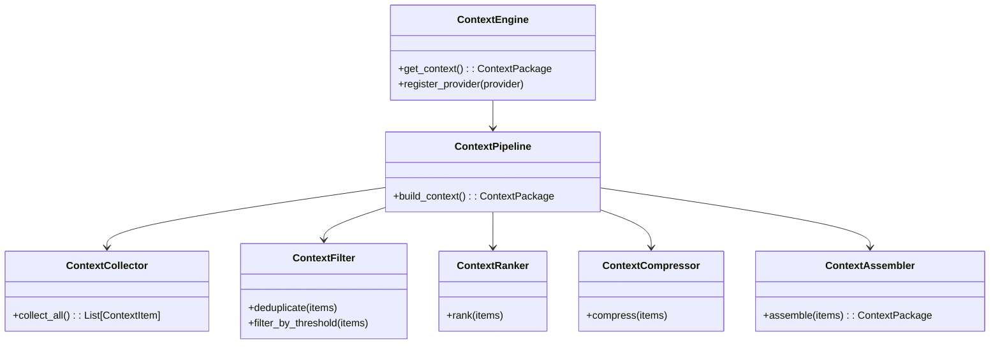
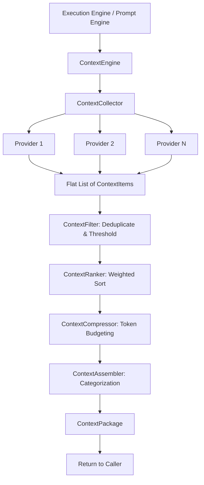
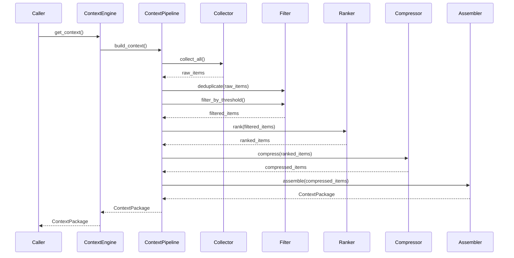
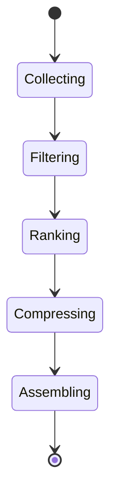

# NOVA Context Engine Architecture

## 1. Overview
The Context Engine is responsible for collecting, normalizing, filtering, deduplicating, ranking, and compressing all runtime context before an AI request is submitted to the AI Provider Manager. No other module is permitted to inject context directly.

## 2. Responsibilities
- **Context Collection:** Dynamically queries registered `ContextProviders` (Memory, FileSystem, Browser, UI State, execution artifacts).
- **Filtering & Deduplication:** Removes exact duplicates or extremely low-relevance items to preserve token space.
- **Ranking:** Weights context items based on relevance, recency, and importance heuristics.
- **Compression:** Greedily drops the lowest-ranked context items if the total `estimated_tokens` exceeds the system limit.
- **Assembly:** Packages the finalized tokens into a structured `ContextPackage`.

## 3. Internal Components
- **ContextEngine (Core):** Orchestrates the pipeline and tracks metrics (total packages, average tokens).
- **ContextCollector:** Maintains a registry of active `ContextProviders` and fans out collection asynchronously.
- **ContextPipeline:** Linear execution flow calling Filter -> Ranker -> Compressor -> Assembler.
- **ContextFilter:** Enforces threshold cuts and removes hashed duplicates.
- **ContextRanker:** Sorts the filtered context based on a weighted formula.
- **ContextCompressor:** Token-budget enforcer. Drops bottom-ranked context until the budget fits.
- **ContextAssembler:** Converts flat context items into a strongly-typed `ContextPackage`.

## 4. Folder Structure
```text
backend/context/
├── schema.py        # ContextType, ContextItem, ContextPackage
├── collector.py     # ContextProvider ABC, ContextCollector
├── filter.py        # ContextFilter
├── ranker.py        # ContextRanker
├── compressor.py    # ContextCompressor
├── assembler.py     # ContextAssembler
├── pipeline.py      # ContextPipeline (glue layer)
├── core.py          # ContextEngine (Orchestrator)
```

## 5. Mermaid Class Diagram


## 6. Mermaid Flow Diagram


## 7. Mermaid Sequence Diagram


## 8. Mermaid State Diagram


## 9. Dependency Graph
- Depends on: Pydantic, Python asyncio.
- Consumed by: Prompt Engine.

## 10. Public API
- `ContextEngine.register_provider(provider: ContextProvider)`
- `ContextEngine.get_context() -> ContextPackage`

## 11. Design Decisions
- **Fail-Safe Collection:** The Collector catches and suppresses exceptions from individual providers. One failing provider (e.g., Browser disconnected) will not crash the entire context build.
- **Greedy Compression:** Currently utilizes a fast greedy algorithm (top-down inclusion until token limit is hit) rather than expensive knapsack optimization.

## 12. Performance Considerations
- Context retrieval is heavily parallelized in the real implementation (via `asyncio.gather` for providers).
- Exact hashing is used for deduplication which operates in $O(N)$ time.

## 13. Context Lifecycle
1. Providers inject flat generic `ContextItem`s.
2. Items are stripped out or sliced based on constraints.
3. Assembler categorizes them (e.g., `browser_context`, `memory_context`) making it significantly easier for the Prompt Engine to render the template block by block.

## 14. Future Improvements
- **Semantic Deduplication:** Upgrade exact-hash deduplication to cosine similarity checking to merge context items that mean the same thing but have slightly different text.
- **Accurate Tokenization:** Swap dummy token estimator `len(str) // 4` with a real `tiktoken` or `sentencepiece` wrapper.
