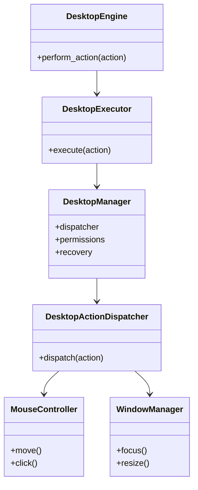
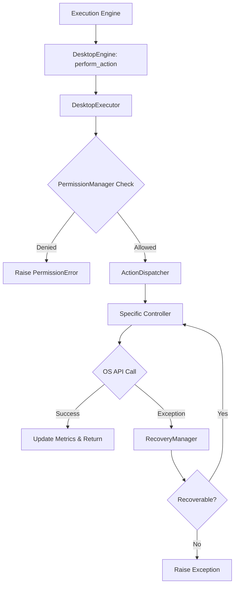
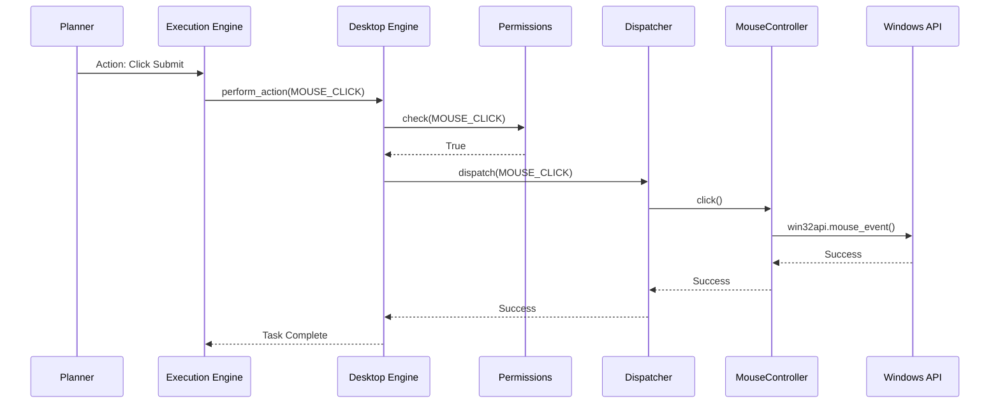
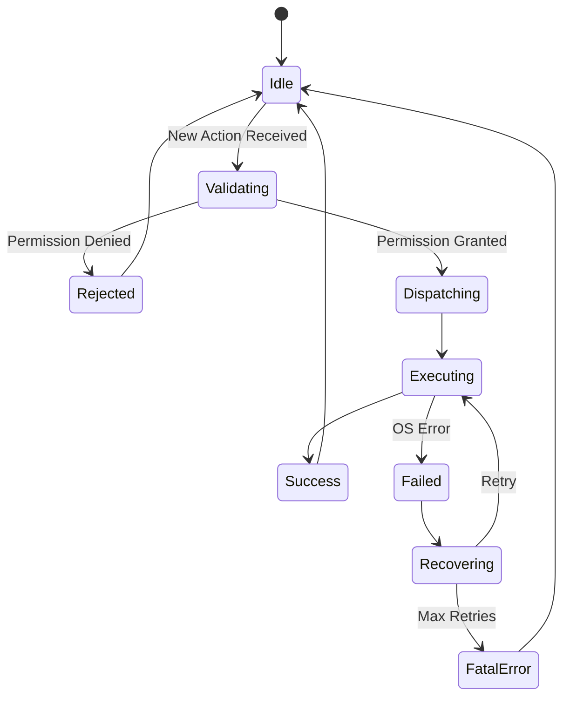

# NOVA Desktop Automation Architecture

## 1. Overview
The NOVA Desktop Automation Engine is the exclusive interface between the AI Runtime and the underlying Operating System (Windows). It converts structured Agent intentions into physical OS actions (Mouse, Keyboard, Filesystem, Application manipulation) while strictly enforcing permission boundaries and recovery protocols.

## 2. Responsibilities
- **OS Abstraction:** Wraps all native Win32/OS API calls into async Python controllers.
- **Permission Enforcement:** Blocks destructive commands (e.g., recursive deletes) if the system is running in `READ_ONLY` mode.
- **Action Dispatching:** Routes typed `DesktopAction` objects to the appropriate hardware or software manager.
- **Failure Recovery:** Intercepts crashes from the OS API, logs the trace, and attempts retry or fallback mechanisms before failing the AI task.
- **Telemetry:** Captures latency metrics for physical I/O (mouse movement speeds, screenshot buffer times).

## 3. Internal Components
- **DesktopEngine (Core):** Public API and orchestrator.
- **DesktopManager:** Wires together controllers, permissions, and the dispatcher.
- **DesktopExecutor:** Manages the actual lifecycle of an action (Permission Check -> Dispatch -> Recover -> Log -> Metrics).
- **DesktopPermissionManager:** Rules engine validating `DesktopActionType` against the current `DesktopPermissionLevel`.
- **DesktopRecoveryManager:** Centralized exception handling for OS API calls.
- **DesktopActionDispatcher:** The router mapping enums to controller functions.
- **Controllers & Managers:**
  - `MouseController`: move, click, drag, scroll.
  - `KeyboardController`: type, shortcuts.
  - `WindowManager`: focus, resize, minimize.
  - `ApplicationManager`: launch, close, find.
  - `ClipboardManager`: read, write.
  - `ScreenshotManager`: full screen, region capture.
  - `FilesystemManager`: read, write, safe delete.
  - `ProcessManager`: list, terminate.

## 4. Folder Structure
```text
backend/desktop/
├── schema.py        # DesktopAction, DesktopSession, Permissions, Metrics
├── controllers.py   # Mouse, Keyboard, Window, Application
├── managers.py      # Clipboard, Screenshot, Filesystem, Process
├── dispatcher.py    # ActionDispatcher, PermissionManager, RecoveryManager
├── core.py          # DesktopEngine, DesktopExecutor, DesktopManager
```

## 5. Mermaid Class Diagram


## 6. Mermaid Flow Diagram


## 7. Mermaid Sequence Diagram


## 8. Mermaid State Diagram


## 9. Dependency Graph
- Depends on: Pydantic, OS Specific bindings (PyAutoGUI, win32api in future implementation).
- Consumed by: Execution Engine, Verification Engine (Screenshots).

## 10. Public API
- `DesktopEngine.perform_action(action: DesktopAction)`

## 11. Desktop Session Lifecycle
1. Session boots with a configured `DesktopPermissionLevel`.
2. As actions arrive, they are logged and gated.
3. Successfully executed actions update the rolling averages for hardware latency.
4. If a fatal failure occurs, it bounces back to the Execution Engine for re-planning.

## 12. OS Adapter Architecture
Controllers do not implement business logic; they are pure adapters mapping Python async awaitables to the underlying blocking Win32 or PyAutoGUI functions. 

## 13. Performance Considerations
- OS API calls are inherently blocking in Python. Future implementations will run heavy physical manipulations inside `asyncio.to_thread()` to prevent stalling the NOVA Kernel.

## 14. Future Improvements
- Implement Computer Vision / OCR fallback for `WindowManager` when Win32 window handles cannot be found (e.g., non-native apps like Electron/Chromium).
