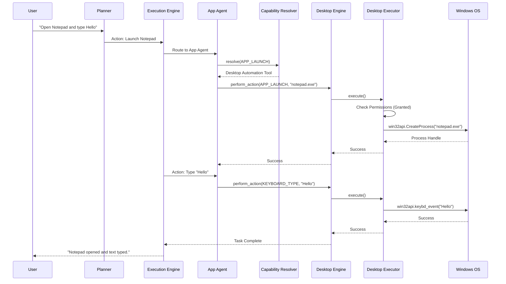
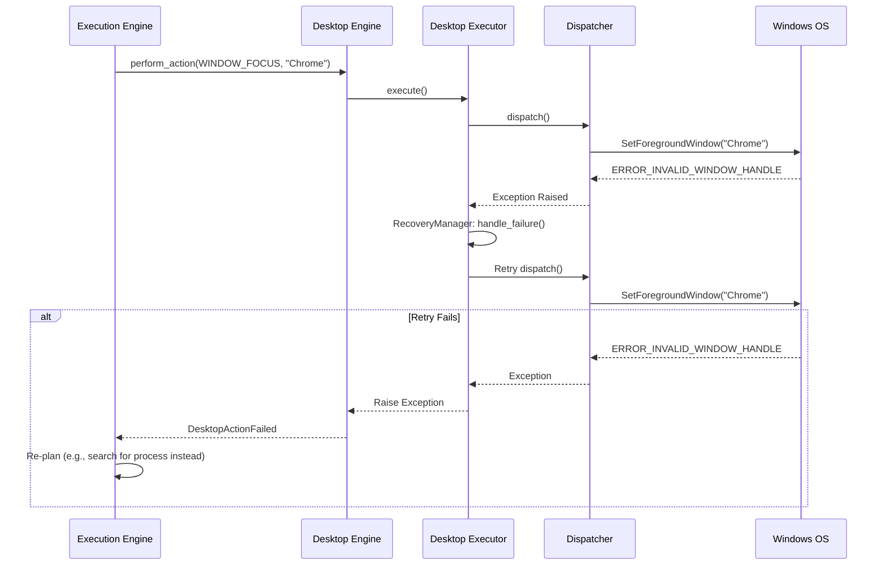
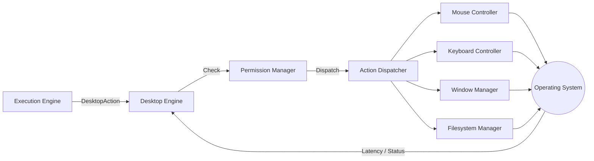

# NOVA Desktop Automation Pipeline

This document visualizes the exact pipeline traversal required to convert an abstract AI plan into a physical change on the user's desktop.

## 1. End-to-End Execution Sequence

## 2. Recovery Pipeline

## 3. Data Flow Diagram

