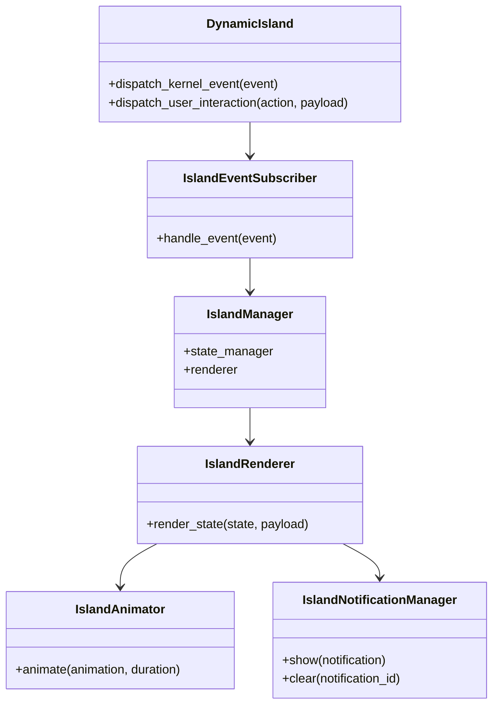
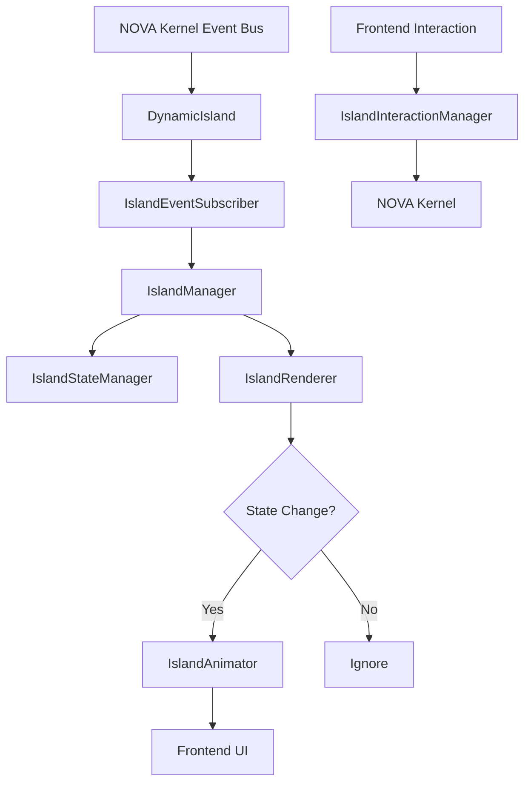
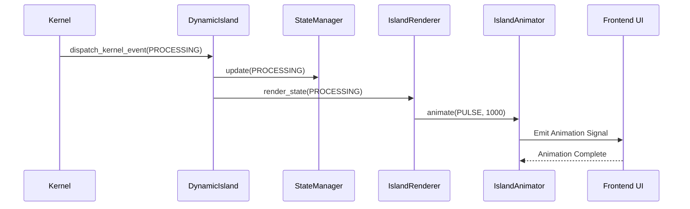
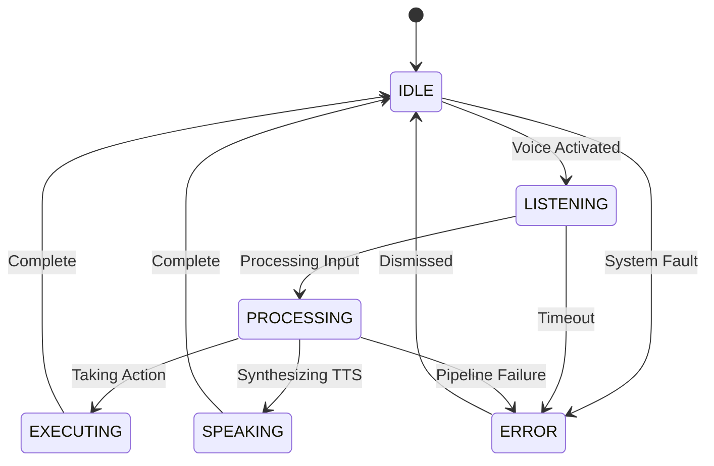

# NOVA Dynamic Island Architecture

## 1. Overview
The NOVA Dynamic Island is the exclusive presentation layer for the AI Operating System. Unlike the core runtime engines, it contains **zero business logic**. It exists solely to subscribe to Kernel events, maintain the UI ViewModel, and orchestrate smooth 60fps visual feedback (animations, widgets, and notifications) to the user.

## 2. Responsibilities
- **Event Subscription:** Listens passively to the NOVA Kernel Event Bus.
- **State Management (MVVM):** Translates raw backend events into a structured ViewModel (`IslandStateManager`).
- **Animation Orchestration:** Maps state transitions (e.g. `IDLE` -> `PROCESSING`) into visual animation triggers (`EXPAND`, `PULSE`, `GLOW`).
- **Notification Handling:** Queues and displays ephemeral alerts (Errors, Successes, System Warnings).
- **User Interaction:** Captures frontend clicks/drags and routes them back to the Kernel (e.g., clicking a "Cancel Action" widget).

## 3. Internal Components
- **DynamicIsland (Core):** Top-level API and event dispatcher.
- **IslandManager:** Wires up the state, animations, and notifications.
- **IslandEventSubscriber:** Listens to incoming system events (`IslandEvent`).
- **IslandStateManager:** Holds the current active state (`IslandStateType`).
- **IslandRenderer:** Translates state changes into UI rendering commands.
- **IslandAnimator:** Controls timing and specific animation types (`IslandAnimationType`).
- **IslandNotificationManager:** Manages the queue of active `IslandNotification` objects.
- **IslandInteractionManager:** Handles incoming signals from the user UI.

## 4. Folder Structure
```text
backend/island/
├── schema.py        # IslandEvent, StateType, AnimationType, Metrics
├── presentation.py  # Renderer, Animator, Notifications, Interactions
├── core.py          # DynamicIsland, Manager, Subscriber, Logger
```

## 5. Mermaid Class Diagram


## 6. Mermaid Flow Diagram


## 7. Mermaid Sequence Diagram


## 8. Mermaid State Diagram


## 9. Dependency Graph
- Depends on: Event Bus (Future integration).
- Consumed by: Frontend UI (React/Tauri).

## 10. Public API
- `DynamicIsland.dispatch_kernel_event(event: IslandEvent)`
- `DynamicIsland.dispatch_user_interaction(action: str, payload: dict)`

## 11. Event Flow
1. Kernel executes business logic.
2. Kernel emits asynchronous `IslandEvent`.
3. Island intercepts event, updates ViewModel.
4. If State changed, Island triggers visual animations.

## 12. Animation System
Animations are fully decoupled from business logic. The backend simply specifies the `IslandAnimationType` (e.g., `MORPH`) and duration; the actual CSS/WebGL rendering is handled strictly by the frontend client to ensure 60fps without GIL blocking.

## 13. Performance Considerations
- Events are processed in `<16ms` to ensure they never block the rendering pipeline.
- Interactions are fire-and-forget.

## 14. Future Improvements
- Widget hot-swapping based on active plugins (e.g., mounting a "Spotify Widget" when the desktop engine controls media).
