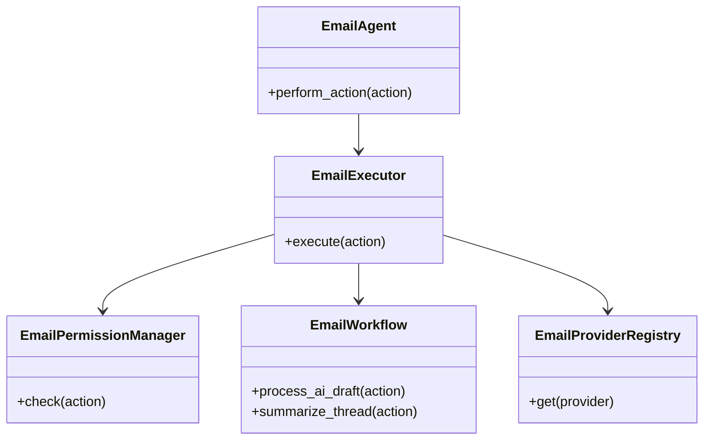
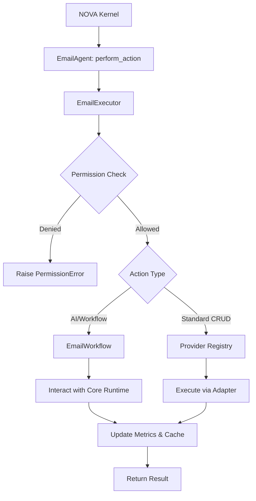
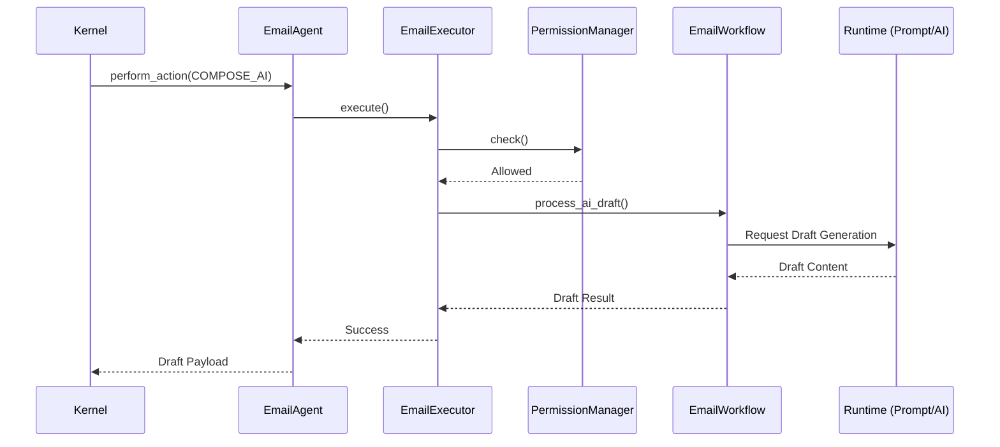
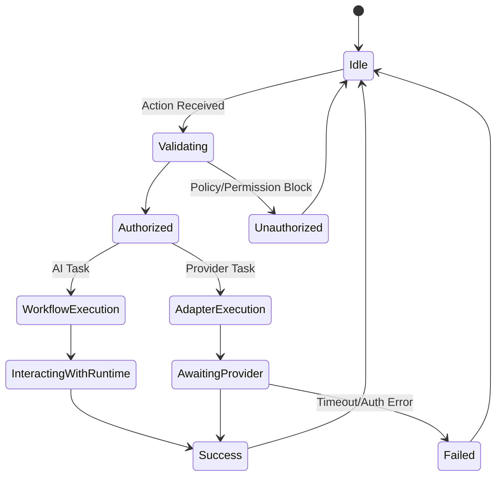

# NOVA Email Agent Architecture

## 1. Overview
The NOVA Email Agent is an intelligent, high-level automation subsystem built on top of the core NOVA AI runtime. It handles reading, sorting, summarizing, and drafting emails. Crucially, it does not duplicate search or LLM capabilities; instead, it orchestrates the `SearchEngine` for local cache lookups and the `PromptEngine`/`ResponseGenerator` for AI features, acting as a specialized client of the runtime.

## 2. Responsibilities
- **Provider Normalization:** Adapts Gmail, Outlook, IMAP, and SMTP APIs into a unified `EmailAction` DTO format.
- **Security & Policies:** Enforces strict permission boundaries (e.g. blocking `SEND` if the agent is configured as `READ_ONLY`) and organization policies (e.g. blocking emails to known malicious domains).
- **AI Orchestration:** Coordinates the summarization of long threads and AI drafting of replies via the existing runtime, rather than implementing custom LLM calls.
- **Action Execution:** Executes standard CRUD operations on email inboxes safely.

## 3. Internal Components
- **EmailAgent (Core):** Top-level API.
- **EmailManager:** Dependency injection container.
- **EmailExecutor:** Handles execution lifecycle, latency tracking, and error bubbling.
- **EmailWorkflow:** Contains business logic for multi-step AI features (Drafting, Summarizing, Threading).
- **EmailPermissionManager:** Validates actions against the configured `EmailPermissionLevel`.
- **EmailPolicy:** Static rules engine for hardcoded blocks (e.g. domain blacklists).
- **EmailCache:** Speeds up frequent thread reads.
- **Adapters:** `GmailAdapter`, `OutlookAdapter`, `IMAPAdapter`, `SMTPAdapter`.

## 4. Folder Structure
```text
backend/email/
├── schema.py        # EmailMessage, EmailAction, Sessions, Metrics
├── adapters.py      # Provider Registry, GmailAdapter, OutlookAdapter
├── workflow.py      # EmailWorkflow, EmailPermissionManager, EmailPolicy
├── core.py          # Agent, Executor, Manager, Cache, Logger
```

## 5. Mermaid Class Diagram


## 6. Mermaid Flow Diagram


## 7. Mermaid Sequence Diagram


## 8. Mermaid State Diagram


## 9. Dependency Graph
- Depends on: Core AI Runtime (Context, Prompt, AI Provider).
- Consumed by: NOVA Kernel.

## 10. Public API
- `EmailAgent.perform_action(action: EmailAction) -> Any`

## 11. Email Workflow
1. Action received as DTO.
2. Verified against `EmailPermissionLevel` (`READ_ONLY`, `COMPOSE`, `SEND`).
3. Verified against `EmailPolicy` (Domain whitelisting/blacklisting).
4. Dispatched to `EmailWorkflow` if an AI task, or directly to an `EmailAdapter` if a standard operation.
5. Metrics logged and Result returned.

## 12. AI Integration
The agent acts as a client to the `PromptEngine`. It constructs the intent (e.g. "Summarize this email chain") and passes it down into the core runtime, ensuring that no raw LLM processing or parsing occurs within the `backend/email` boundary.

## 13. Performance Considerations
- All adapters are fully asynchronous to prevent blocking the kernel while waiting for IMAP servers or OAuth handshakes.
- `avg_read_latency_ms` and `avg_ai_latency_ms` are tracked separately as AI tasks will inherently take orders of magnitude longer than standard API CRUD calls.

## 14. Future Improvements
- Automated inbox sorting (Spam/Priority classification) running as a background task.
- Webhooks for push-based email reception rather than polling.
