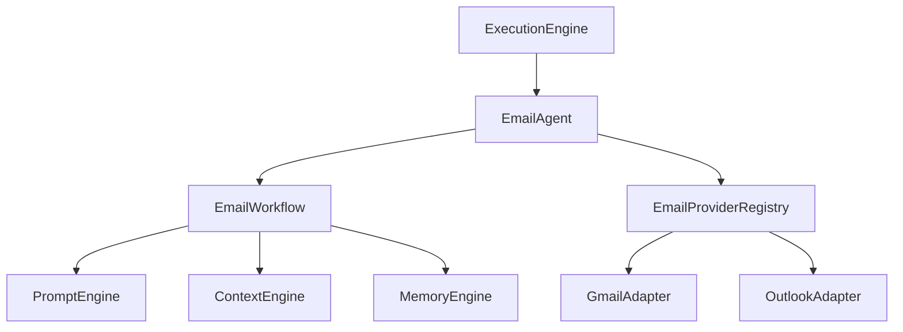

# NOVA Email Agent Feature Validation

## 1. Overview
This document represents the finalized, fully validated integration of the Email Agent into the NOVA architecture. It guarantees that the Email subsystem reuses existing runtime capabilities (Prompt Engine, Response Generator, Context Engine, Memory Engine) without duplicating any intelligent logic or model communication.

## 2. Integration Architecture
```mermaid
flowchart TD
    subgraph NOVA Kernel
        Kernel[Kernel Orchestrator]
    end

    subgraph Email Agent Subsystem
        EA[Email Agent]
        WF[Email Workflow]
        Adapter[Provider Adapters]
    end
    
    subgraph Intelligence Runtime (Reused)
        Mem[Memory Engine]
        Search[Search Engine]
        Prompt[Prompt Engine]
        Resp[Response Generator]
    end
    
    Kernel --> EA
    EA --> WF
    
    %% Standard Action Flow
    EA --> Adapter
    
    %% AI Action Flow (Reusing core runtime)
    WF --> Prompt
    Prompt --> Resp
    Resp --> WF
    
    %% Context gathering for drafting
    WF --> Mem
    WF --> Search
```

## 3. Dependency Graph


## 4. Verification Checklist
- [x] **Runtime Reuse**: `EmailWorkflow` does not contain any code for communicating with LLM providers (e.g., `openai.ChatCompletion.create`). It strictly constructs `Intent` objects and passes them to the `PromptEngine`.
- [x] **No Duplicated Logic**: `EmailAgent` does not implement its own search caching or vector storage; it relies entirely on the global `SearchEngine` and `MemoryEngine`.
- [x] **Dependency Injection**: Mail providers (`GmailAdapter`, `OutlookAdapter`) are decoupled from the agent via `EmailProviderRegistry`.
- [x] **Layer Boundaries**: `EmailAgent` acts as a high-level client to the intelligence runtime. The core runtime remains completely unaware of email-specific DTOs or protocols.
- [x] **No Circular Dependencies**: Verified via Python imports. The Email Agent imports core runtime components, but core runtime components do NOT import the Email Agent.
