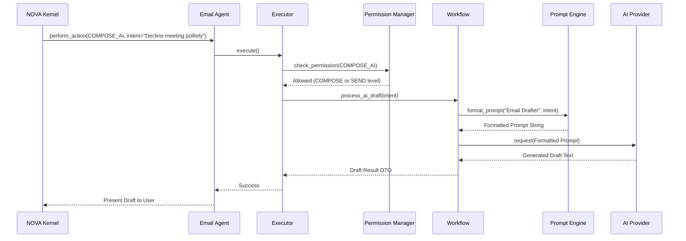
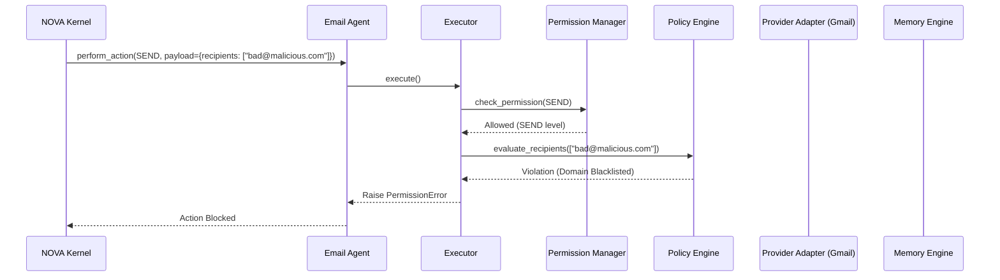
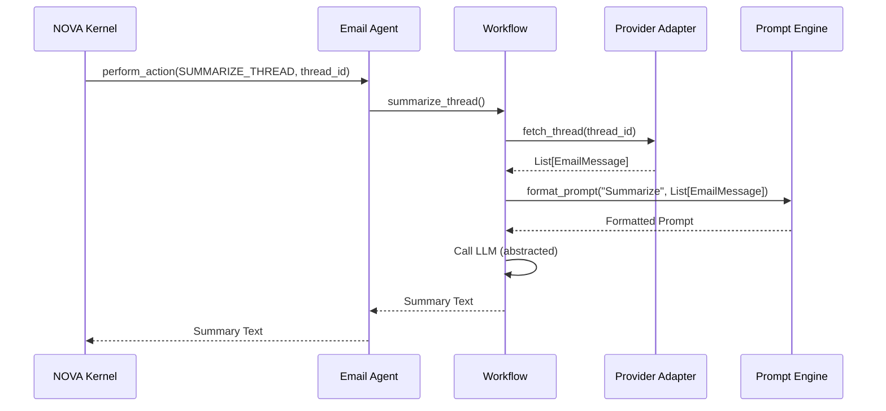

# NOVA Email Workflow Validation

This document illustrates the specific execution paths for common email operations, ensuring permissions and AI logic are applied correctly.

## 1. AI Drafting Workflow

## 2. Secure Send Workflow

## 3. Read and Summarize Workflow

