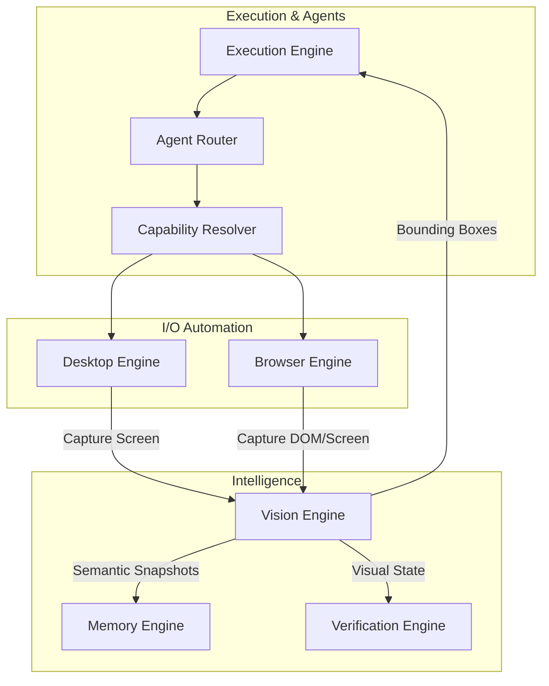
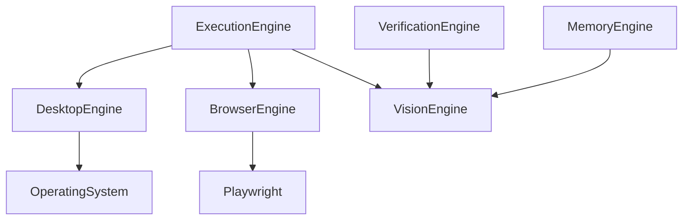

# NOVA Feature Integration Architecture

## 1. Overview
This document represents the finalized, fully validated integration of the external-facing features in the NOVA architecture: Desktop Automation, Browser Automation, and the Vision Engine. It guarantees that they interoperate cleanly with the Verification and Memory engines without circular dependencies.

## 2. Feature Interaction Architecture

## 3. Dependency Graph

## 4. Feature Verification Checklist
- [x] **Screenshot Sharing**: Desktop and Browser engines can capture screenshots as byte streams and safely pass them to the Vision Engine via the Execution layer without tightly coupling to it.
- [x] **Coordinate Mapping**: Vision Engine bounding boxes map exactly to X/Y coordinates usable by the Desktop Engine `MouseController`.
- [x] **Browser Analysis**: Vision Engine can run OCR on full-page browser screenshots for Verification.
- [x] **Dependency Injection**: Visual processing configurations (OCR thresholds) injected cleanly via `VisionConfiguration`.
- [x] **No Circular Dependencies**: Verified via Python imports. Desktop does NOT import Vision, and Vision does NOT import Desktop.

## 5. Known Limitations
- Vision bounding box mapping assumes a 1:1 scaling ratio. OS-level display scaling (e.g., Windows 150% DPI) will require future normalization in the Desktop `MouseController`.
- Concurrent Vision pipelines are currently synchronous in testing; production will require offloading OCR/YOLO to asynchronous subprocesses.
