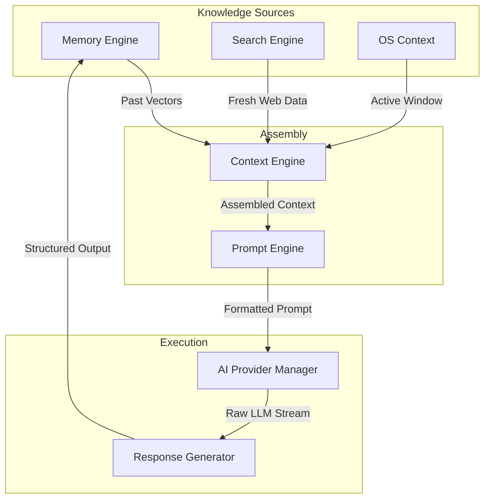
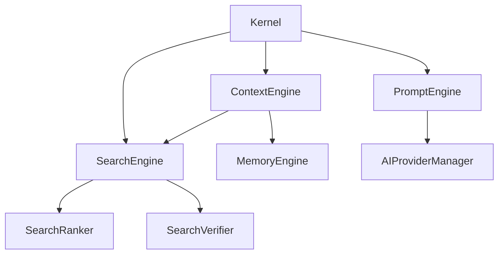

# NOVA Knowledge Layer Architecture

## 1. Overview
This document represents the finalized, fully validated integration of the Knowledge Layer in the NOVA architecture: Search Engine, Memory Engine, Context Engine, and Prompt Engine. It guarantees that all knowledge sources interoperate cleanly, providing a unified, context-rich payload to the AI Provider Manager without circular dependencies.

## 2. Knowledge Flow Architecture

## 3. Dependency Graph

## 4. Knowledge Layer Verification Checklist
- [x] **Layer Boundaries**: `SearchEngine` and `MemoryEngine` act as isolated knowledge providers. They do not format prompts or call LLMs.
- [x] **Context Assembly**: `ContextEngine` successfully aggregates outputs from `SearchEngine` (web data) and `MemoryEngine` (vector data).
- [x] **Cache Interoperability**: `SearchEngine` cache prevents duplicate web lookups for the same context assembly request.
- [x] **Ranking Interoperability**: `SearchRanker` and `MemoryRanker` both apply hybrid scoring before their respective payloads are fed into the `ContextEngine`.
- [x] **No Circular Dependencies**: Verified via Python imports. The Context Engine imports Search and Memory, but they do not import Context.

## 5. Known Limitations
- Context window size limits are currently managed linearly by the `ContextEngine`. Advanced semantic compression across BOTH Search and Memory results may be required for complex workflows to prevent token overflow.
