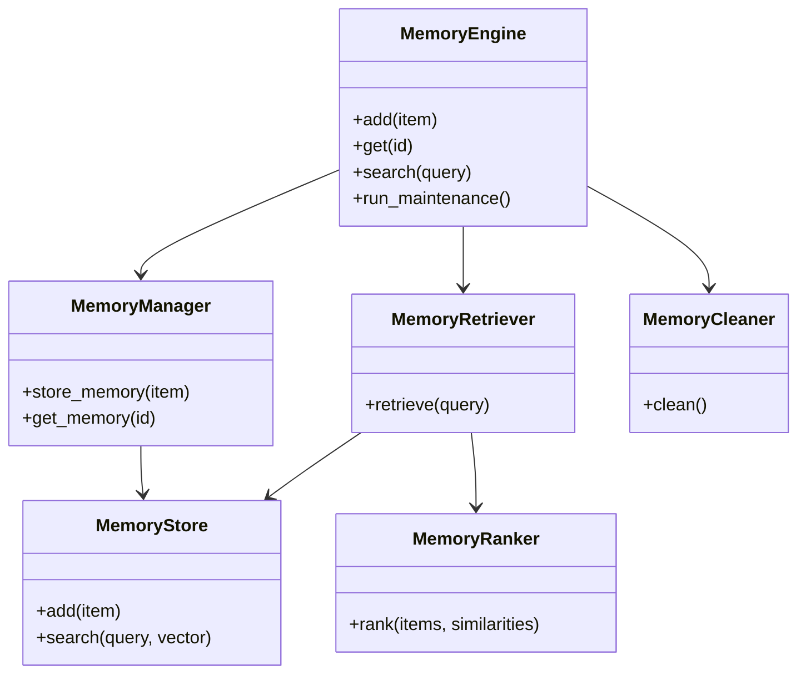
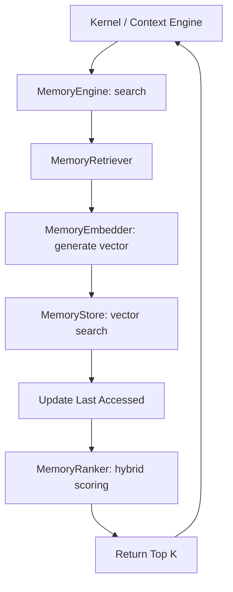
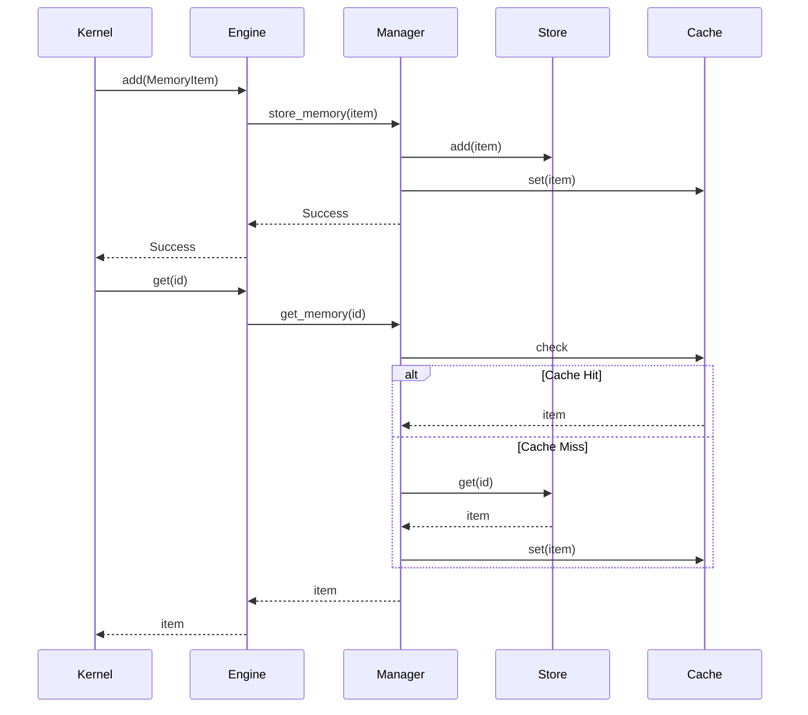
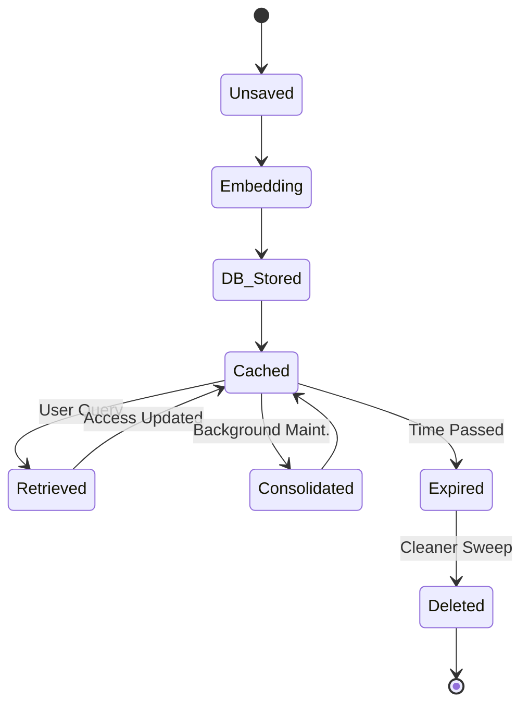

# NOVA Memory Engine Architecture

## 1. Overview
The NOVA Memory Engine is the exclusive subsystem responsible for the lifecycle of all contextual state. It bridges the gap between instantaneous runtime memory (Context Engine) and long-term persistent storage (Vector Database). No other subsystem may directly interact with the vector embeddings or the database layer.

## 2. Responsibilities
- **Storage & Retrieval:** Safely reads, writes, and updates `MemoryItem`s inside the Vector DB.
- **Embedding Generation:** Abstracts the transformation of text into vector representations via `MemoryEmbedder` (e.g., SentenceTransformers, ONNX, or remote APIs).
- **Hybrid Search & Ranking:** `MemoryRetriever` queries the DB, and `MemoryRanker` applies a composite score based on vector similarity, recency decay, and absolute importance.
- **Maintenance (Consolidation & Cleanup):** The `MemoryConsolidator` runs asynchronously to merge overlapping episodic memories, while the `MemoryCleaner` sweeps expired or low-importance fragments based on the `MemoryPolicy`.
- **Caching:** Prevents redundant database hits for frequently accessed memory objects using a fast LRU `MemoryCache`.

## 3. Internal Components
- **MemoryEngine (Core):** The orchestrator and only public interface.
- **MemoryManager:** Internal router handling CRUD operations while syncing state between `MemoryStore` and `MemoryCache`.
- **MemoryStore:** Abstraction over the underlying Vector DB (e.g. ChromaDB) executing the actual KNN nearest-neighbor algorithms.
- **MemoryCache:** Fast, in-memory dictionary.
- **MemoryEmbedder:** Generates `List[float]` vectors from raw string content.
- **MemoryRetriever:** Coordinates the `embed -> search -> update access time -> rank` pipeline.
- **MemoryRanker:** Applies the Hybrid Scoring algorithm `(sim * 0.5) + (recency * 0.3) + (importance * 0.2)`.
- **MemoryConsolidator & Summarizer:** Reduces token load by squashing highly similar nodes into unified semantic clusters.
- **MemoryCleaner:** Enforces `MemoryPolicy` (size limits, time-to-live expirations).
- **MemoryLogger & Metrics:** Captures cache hit rates, DB size, and retrieval latencies.

## 4. Folder Structure
```text
backend/memory/
├── schema.py        # MemoryType, MemoryItem, MemoryQuery, Policy, Metrics
├── store.py         # MemoryStore, MemoryCache
├── embedder.py      # MemoryEmbedder
├── ranker.py        # MemoryRanker
├── retriever.py     # MemoryRetriever
├── consolidator.py  # MemoryConsolidator, MemorySummarizer
├── cleaner.py       # MemoryCleaner
├── core.py          # MemoryEngine, MemoryManager, MemoryLogger
```

## 5. Mermaid Class Diagram


## 6. Mermaid Flow Diagram (Search)


## 7. Mermaid Sequence Diagram


## 8. Mermaid State Diagram (Lifecycle)


## 9. Dependency Graph
- Depends on: Pydantic, Vector DB Driver (future).
- Consumed by: Context Engine, NOVA Kernel.

## 10. Public API
- `MemoryEngine.add(item: MemoryItem)`
- `MemoryEngine.get(memory_id: str) -> Optional[MemoryItem]`
- `MemoryEngine.update(item: MemoryItem)`
- `MemoryEngine.forget(memory_id: str)`
- `MemoryEngine.search(query: MemoryQuery) -> List[MemoryItem]`
- `MemoryEngine.run_maintenance()`

## 11. Memory Lifecycle
1. Generated in runtime (e.g. Conversation Engine captures a user preference).
2. Embedded and stored with an importance score and expiration.
3. Searched later; if retrieved, its `last_accessed_at` is updated, reinforcing its neural weight.
4. If untouched for a long period, it loses recency weight.
5. If it expires, the `MemoryCleaner` purges it automatically.

## 12. Retrieval Pipeline
Text -> Vector -> KNN Search -> Score Normalization -> Recency/Importance Hybrid Ranking -> Top K Slicing.

## 13. Performance Considerations
- Database interactions are async.
- Embeddings should eventually be batched or offloaded to a dedicated local ONNX microservice to prevent blocking the main Python loop.

## 14. Future Improvements
- Integrate actual ChromaDB or Qdrant via a Dockerized sidecar.
- Implement graph-based memory (Neo4j) to track relational hierarchies instead of just vector similarities.
