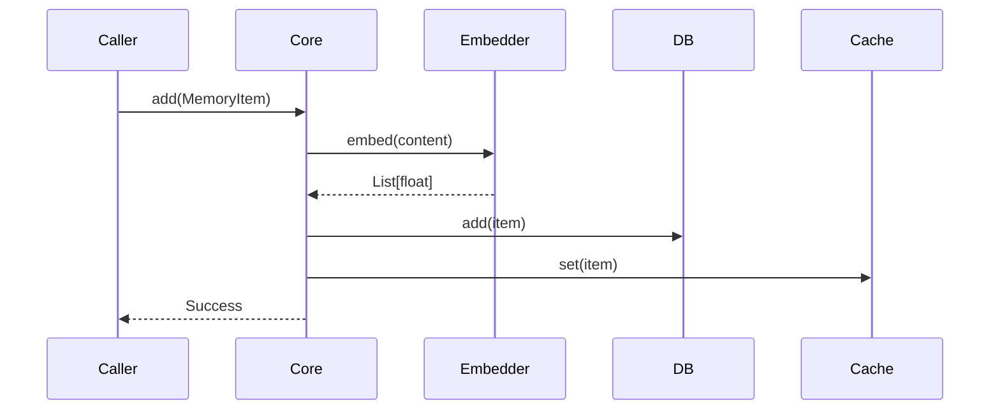
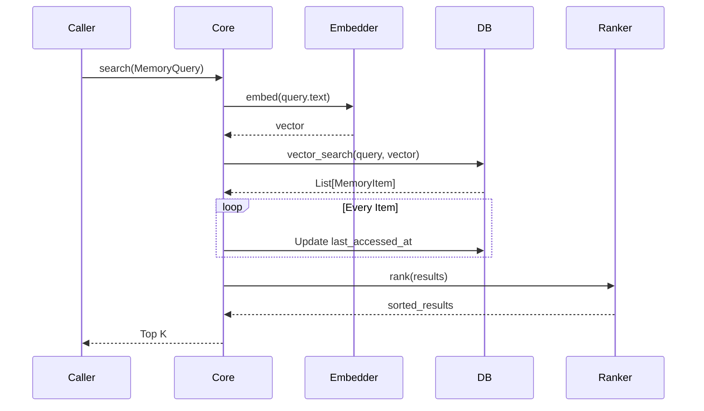
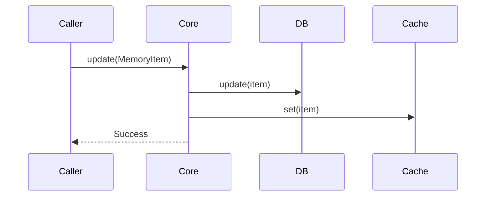
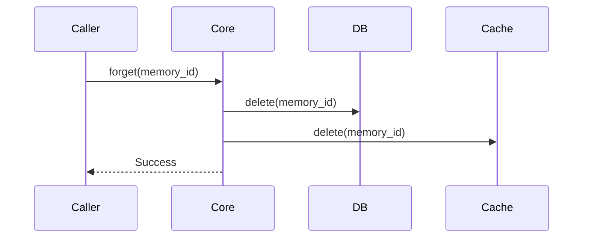
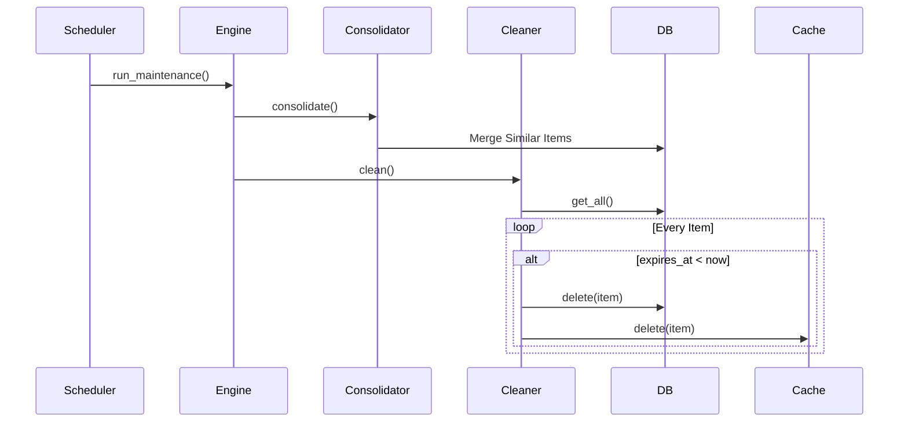
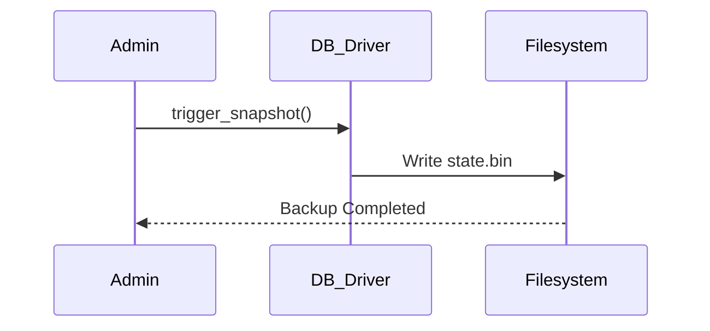
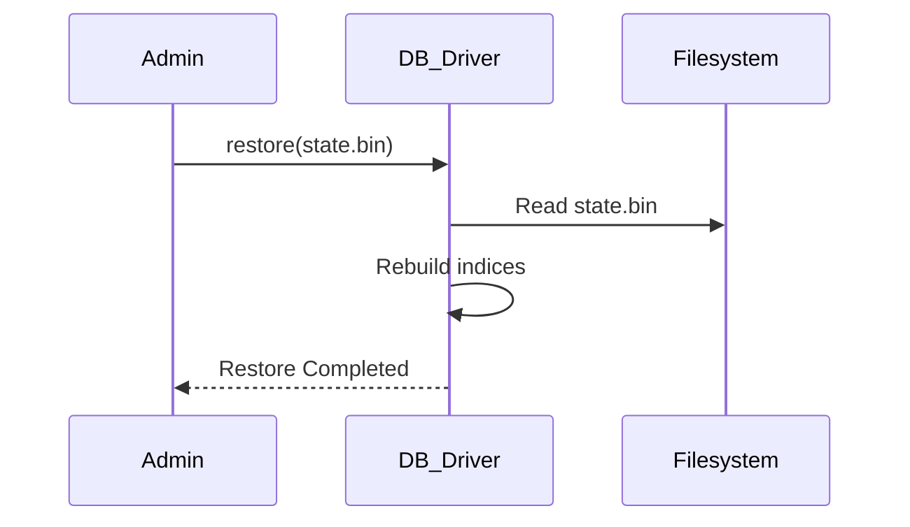

# NOVA Memory Validation Pipelines

This document maps out the specific execution flows for all fundamental CRUD and maintenance operations within the Memory Engine.

## 1. Store Flow

## 2. Retrieve Flow

## 3. Update Flow

## 4. Forget Flow (Manual)

## 5. Background Maintenance Flow (Cleanup)

## 6. Backup Flow (Future/WIP)

## 7. Restore Flow (Future/WIP)

