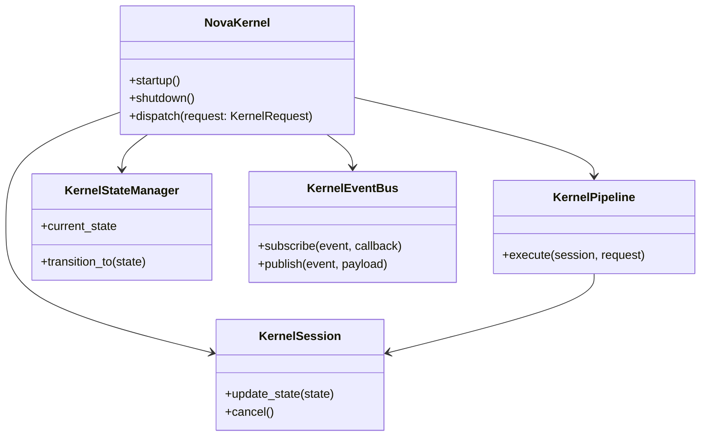
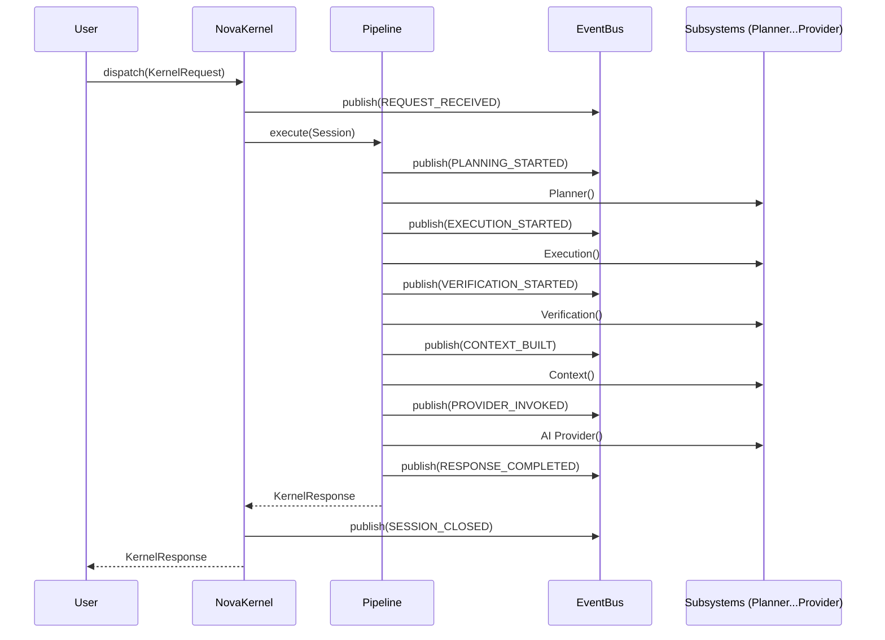
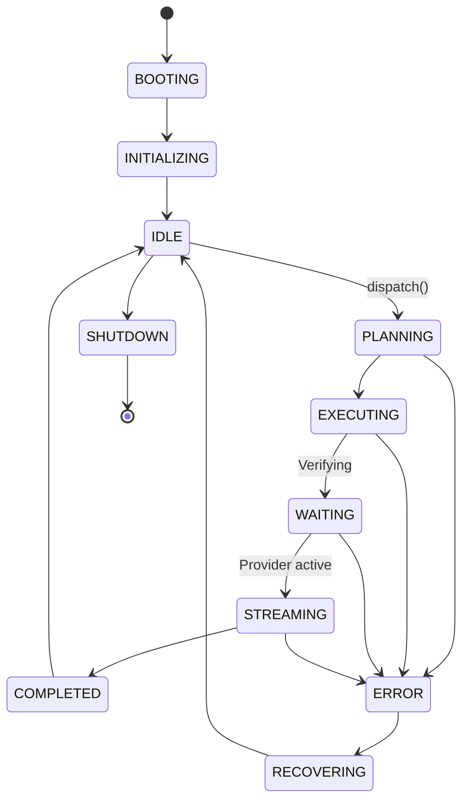

# NOVA Kernel Architecture

## 1. Overview
The NOVA Kernel is the central orchestration unit of the entire AI Runtime. It strictly enforces a monolithic sequence across modular, decoupled subsystems. No subsystem (e.g., Planner, Execution Engine, Context Engine) is permitted to call or orchestrate another subsystem. All cross-component communication and data flow happens through the Kernel.

## 2. Responsibilities
- **Request Ingress & Egress:** Acts as the single entry and exit point for all user requests.
- **Session Management:** Creates and tracks `KernelSession` states, preventing collisions and enabling cancellations.
- **Subsystem Orchestration:** Sequences the runtime pipeline: Planner -> Execution -> Verification -> Context -> Provider.
- **State Management:** Tracks global system health (Booting, Idle, Shutdown) and local session health (Planning, Executing, Error).
- **Concurrency & Rate Limiting:** Enforces `max_concurrent_sessions` to protect local hardware and API quotas.
- **Event Bus:** Publishes lifecycle events (`PLANNING_STARTED`, `ERROR`) that logging / analytics can subscribe to without blocking execution.

## 3. Internal Components
- **NovaKernel (Core):** Bootstraps the application, handles configuration, and exposes the `dispatch()` method.
- **KernelPipeline:** Contains the physical synchronous/asynchronous logic mapping data structures from one subsystem to the next.
- **KernelSession:** Encapsulates the unique UUID, timing, and local state of a specific request.
- **KernelEventBus:** An asynchronous publish/subscribe system decoupling telemetry from the execution path.
- **KernelStateManager:** A strict state machine ensuring illegal transitions (e.g., `Idle` -> `Booting`) are rejected.
- **KernelLogger & KernelMetrics:** Aggregates telemetry across the entire platform.

## 4. Folder Structure
```text
backend/kernel/
├── schema.py        # KernelRequest, KernelResponse, KernelState, Configuration
├── session.py       # KernelSession
├── state.py         # KernelStateManager
├── events.py        # KernelEventBus, KernelEventType
├── pipeline.py      # KernelPipeline
├── core.py          # NovaKernel (Orchestrator)
```

## 5. Mermaid Class Diagram


## 6. Mermaid Flow Diagram
```mermaid
flowchart TD
    A[Incoming Request] --> B[NovaKernel: dispatch()]
    B --> C{Under Concurrency Limit?}
    C -- No --> D[Return Error: Max Sessions]
    C -- Yes --> E[Create KernelSession]
    E --> F[KernelPipeline: execute()]
    
    subgraph Subsystem Orchestration
        F --> G[Planner Engine]
        G --> H[Execution Engine]
        H --> I[Verification Engine]
        I --> J[Context Engine]
        J --> K[AI Provider Manager]
    end
    
    K --> L[Generate KernelResponse]
    L --> M[Publish SESSION_CLOSED Event]
    M --> N[Return Response to User]
```

## 7. Mermaid Sequence Diagram


## 8. Mermaid State Diagram


## 9. Dependency Graph
- Depends on: Pydantic, Python asyncio.
- Consumes: ALL backend subsystems.

## 10. Public API
- `NovaKernel.startup()`
- `NovaKernel.shutdown()`
- `NovaKernel.dispatch(request: KernelRequest) -> KernelResponse`

## 11. Session Lifecycle
1. Session UUID created on `dispatch()`.
2. Passed mutably through the `KernelPipeline`.
3. Checked for `is_cancelled` booleans between each subsystem leap.
4. Cleaned up aggressively in the `finally` block of the dispatch method, ensuring no ghost sessions leak memory.

## 12. Design Decisions
- **Event Bus Decoupling:** Logging and telemetry occur completely asynchronously via the Event Bus, ensuring I/O blocking loggers do not slow down the AI generation path.
- **Strict Orchestration:** Subsystems literally have no code imports for each other (e.g. Planner does not import Executor). The `KernelPipeline` imports all of them and acts as the bridge.

## 13. Performance Considerations
- `asyncio.wait_for` is used at the root level. If the entire pipeline takes longer than `timeout_seconds` (e.g., 300s), the kernel forcefully abandons the task to prevent deadlocks.

## 14. Failure Recovery
- When a subsystem throws a fatal error, it is caught in `pipeline.execute()`. The state transitions to `ERROR`, an event is emitted, and a `KernelResponse` with a clean error string is immediately bounced back to the User/UI without crashing the backend thread.

## 15. Future Improvements
- **Persistent Sessions:** Save `KernelSession` state to SQLite so that if the desktop application crashes, the AI can resume its exact location in the execution pipeline upon reboot.
