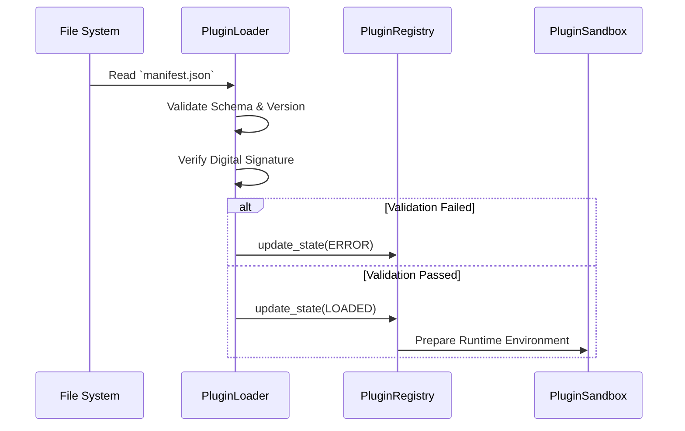
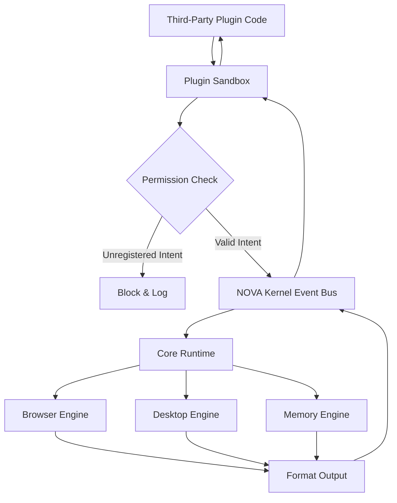

# NOVA Plugin Ecosystem

This document visualizes the journey of a third-party plugin integrating into the NOVA AI Runtime, highlighting the strict sandbox enforcement.

## 1. Plugin Load Ecosystem

## 2. Plugin Execution Ecosystem

