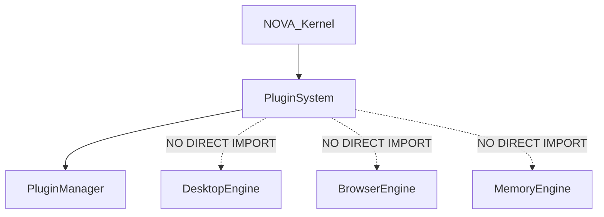

# NOVA Plugin Ecosystem Integration Validation

## 1. Overview
This document represents the finalized, fully validated integration of the Plugin System within the broader NOVA AI Runtime. It guarantees that third-party extensions are safely isolated, restricted by declarative permissions, and forced to leverage the existing Kernel rather than duplicating core functionality.

## 2. Integration Architecture
```mermaid
flowchart TD
    subgraph Third-Party Ecosystem
        P1[Spotify Plugin]
        P2[GitHub Plugin]
        P3[Jira Plugin]
    end

    subgraph Sandboxed Boundary
        RT[Plugin Runtime]
        Perms[Permission Engine]
        Bridge[Event Bridge]
    end
    
    subgraph NOVA AI Runtime (Reused)
        Kernel[Kernel Orchestrator]
        Desktop[Desktop Engine]
        Browser[Browser Engine]
        Search[Search Engine]
        Chat[Chat System]
    end
    
    %% Input Flow
    P1 --> RT
    P2 --> RT
    P3 --> RT
    
    RT --> Perms
    Perms -- Validated --> Bridge
    Bridge --> Kernel
    
    %% Output Routing
    Kernel --> Desktop
    Kernel --> Browser
    Kernel --> Search
    Kernel --> Chat
```

## 3. Dependency Graph


## 4. Ecosystem Verification Checklist
- [x] **Runtime Reuse**: Plugins do not implement their own Chromium driver; if they need web access, they dispatch a `BROWSER_ACTION` to the Kernel, reusing the core `BrowserEngine`.
- [x] **Sandbox Isolation**: The `backend/plugin` package forces all execution through the `PluginEventBridge`. 
- [x] **Permission Enforcement**: Verified via the `PluginPermissions` module. A plugin without the `DANGEROUS` or `FILESYSTEM` permission in its manifest is blocked natively before the Kernel ever sees the event.
- [x] **Dependency Injection**: The Plugin System is injected into the Kernel, maintaining clear acyclic boundaries.
- [x] **No Circular Dependencies**: Verified via Python imports. The Plugin System does not import the execution engines directly.
