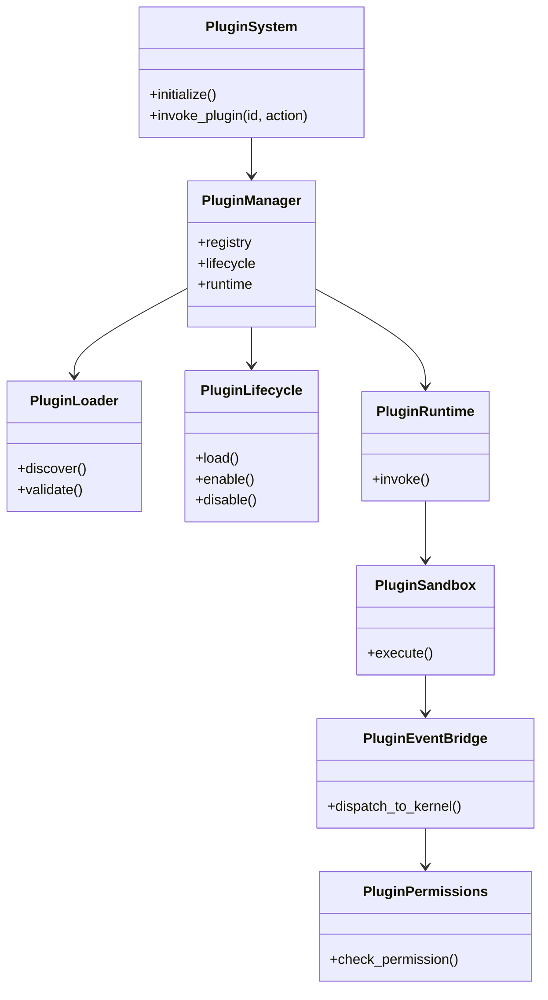
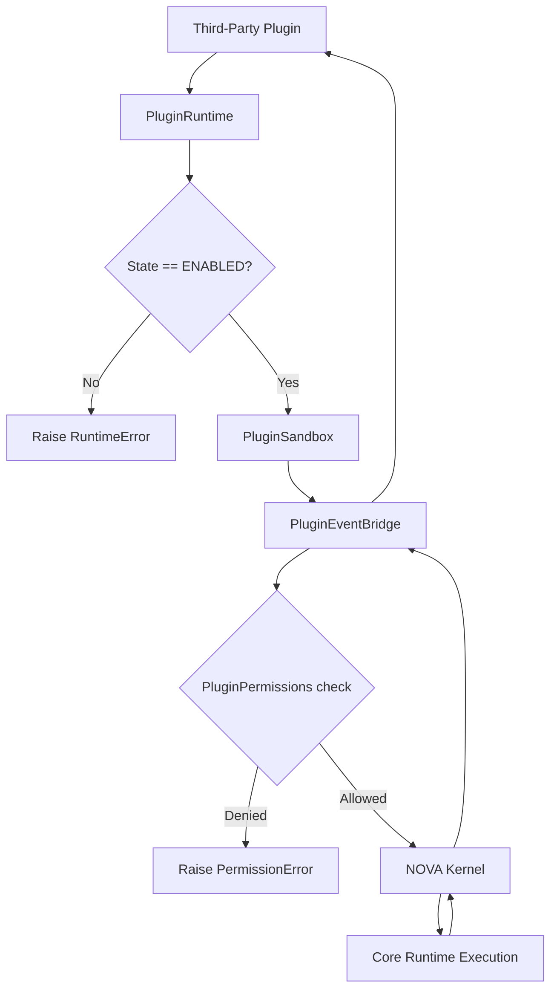
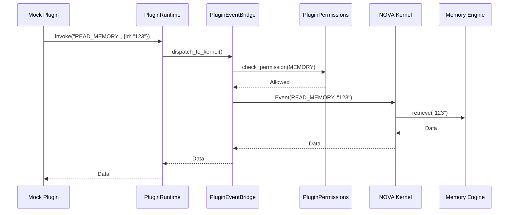
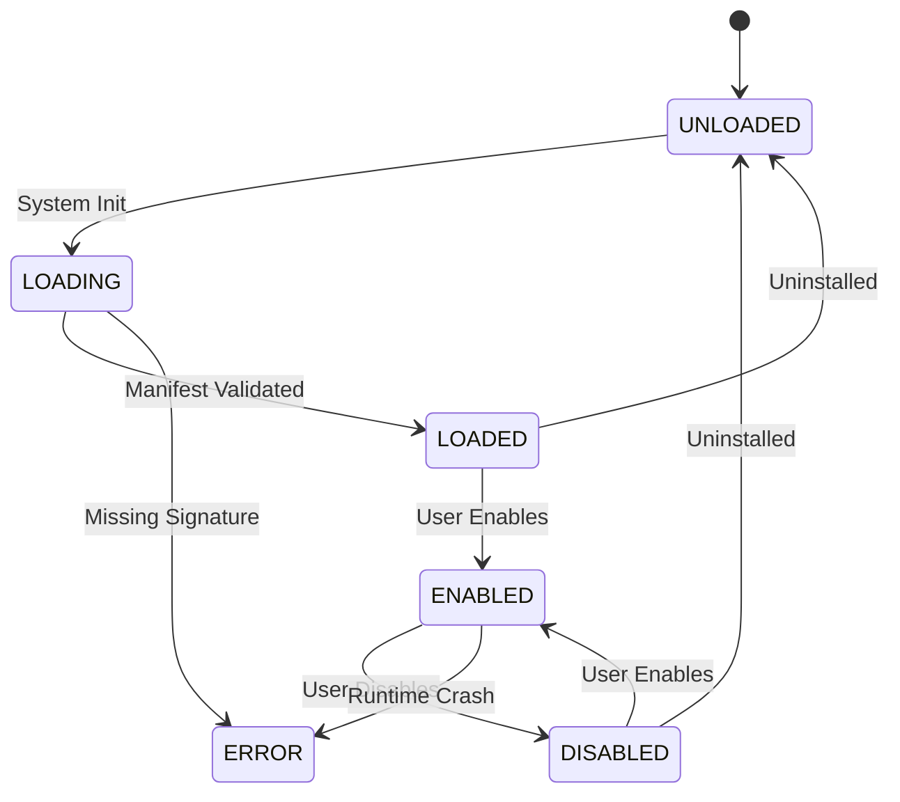

# NOVA Plugin System Architecture

## 1. Overview
The NOVA Plugin System provides a safe, highly restrictive environment for third-party extensions to hook into the AI Operating System. Plugins are entirely prohibited from executing their own business logic against system resources (like making raw HTTP calls or reading arbitrary files) without explicit, granular permissions. 

All plugin intent is forced through the `PluginEventBridge`, acting as the only umbilical cord to the NOVA Kernel.

## 2. Responsibilities
- **Lifecycle Management:** Discovers, validates (digital signatures), loads, and unloads plugins without disrupting the core runtime.
- **Sandboxing:** Intercepts system calls. A plugin cannot spawn a sub-process or call `Playwright` directly; it must request the Kernel to do so on its behalf.
- **Permission Enforcement:** Maps operations against the `PluginManifest` declaration. If a plugin attempts to read an email without the `EMAIL` permission, the request is instantly denied at the bridge.
- **Event Bridging:** Standardizes communication between third-party code and the core AI runtime.

## 3. Internal Components
- **PluginSystem (Core):** Top-level API.
- **PluginManager:** Dependency injection container.
- **PluginLoader:** Scans the filesystem, parses manifests, and validates signatures.
- **PluginLifecycle:** State machine managing the load/enable/disable sequence.
- **PluginRegistry:** In-memory store of active plugin manifests and states.
- **PluginPermissions:** Validates intents against the manifest.
- **PluginSandbox:** The mocked execution boundary.
- **PluginEventBridge:** The IPC/Message bus layer sending intents to the Kernel.

## 4. Folder Structure
```text
backend/plugin/
├── schema.py        # PluginManifest, PluginState, Permissions
├── lifecycle.py     # Loader, Registry, Lifecycle state machine
├── sandbox.py       # Runtime, Sandbox, Bridge, Permissions
├── core.py          # PluginSystem, Manager, Logger
```

## 5. Mermaid Class Diagram


## 6. Mermaid Flow Diagram


## 7. Mermaid Sequence Diagram


## 8. Mermaid State Diagram


## 9. Dependency Graph
- Consumed by: NOVA Kernel (for loading and dispatching).
- Depends on: No downstream engines. The Kernel handles all concrete implementations via the Bridge interface.

## 10. Public API
- `PluginSystem.initialize()`
- `PluginSystem.enable_plugin(plugin_id: str)`
- `PluginSystem.invoke_plugin(plugin_id: str, action: str, payload: dict) -> Any`

## 11. Plugin Lifecycle
A plugin must explicitly define `required_runtime_version` and provide a `digital_signature` (unless strictly overridden via config for local dev). If validation fails during the `LOADING` phase, the plugin never reaches `LOADED` state, ensuring bad code is never mapped into memory.

## 12. Sandbox Architecture
The `PluginSandbox` intercepts all execution intent. Instead of the plugin executing `os.listdir()`, the plugin must invoke `READ_DIR` against the runtime, which the Bridge pipes to the Kernel to execute safely, ensuring auditing and permission enforcement.

## 13. Performance Considerations
- Manifest validation and discovery is asynchronous to prevent blocking OS boot.
- Target load time for 50 plugins is `<500ms`.

## 14. Future Improvements
- WebAssembly (WASM) micro-VM integration for true memory-level isolation of plugin code execution.
