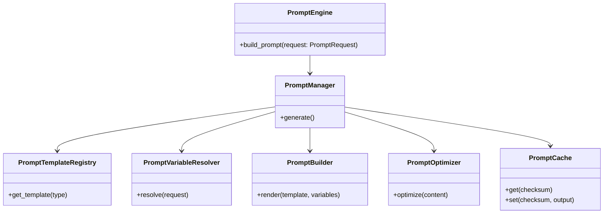
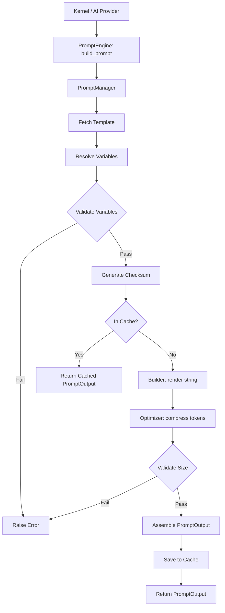
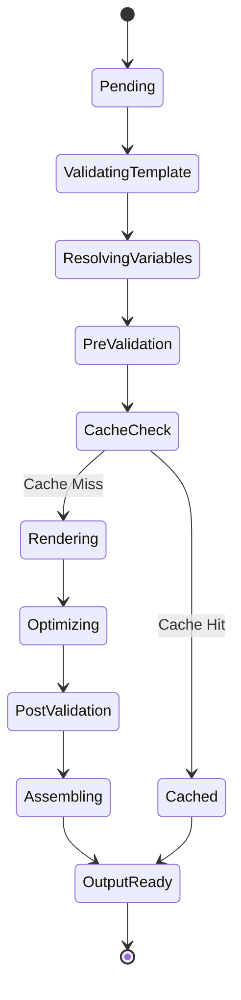

# NOVA Prompt Engine Architecture

## 1. Overview
The NOVA Prompt Engine is the strict gatekeeper and sole constructor for all prompts sent to any AI Provider (Gemini, OpenRouter, Ollama). No other subsystem is permitted to concatenate, build, or manipulate raw LLM strings. The engine ensures that every prompt is deterministic, modular, traceable, and configurable through strongly-typed templates and variables.

## 2. Responsibilities
- **Template Management:** Registers, versions, and loads specific prompt templates (e.g., Planning vs. Verification).
- **Variable Resolution:** Dynamically maps structured Context Packages, conversation history, and system metadata into the template's required variables.
- **Validation:** Enforces token limits (Policy) and ensures no required template variables are missing before rendering.
- **Optimization:** Compresses strings (stripping excess whitespace/newlines) to save tokens and improve inference speed.
- **Caching:** Hashes rendered prompts using SHA-256 to prevent redundant provider generation for identical state transitions.
- **Audit Logging:** Logs the Prompt ID, Token Estimate, and Target Provider for observability.

## 3. Internal Components
- **PromptEngine (Core):** Bootstraps the subsystem, loads default templates, and handles metric updates.
- **PromptManager:** Orchestrates the internal flow from template retrieval -> resolution -> validation -> rendering -> optimization -> assembly -> caching.
- **PromptTemplateRegistry:** Maintains the catalog of available templates keyed by `PromptType`.
- **PromptVersionManager:** Tracks active vs deprecated versions of specific templates.
- **PromptVariableResolver:** Extracts fields from the `KernelRequest` and `ContextPackage`.
- **PromptBuilder:** Safely formats the template string with the resolved variables.
- **PromptOptimizer & PromptCompressor:** Applies token-saving regular expressions.
- **PromptValidator:** Cross-checks variables against `PromptPolicy` limits.
- **PromptAssembler:** Bundles the final payload into a rich `PromptOutput` DTO.
- **PromptCache:** In-memory LRU storage mapping SHA-256 checksums to finalized PromptOutputs.

## 4. Folder Structure
```text
backend/prompt/
├── schema.py        # PromptType, PromptTemplate, PromptRequest, PromptOutput
├── template.py      # Registry, Loader, VersionManager
├── resolver.py      # VariableResolver
├── validator.py     # Validator, Policy
├── builder.py       # Builder, Assembler
├── optimizer.py     # Optimizer, Compressor
├── cache.py         # PromptCache
├── core.py          # PromptEngine (Orchestrator)
```

## 5. Mermaid Class Diagram


## 6. Mermaid Flow Diagram


## 7. Mermaid Sequence Diagram
```mermaid
sequenceDiagram
    participant Caller
    participant Core as Engine/Manager
    participant Reg as Registry
    participant Res as Resolver
    participant Bld as Builder
    participant Opt as Optimizer
    participant Asm as Assembler

    Caller->>Core: build_prompt(PromptRequest)
    Core->>Reg: get_template(prompt_type)
    Reg-->>Core: PromptTemplate
    
    Core->>Res: resolve(request)
    Res-->>Core: Variables Dict
    
    Core->>Core: Check Cache
    
    Core->>Bld: render(template, variables)
    Bld-->>Core: raw_rendered_string
    
    Core->>Opt: optimize(raw_rendered_string)
    Opt-->>Core: compressed_string
    
    Core->>Asm: assemble(...)
    Asm-->>Core: PromptOutput
    
    Core->>Core: Set Cache
    Core-->>Caller: PromptOutput
```

## 8. Mermaid State Diagram


## 9. Dependency Graph
- Depends on: Context Engine (schemas), Logger, Asyncio.
- Consumed by: AI Provider Manager.

## 10. Public API
- `PromptEngine.build_prompt(request: PromptRequest) -> PromptOutput`

## 11. Prompt Lifecycle
1. Request originates mapped to a specific `PromptType`.
2. Required template is located.
3. System metadata (time), Context (history, memory), and custom overrides are mapped.
4. Rendered output is stripped of token-heavy formatting and validated against LLM constraints.

## 12. Design Decisions
- **Deterministic Checksums:** A unique SHA-256 hash is generated based on the template ID and sorted variable arguments *before* rendering. This ensures O(1) cache hits for repeating logic loops without needing to parse giant strings.

## 13. Performance Considerations
- The engine uses native Python string `.format()` for speed. `re` based compression is run post-render which is $O(N)$ on the size of the final string.

## 14. Future Improvements
- Integrate Jinja2 for complex `` conditional blocks and dynamic looping over array variables within the PromptTemplate itself.
