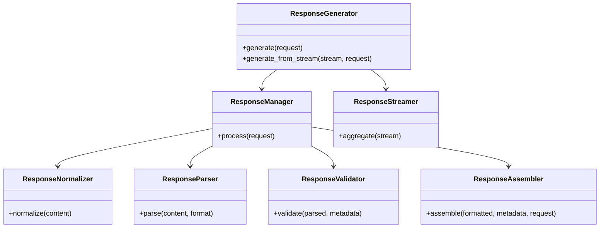
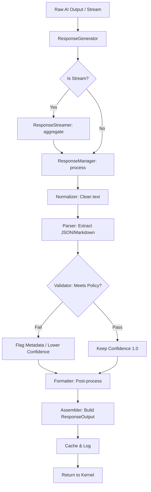
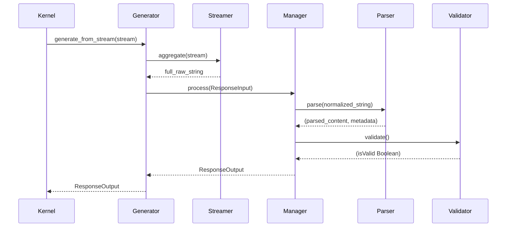
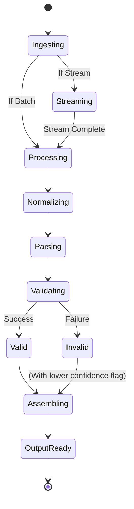

# NOVA Response Generator Architecture

## 1. Overview
The NOVA Response Generator is the final subsystem in the AI Runtime pipeline. It receives raw LLM string outputs from the AI Provider Manager and sanitizes, normalizes, parses, and structures them into highly typed `ResponseOutput` objects. This subsystem guarantees that no malformed provider hallucinations leak into downstream components (e.g. Memory Engine, Planner, UI).

## 2. Responsibilities
- **Streaming Aggregation:** Accumulates asynchronous token streams into cohesive chunks for real-time or batched processing.
- **Normalization:** Cleanses trailing whitespaces, normalizes line endings (`\r\n` -> `\n`), and prepares data for parsing.
- **Parsing & Extraction:** Naively attempts to strip markdown block wrappers (e.g., ` ```json `) to extract target data structures (like pure JSON).
- **Validation:** Enforces strict compliance with requested formats (e.g. If the task required JSON but the model output plaintext, validation flags the confidence score).
- **Metadata Bundling:** Enriches the final object with original provider data, token estimates, validation flags, and SHA-256 checksums.
- **Caching:** Maps identical raw Provider outputs to the same structured objects, avoiding redundant parsing operations on retries.

## 3. Internal Components
- **ResponseGenerator (Core):** Orchestrates the synchronous batch processing or asynchronous stream processing entry points.
- **ResponseManager:** Executes the internal pipeline (Normalize -> Parse -> Validate -> Format -> Assemble -> Cache).
- **ResponseStreamer:** An async generator wrapper that reliably consumes and aggregates token streams.
- **ResponseNormalizer:** A string manipulation utility for foundational cleanup.
- **ResponseParser:** A deterministic data extractor. Currently supports naive JSON block extraction.
- **ResponseValidator & Policy:** A rules engine dictating what is an acceptable outcome versus a recoverable failure.
- **ResponseFormatter:** A post-processing utility to inject formatting tags (UI-specific) if needed.
- **ResponseAssembler:** Constructs the final `ResponseOutput` Pydantic model.
- **ResponseCache:** In-memory dictionary mapped to the SHA-256 of the raw content + request parameters.
- **ResponseAuditLogger & Metrics:** Collects telemetry (confidence scores, validation failures) for dashboarding.

## 4. Folder Structure
```text
backend/response/
├── schema.py        # ResponseType, ResponseFormat, ResponseInput, ResponseOutput
├── streamer.py      # ResponseStreamer
├── normalizer.py    # ResponseNormalizer
├── parser.py        # ResponseParser
├── validator.py     # ResponseValidator, ResponsePolicy
├── formatter.py     # ResponseFormatter
├── builder.py       # ResponseAssembler
├── cache.py         # ResponseCache
├── core.py          # ResponseGenerator (Orchestrator)
```

## 5. Mermaid Class Diagram


## 6. Mermaid Flow Diagram


## 7. Mermaid Sequence Diagram


## 8. Mermaid State Diagram


## 9. Dependency Graph
- Depends on: Pydantic, Python asyncio.
- Consumed by: NOVA Kernel.

## 10. Public API
- `ResponseGenerator.generate(request: ResponseInput) -> ResponseOutput`
- `ResponseGenerator.generate_from_stream(stream: AsyncGenerator, request: ResponseInput) -> ResponseOutput`

## 11. Response Lifecycle
1. The AI Provider streams/returns raw text.
2. The Kernel wraps it in a `ResponseInput` and hands it to the `ResponseGenerator`.
3. Extraneous Markdown (hallucinated ` ```json ` blocks) are stripped.
4. If strict JSON is required but broken, confidence is set to `0.0`, triggering the Execution Engine's retry logic.
5. Structured data is shipped back to the Kernel for final UI/Memory dispatch.

## 12. Design Decisions
- **Fault-Tolerant Parsing:** A failed JSON parse does not throw a fatal Python exception. It gracefully sets a flag (`validation_failed=True`) allowing the broader orchestrator to decide if it wants to retry the AI prompt, rather than crashing the runtime.

## 13. Performance Considerations
- The string `re` operations and JSON parsing happen in-memory synchronously. For massive context windows, this is highly efficient.

## 14. Future Improvements
- Implement a JSON-repair fallback mechanism for slightly malformed JSON outputs.
