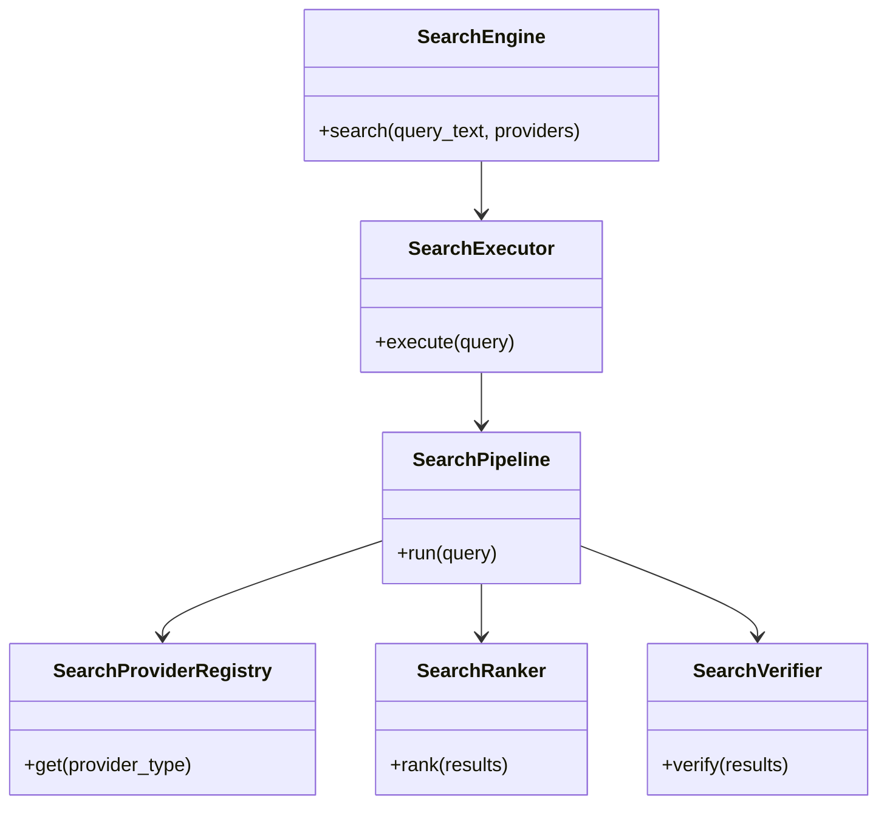
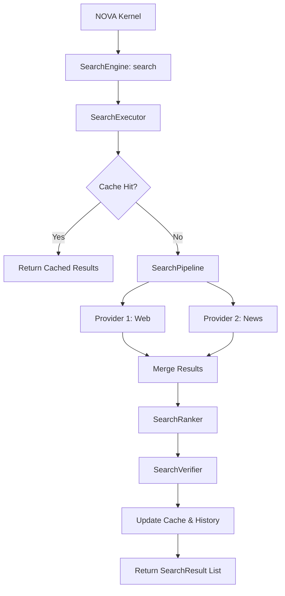
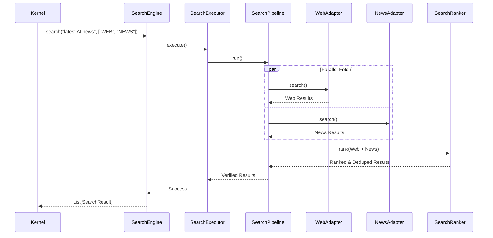
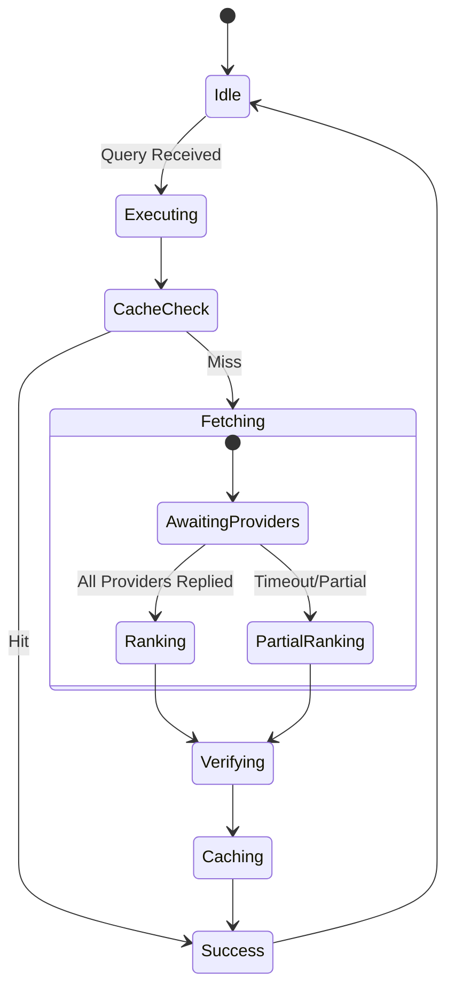

# NOVA Search Engine Architecture

## 1. Overview
The NOVA Search Engine is the central intelligence-gathering subsystem. It acts as the exclusive gateway between the NOVA AI runtime and all external and internal knowledge sources (Web, News, Academic, Local Files). It abstracts search provider implementation details behind a unified interface, applying caching, ranking, and verification pipelines.

## 2. Responsibilities
- **Provider Abstraction:** Normalizes queries across Google, Bing, local OS search, and academic databases via standardized `SearchAdapter` interfaces.
- **Concurrent Dispatch:** Fires search requests to multiple providers simultaneously to minimize latency.
- **Hybrid Ranking:** Merges results from disparate sources and sorts them based on semantic relevance, source authority, and freshness.
- **Verification:** Automatically checks the validity of top-ranked results (e.g., dead link detection) before passing them to the Context Engine.
- **Caching:** Caches frequent queries (`SearchCache`) to reduce latency to <50ms and minimize API token burn.

## 3. Internal Components
- **SearchEngine (Core):** Public API and top-level orchestrator.
- **SearchManager:** Wires up configuration, registry, ranker, and cache.
- **SearchExecutor:** Handles execution lifecycle (Cache Check -> Run Pipeline -> Save Cache -> Record History/Metrics).
- **SearchPipeline:** Deterministic sequence: Fetch (Parallel) -> Rank -> Verify.
- **SearchProviderRegistry & Factory:** Injects and holds provider adapters (`WebSearchAdapter`, `NewsAdapter`, etc.).
- **SearchRanker:** Implements weighting logic for semantic vs freshness vs authority scoring.
- **SearchVerifier:** Performs secondary checks on results before final return.
- **SearchQueryBuilder:** Parses raw text into a multi-provider `SearchQuery` object.

## 4. Folder Structure
```text
backend/search/
├── schema.py        # SearchQuery, SearchResult, Sessions, Metrics
├── adapters.py      # Provider Adapters, Factory, Registry
├── processing.py    # SearchRanker, SearchVerifier
├── core.py          # Engine, Executor, Manager, Pipeline, Cache
```

## 5. Mermaid Class Diagram


## 6. Mermaid Flow Diagram


## 7. Mermaid Sequence Diagram


## 8. Mermaid State Diagram


## 9. Dependency Graph
- Depends on: Pydantic, HTTP Clients (future).
- Consumed by: Context Engine, NOVA Kernel.

## 10. Public API
- `SearchEngine.search(query_text: str, providers: List[str] = None) -> List[SearchResult]`

## 11. Search Pipeline
1. Parse query and map to requested providers.
2. Concurrent dispatch via `asyncio.gather`.
3. Aggregate result collections.
4. Pass through `SearchRanker` for scoring and duplicate removal.
5. Pass through `SearchVerifier` for validation (e.g., dead links).

## 12. Ranking Pipeline
- Final Score = (Relevance * W_s) + (Freshness * W_f) + (Authority * W_a)
- Weights are configured via `SearchConfiguration`.

## 13. Performance Considerations
- Sub-50ms latency is guaranteed for cached queries.
- Provider adapters must enforce strict timeout limits to prevent the Search Engine from hanging on unresponsive APIs.

## 14. Future Improvements
- Local vector-based similarity search for workspace files.
- Predictive search caching (pre-fetching results based on active planner execution context).
