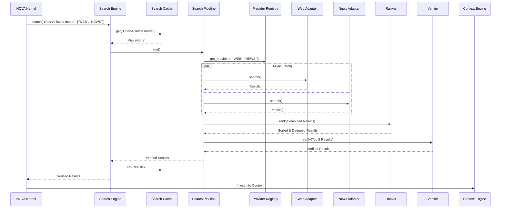
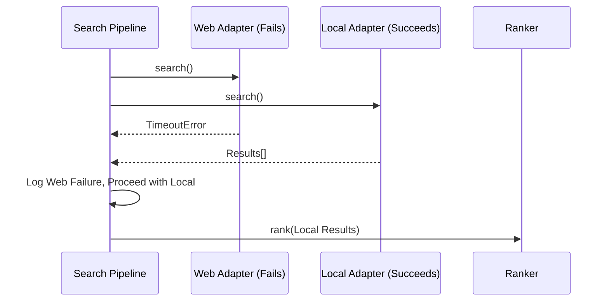

# NOVA Search Pipeline Validation

This document illustrates the execution flow for translating raw search queries into verified, ranked knowledge for the Context Engine.

## 1. End-to-End Search Execution Sequence

## 2. Failover and Timeout Flow

## 3. Data Flow Diagram

