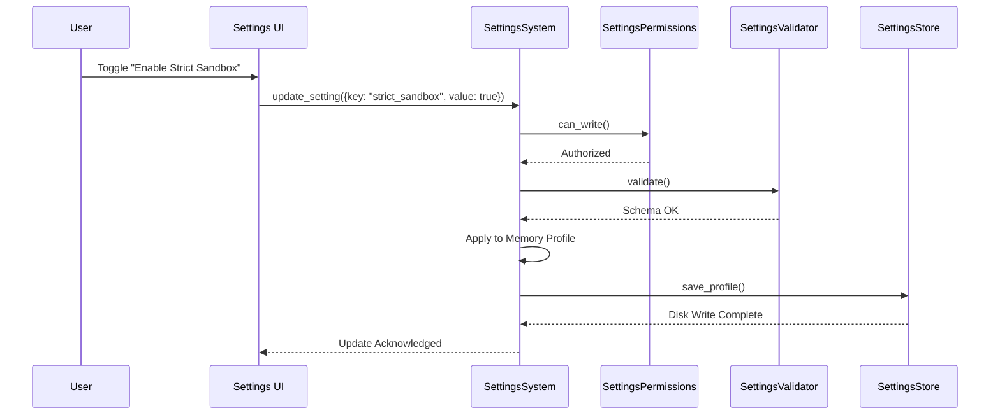
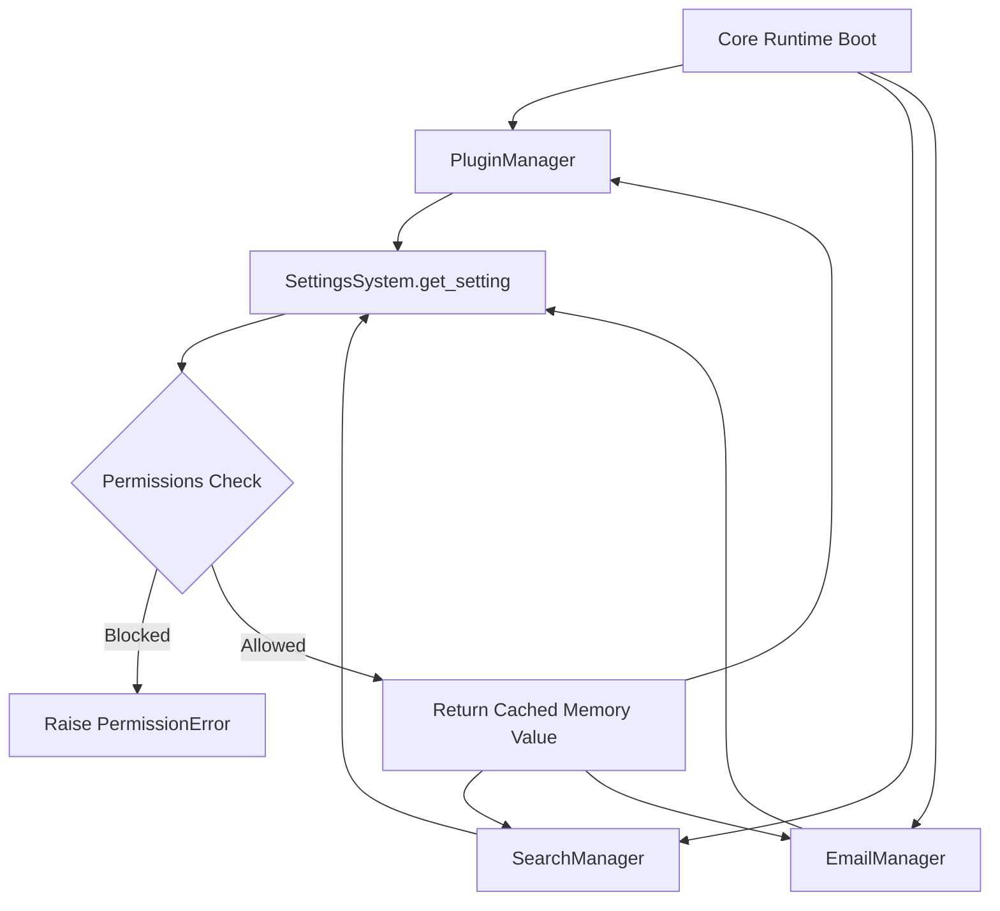

# NOVA Settings Pipeline

This document visualizes how configuration flows from a User UI update down into the central store, and how runtime modules fetch it.

## 1. UI Update Pipeline

## 2. Runtime Retrieval Pipeline

