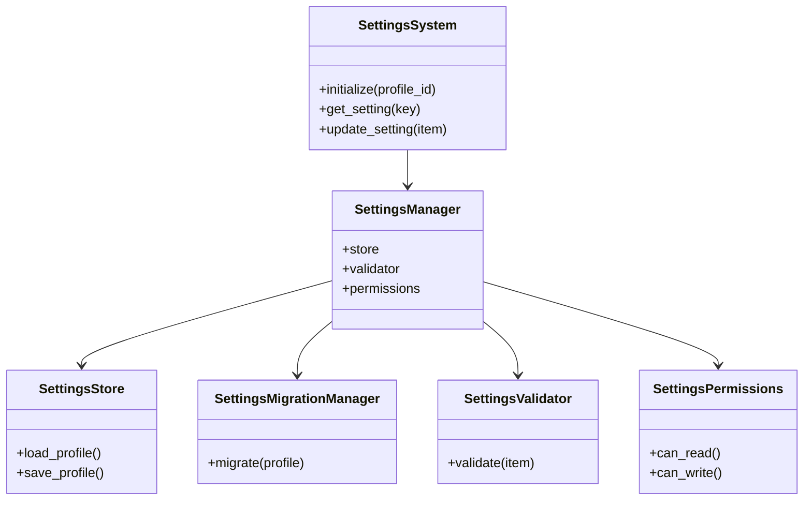
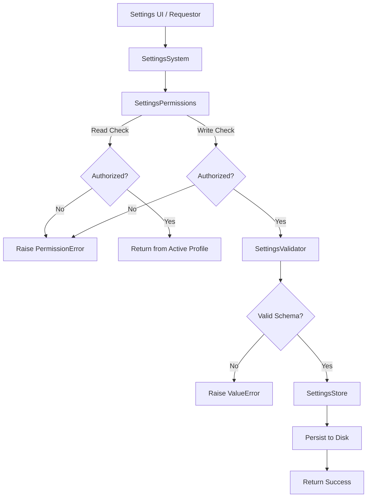
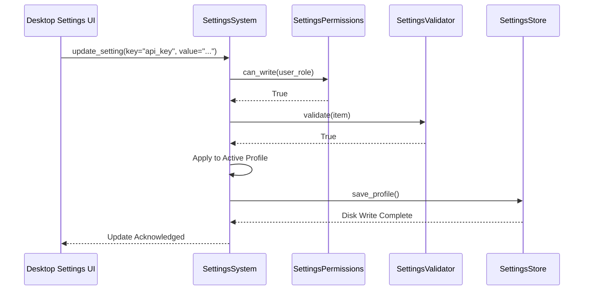
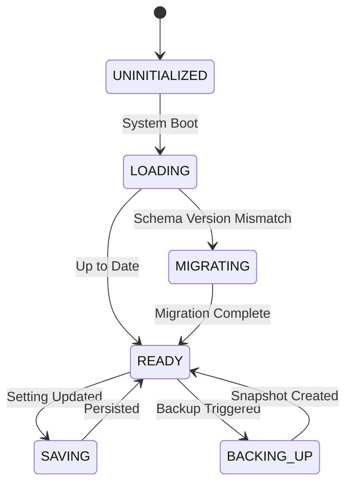

# NOVA Settings System Architecture

## 1. Overview
The NOVA Settings System is the centralized source of truth for all configuration, preferences, API keys, and environment variables across the entire AI OS. By forcing all modules to retrieve their configurations via dependency injection from this unified store, we guarantee a single, auditable, migrating configuration layer that supports multiple user profiles.

## 2. Responsibilities
- **Centralized Configuration:** Provides the sole interface for getting and setting parameters across 19 categories (e.g. `GENERAL`, `APPEARANCE`, `AI_PROVIDERS`, `MEMORY`).
- **Profile Management:** Supports swapping entirely different configuration sets seamlessly via `SettingsProfile`.
- **Validation & Migration:** Enforces schema correctness and handles upgrading older profiles to newer schema versions without data loss.
- **Security & Permissions:** Restricts access to sensitive tokens (`is_secret=True`) and enforces read/write role constraints.
- **Snapshot & Recovery:** Backs up profile configurations natively before any destructive overrides.

## 3. Internal Components
- **SettingsSystem (Core):** Top-level API used for initializing the active profile.
- **SettingsManager:** Dependency injection container.
- **SettingsStore & SettingsSerializer:** Local disk CRUD operations and JSON parsing.
- **SettingsValidator:** Validates structural correctness of `SettingItem` additions.
- **SettingsMigrationManager:** Overlays old schema structures onto new schema requirements.
- **SettingsPermissions:** Enforces field-level access control.
- **SettingsBackupManager:** Takes atomic snapshots of the configuration state.

## 4. Folder Structure
```text
backend/settings/
├── schema.py        # SettingsProfile, SettingItem, Enums, Metrics
├── storage.py       # Store, Serializer, Backups
├── validation.py    # Validator, MigrationManager, Permissions
├── core.py          # SettingsSystem, Manager, Logger
```

## 5. Mermaid Class Diagram


## 6. Mermaid Flow Diagram


## 7. Mermaid Sequence Diagram


## 8. Mermaid State Diagram


## 9. Dependency Graph
- Consumed by: *Every single subsystem* in the NOVA Runtime.
- Depends on: None. This is the foundational layer.

## 10. Public API
- `SettingsSystem.initialize(profile_id: str)`
- `SettingsSystem.get_setting(key: str) -> Any`
- `SettingsSystem.update_setting(item: SettingItem)`

## 11. Configuration Lifecycle
Configuration is loaded once at boot (usually `profile_id = 'default'`). The `SettingsMigrationManager` intercepts this read, verifies the schema version, and applies translation maps if the user is upgrading from an older NOVA OS build. The updated profile is then held in memory.

## 12. Security Model
Any setting with `is_secret = True` (like OpenAI API keys or IMAP passwords) is gated by the `SettingsPermissions` class, requiring administrative elevation to read or modify. Future iterations of the `SettingsSerializer` will encrypt these fields at rest before writing to JSON.

## 13. Performance Considerations
- Initial boot load takes `<100ms`.
- Retrieving settings via `get_setting` is a pure memory operation taking `<1ms`.

## 14. Future Improvements
- Environment variable fallback (`.env` overrides for containerized execution).
