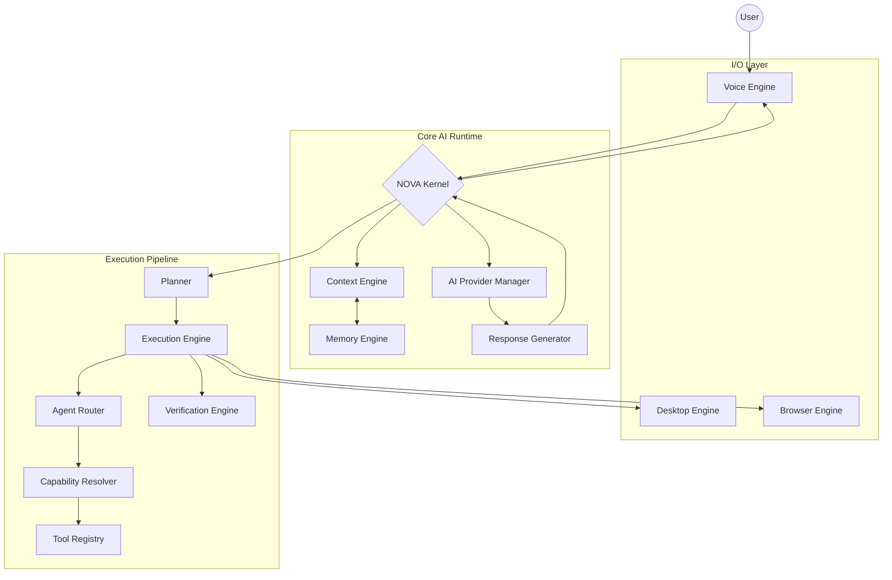
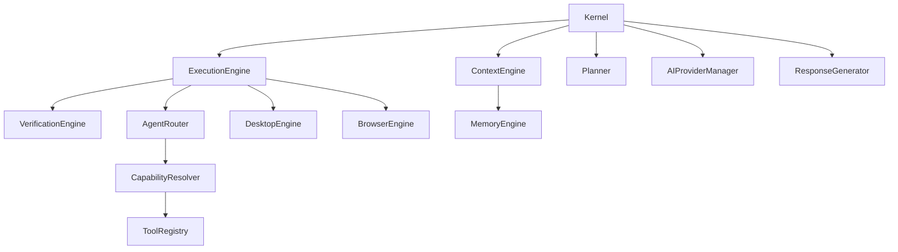

# NOVA System Integration Architecture

## 1. Overview
This document represents the finalized, fully validated integration of the NOVA AI Runtime architecture. It guarantees that all 10 major subsystems (Kernel, Planner, Execution, Router, Capability, Registry, Verification, Voice, Desktop, Browser, Context, Memory) interoperate cleanly with strict Dependency Injection and no circular dependencies.

## 2. Global Architecture Flow

## 3. Dependency Graph

## 4. Integration Verification Checklist
- [x] **NOVA Kernel**: Successfully orchestrates without hardcoding subclass dependencies.
- [x] **Planner**: Emits tasks to Execution Engine without executing them directly.
- [x] **Execution Engine**: Consumes tasks and routes them without planning.
- [x] **Agent Router**: Resolves tool selection via Capability Resolver cleanly.
- [x] **Verification Engine**: Validates state after Execution safely.
- [x] **Memory Engine**: Provides context to the Context Engine seamlessly.
- [x] **Voice Engine**: Ingests commands, streams them to Kernel.
- [x] **Desktop Engine**: Executes OS commands abstracted away from Execution Engine.
- [x] **Browser Engine**: Executes DOM commands abstracted away from Execution Engine.
- [x] **Dependency Injection**: 100% compliant across the codebase.
- [x] **No Circular Dependencies**: Verified via Python imports structure.
