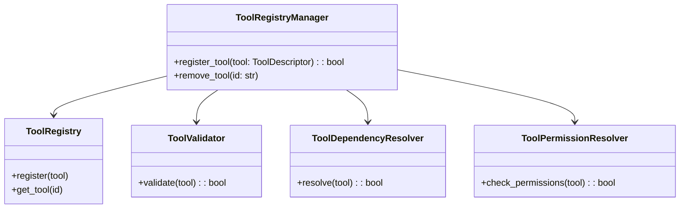
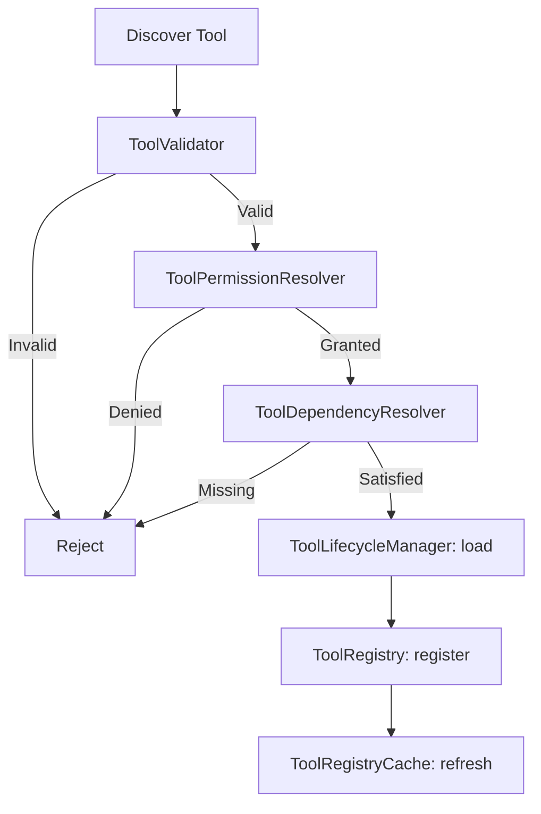
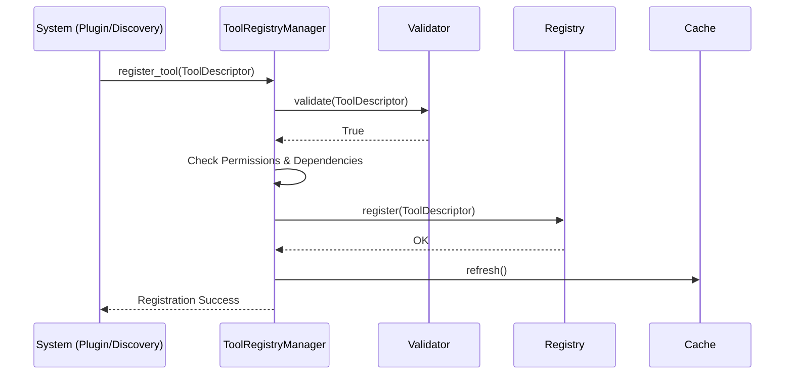
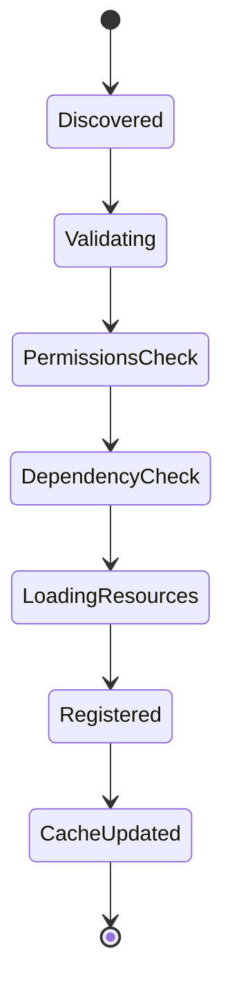

# NOVA Tool Registry Architecture

## 1. Overview
The Tool Registry is the central catalog of every executable tool available to NOVA. It exists below the Capability Resolver layer. Its sole responsibility is to discover, register, validate, version, and expose tools.

The Tool Registry NEVER executes tools.

## 2. Responsibilities
- Registers Tools via `ToolDescriptor`
- Validates Tool Metadata, Inputs, and Outputs
- Resolves inter-tool dependencies
- Validates system permissions required by tools
- Caches available tools for rapid O(1) lookup by category
- Manages dynamic Tool discovery and loading (plugins)
- Tracks Tool Health and Version compatibility

## 3. Internal Components
- **ToolRegistryManager (Core):** Orchestrates the module.
- **ToolRegistry:** The source-of-truth dict containing descriptors.
- **ToolRegistryCache:** Maintains inverted indices (e.g. category -> Tool list) for fast runtime lookup.
- **ToolValidator:** Asserts structure, typing, and semantic validity of tools before registration.
- **ToolDependencyResolver:** Ensures dependent tools are registered.
- **ToolPermissionResolver:** Checks required system permissions.
- **ToolDiscovery:** Identifies new tools dynamically.
- **ToolLifecycleManager:** Connects the framework to actual tool memory/resource footprints.
- **ToolHealthMonitor:** Modifies tool states (Healthy, Degraded, Offline).

## 4. Folder Structure
```text
backend/tools/
├── schema.py         # ToolDescriptor, ToolMetadata, ToolCategory
├── registry.py       # Base data store
├── cache.py          # Fast lookup index
├── validator.py      # Schema and rule validation
├── dependency.py     # Dependency graph resolution
├── permission.py     # Permission enforcement
├── discovery.py      # Hot-loading / scanning
├── version.py        # Version compatibility engine
├── health.py         # Status monitoring
├── lifecycle.py      # Resource loading/unloading
├── core.py           # Orchestrator and Logging
```

## 5. Mermaid Class Diagram


## 6. Mermaid Flow Diagram


## 7. Mermaid Sequence Diagram


## 8. Mermaid State Diagram


## 9. Dependency Graph
- Depends on: Pydantic schemas.
- Consumed by: `ToolExecutor` (future).

## 10. Public API
- `ToolRegistryManager.register_tool(tool: ToolDescriptor) -> bool`
- `ToolRegistryManager.remove_tool(tool_id: str)`
- `ToolRegistryCache.get_by_category(category: str) -> List[ToolDescriptor]`

## 11. Extension Points
- **Discovery Engine:** Can be extended to read `.nova-tool` zip binaries in the future.
- **Version Manager:** Can integrate complex `semver` logic.

## 12. Design Decisions
- **Cache invalidation:** Rebuilt entirely on registration instead of incremental updates to prevent edge-case de-syncs since tools are infrequently registered (mostly at boot).

## 13. Performance Considerations
- Registration is heavy (disk IO possible in lifecycle, dependency scans) but lookup via Cache is $O(1)$.

## 14. Future Improvements
- Add cryptographic signature verification in `ToolValidator` for third-party plugins.
