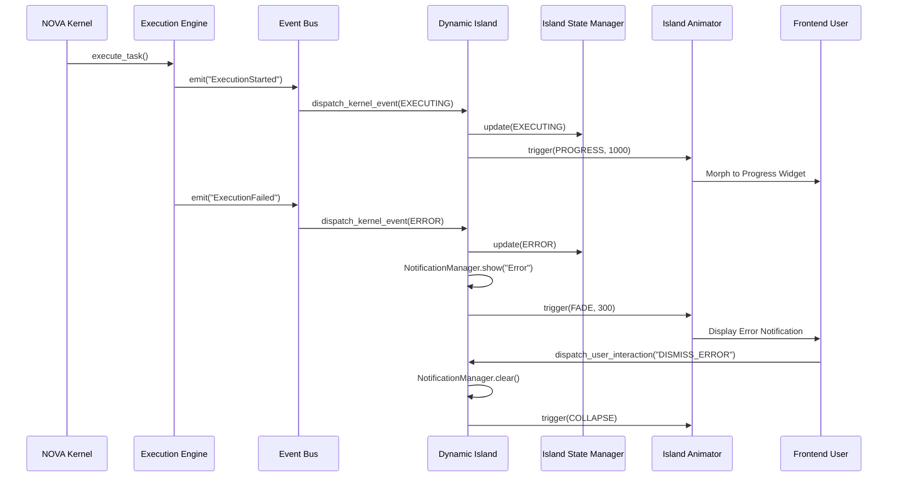
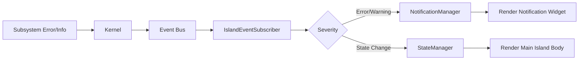

# NOVA UI Event Pipeline

This document illustrates the one-way event flow from the NOVA Kernel out to the Dynamic Island Presentation Layer.

## 1. End-to-End UI Event Flow

## 2. Notification Data Flow

