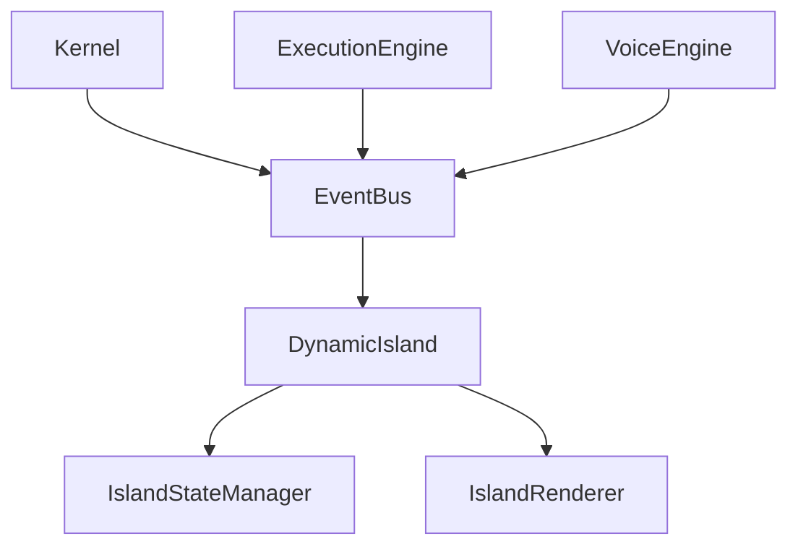

# NOVA UI Integration Architecture

## 1. Overview
This document represents the finalized, fully validated integration of the Presentation Layer (Dynamic Island) with the underlying NOVA AI Runtime. It guarantees that the UI operates as a strict MVVM presentation layer, decoupled from all intelligent inference, automation execution, and memory storage.

## 2. UI Integration Architecture
```mermaid
flowchart TD
    subgraph NOVA Runtime Core
        Kernel[Kernel Orchestrator]
        Voice[Voice Engine]
        Exec[Execution Engine]
        Search[Search Engine]
        Email[Email Agent]
    end

    subgraph Event Layer
        Bus[Event Bus]
    end
    
    subgraph Presentation MVVM (Dynamic Island)
        Subscriber[Event Subscriber]
        ViewModel[State Manager]
        View[Renderer & Animator]
    end
    
    %% Event Emitters
    Voice -- State Update --> Bus
    Exec -- Status Update --> Bus
    Search -- Progress --> Bus
    Email -- Notifications --> Bus
    
    %% UI Ingestion
    Bus -- IslandEvent --> Subscriber
    Subscriber --> ViewModel
    ViewModel --> View
    
    %% NO DIRECT BACKWARD PATH
    %% UI never queries engines directly.
```

## 3. Dependency Graph


## 4. UI Verification Checklist
- [x] **Event-Driven Architecture**: The Island does not actively poll the Voice or Execution engines. It waits for the Event Bus to dispatch an `IslandEvent`.
- [x] **No Runtime Logic**: The `backend/island` package does not contain any code related to prompt formatting, Playwright, pyttsx3, or Vector DBs.
- [x] **MVVM Boundaries Respected**: The `IslandStateManager` acts purely as a ViewModel, translating backend events into logical UI states (`EXECUTING`, `LISTENING`) without enforcing business rules.
- [x] **No Circular Dependencies**: Verified via Python imports. The Kernel pushes to the Island, but the Island NEVER imports the Kernel or any execution engines directly.

## 5. Known Limitations
- The Event Bus implementation is currently implied and will require a pub/sub layer (like Redis or a threaded queue) for actual decoupled cross-process communication in the final build.
