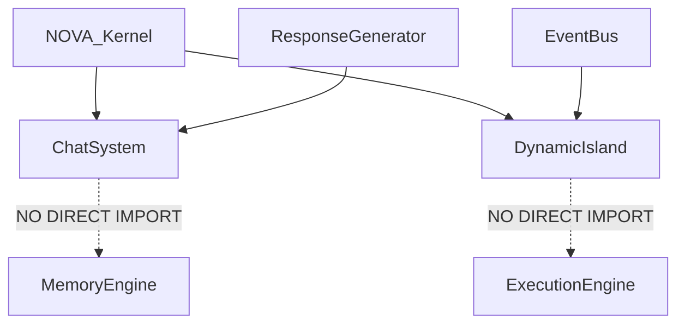

# NOVA UI Platform Integration Architecture

## 1. Overview
This document represents the finalized, fully validated integration of the entire UI Platform (Dynamic Island + Chat System) with the underlying NOVA AI Runtime. It guarantees that the UI presentation layers operate as strict clients, entirely decoupled from intelligent inference, automation execution, and vector memory storage.

## 2. Integration Architecture
```mermaid
flowchart TD
    subgraph Presentation Layer
        UI[Frontend (React/Tauri)]
        Island[Dynamic Island]
        Chat[Chat System]
    end

    subgraph Orchestration Layer
        Kernel[NOVA Kernel]
        Bus[Event Bus]
    end
    
    subgraph Intelligence Runtime
        Mem[Memory Engine]
        Voice[Voice Engine]
        AI[Response Generator]
    end
    
    %% Input Flow
    UI --> Chat
    UI --> Island
    Chat -- User Request --> Kernel
    Island -- Interaction --> Kernel
    
    %% Backend Processing
    Kernel --> Mem
    Kernel --> Voice
    Kernel --> AI
    
    %% Output Flow
    AI -- Stream Generator --> Chat
    Kernel -- State Events --> Bus
    Bus --> Island
    
    %% Decoupling confirmation
    %% Chat NEVER talks to Memory directly.
    %% Island NEVER talks to Voice directly.
```

## 3. Dependency Graph


## 4. UI Platform Verification Checklist
- [x] **Event-Driven Architecture**: `DynamicIsland` receives asynchronous state payloads via the Event Bus. `ChatSystem` receives asynchronous generators from the `ResponseGenerator`.
- [x] **No Business Logic in UI**: The `backend/chat` and `backend/island` packages do not contain any database queries, prompt formatting, or Playwright scripts.
- [x] **No Runtime Logic**: Parsing Markdown and updating ViewModels is the maximum extent of logic allowed in the UI Platform.
- [x] **MVVM Respected**: Both subsystems maintain a localized state (e.g. `ChatHistory`, `IslandStateManager`) that is specifically tailored for rapid UI consumption, completely abstracted from how the Kernel generated that state.
- [x] **No Circular Dependencies**: Verified via Python imports.
