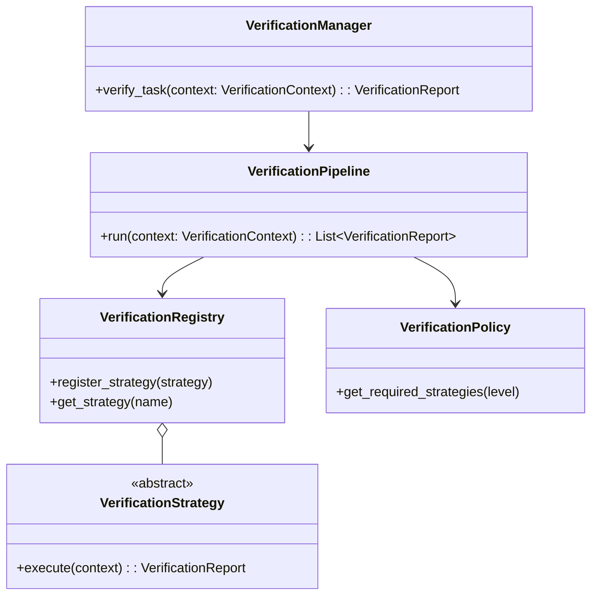
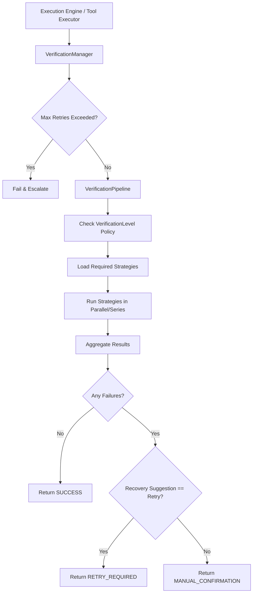
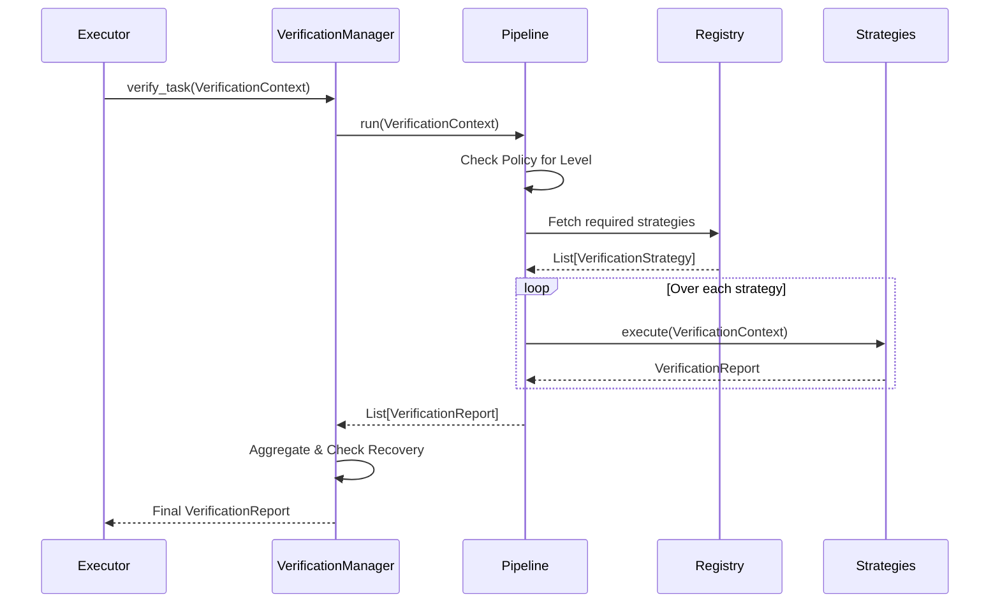
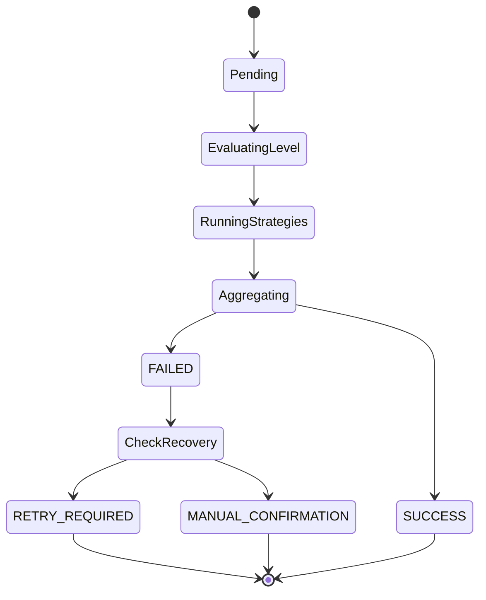

# NOVA Verification Engine Architecture

## 1. Overview
The Verification Engine serves as the final checkpoint for any task executed by NOVA. It never plans and never executes tools itself. Its sole responsibility is to evaluate the artifacts and outputs produced by an executed task to confidently determine if the task succeeded, failed, or requires further action.

If success cannot be verified, the task MUST NOT be marked complete.

## 2. Responsibilities
- Receives Execution Context containing expected state and actual output data.
- Defines rules mapping `VerificationLevel` (None, Basic, Standard, Strict, Critical) to a suite of `VerificationStrategy` checks.
- Executes Verification Strategies against the output/state.
- Aggregates the lowest confidence scores across multiple strategies.
- Triggers Failure Recovery heuristics (e.g., Retry, Manual Confirmation, Escalation) when verification fails.
- Generates a highly detailed `VerificationReport`.

## 3. Internal Components
- **VerificationManager (Core):** Central orchestration, handles recovery rules (retry/escalate) and metrics.
- **VerificationPipeline:** Resolves policy requirements and iterates over registered strategies.
- **VerificationPolicy:** Maps `VerificationLevel` enum to concrete strategy names.
- **VerificationRegistry:** CRD dictionary mapping strategy names to concrete implementation instances.
- **VerificationStrategy (Abstract):** Defines the base contract (`execute()`) for individual check logic.
- **VerificationRule (Abstract):** Smaller, atomic checks used by Strategies.
- **VerificationLogger:** Captures successes and highlights recovery paths on failure.

## 4. Folder Structure
```text
backend/verification/
├── schema.py         # Context, Report, Level, Status
├── registry.py       # VerificationRegistry
├── rules.py          # VerificationRule (Atomic)
├── strategies.py     # Concrete strategies (ResultVerification, FilesystemVerification)
├── policy.py         # VerificationPolicy (Level -> Strategy mapping)
├── pipeline.py       # Execution pipeline runner
├── core.py           # VerificationManager and Metrics
```

## 5. Mermaid Class Diagram


## 6. Mermaid Flow Diagram


## 7. Mermaid Sequence Diagram


## 8. Mermaid State Diagram


## 9. Dependency Graph
- Depends on: Pydantic, Python asyncio.
- Consumed by: Execution Engine / Tool Executor.

## 10. Public API
- `VerificationManager.verify_task(context: VerificationContext) -> VerificationReport`
- `VerificationRegistry.register_strategy(strategy: VerificationStrategy)`

## 11. Design Decisions
- **Pessimistic Aggregation:** If any single strategy fails, the overall verification fails. If any strategy returns `UNKNOWN`, the overall status drops to `UNKNOWN` (unless it already failed).
- **Decoupled Recovery:** Strategies don't actually trigger retries; they supply a `recovery_suggestion` which the Manager translates into `RETRY_REQUIRED` or `MANUAL_CONFIRMATION`.

## 12. Performance Considerations
- Verification checks (e.g., Vision/Browser DOM) can be expensive. The pipeline is designed around asyncio to allow parallel verification where supported.

## 13. Failure Recovery
- **Retry:** Automatically loops back to Execution Engine until `max_retries` is hit.
- **Escalation:** Reaching `max_retries` bypasses the pipeline entirely and instantly triggers a failure demanding manual user intervention.

## 14. Future Improvements
- Implement `VisionVerification` using LLM/VLM multi-modal models to compare before/after screenshots of the Desktop UI to ensure UI tasks succeeded.
