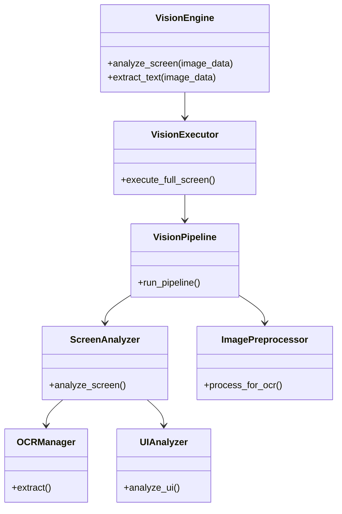
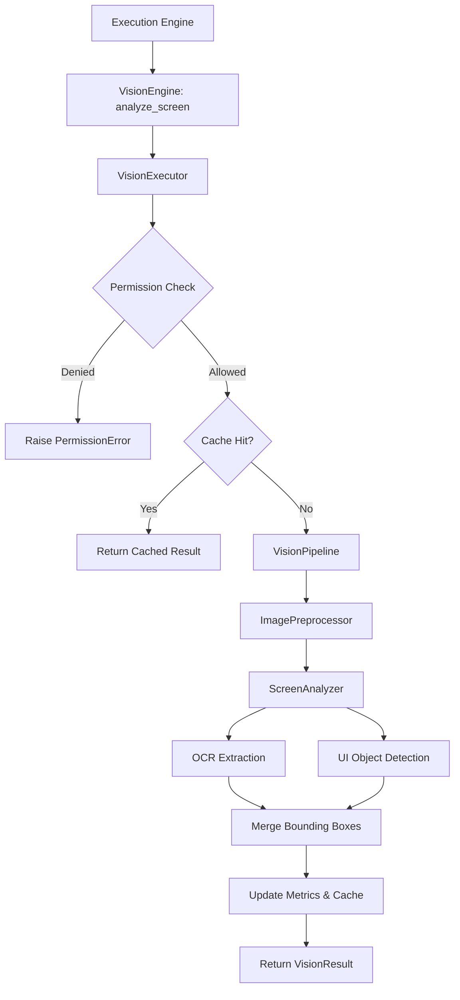
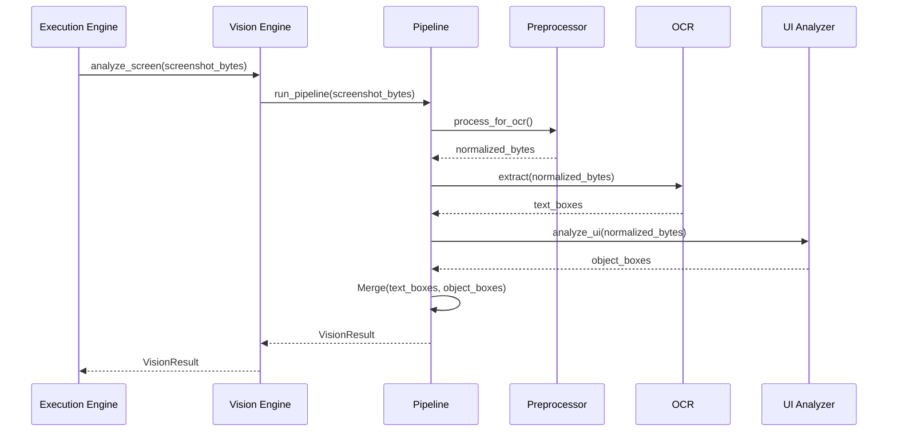
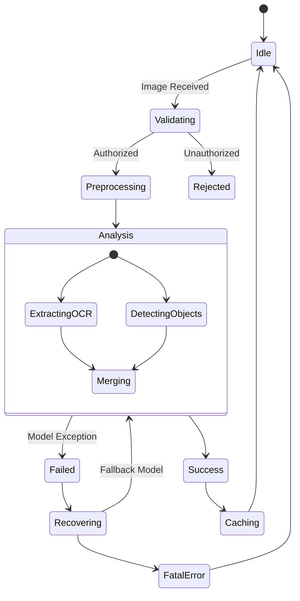

# NOVA Vision Engine Architecture

## 1. Overview
The NOVA Vision Engine is the exclusive centralized subsystem for all image-based processing. It handles raw screenshots from the Desktop or Browser engines and runs them through a pipeline of preprocessing, OCR (Optical Character Recognition), and Object Detection to generate structured bounding box data for the AI runtime.

## 2. Responsibilities
- **Image Preprocessing:** Safely crops, resizes, and normalizes raw byte streams (e.g. contrast enhancement for better OCR yield).
- **OCR Orchestration:** Extracts text and maps its absolute coordinates using engines like Tesseract or Windows native OCR.
- **UI & Object Detection:** Detects non-text semantic elements (buttons, inputs, dropdowns) using specialized ML models (e.g. YOLO/ONNX).
- **Region Management:** Constructs interactive bounding boxes, translating visual screen real estate into programmatic interaction targets for the Desktop/Browser engines.
- **Permissions:** Enforces boundaries (e.g., preventing OCR on regions marked as sensitive, like password managers).

## 3. Internal Components
- **VisionEngine (Core):** Public API and orchestrator.
- **VisionManager:** Injects dependencies and configurations.
- **VisionExecutor:** Lifecycle management (Auth -> Pipeline -> Cache/Metrics -> Return).
- **VisionPipeline:** The deterministic sequence: Preprocess -> OCR -> UI Detect -> Merge.
- **VisionPermissionManager:** Validates visual read boundaries.
- **VisionRecoveryManager:** Provides fallback models if the primary OCR engine crashes.
- **VisionCache:** Stores hashed analysis results of static screen regions to save compute latency.
- **Adapters:**
  - `ImagePreprocessor`, `ImageNormalizer`, `ImageResizer`, `ImageCropper`, `ImageAnnotator`, `ColorAnalyzer`.
  - `ScreenAnalyzer`, `OCRManager`, `UIAnalyzer`, `ObjectDetector`, `RegionSelector`, `TextExtractor`, `LayoutAnalyzer`.

## 4. Folder Structure
```text
backend/vision/
├── schema.py        # VisionSession, VisionBoundingBox, VisionResult, Metrics
├── processing.py    # Resizer, Cropper, Normalizer, Annotator
├── analysis.py      # OCR, UI Analyzer, Object Detector
├── core.py          # Engine, Executor, Manager, Pipeline, Cache
```

## 5. Mermaid Class Diagram


## 6. Mermaid Flow Diagram


## 7. Mermaid Sequence Diagram


## 8. Mermaid State Diagram


## 9. Dependency Graph
- Depends on: Pydantic, Pillow, Tesseract/ONNX (future).
- Consumed by: Execution Engine, Verification Engine, Memory Engine (Contextual snapshots).

## 10. Public API
- `VisionEngine.analyze_screen(image_data: bytes) -> VisionResult`
- `VisionEngine.extract_text(image_data: bytes) -> VisionResult`

## 11. Vision Pipeline
1. Image Byte Stream received.
2. Normalized for contrast/brightness.
3. Passed to OCR Manager for textual bounding boxes.
4. Passed to YOLO/Object Detector for semantic UI bounding boxes.
5. Consolidated into a single `VisionResult` DTO.

## 12. OCR Pipeline
1. Isolate text blocks via contours.
2. Deskew and binarize.
3. Tesseract recognition.
4. Confidence threshold filtering.

## 13. Performance Considerations
- ML inference blocks the thread. Final implementation will require `asyncio.to_thread()` or a dedicated subprocess pool for YOLO/Tesseract execution.

## 14. Future Improvements
- Integrate visual grounding LLMs (e.g., LLaVa or Qwen-VL) to replace deterministic YOLO object detection with semantic reasoning.
