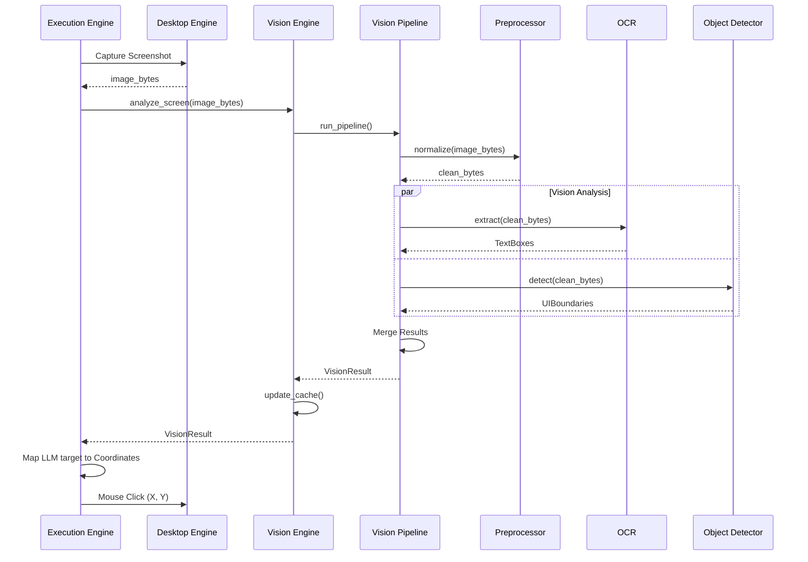
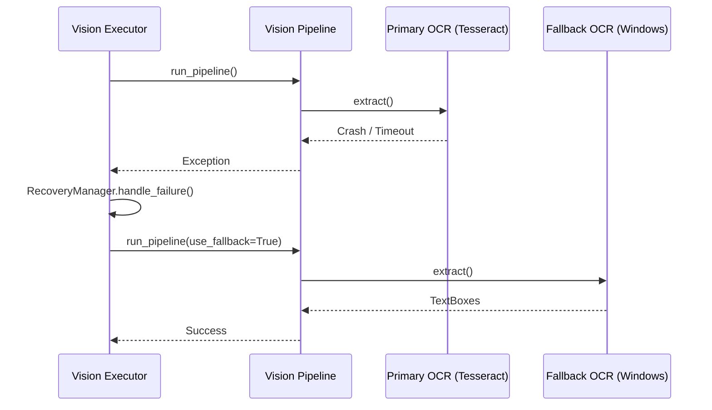
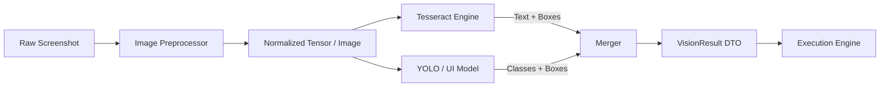

# NOVA Vision Pipeline Validation

This document illustrates the execution flow for translating raw pixels from the Desktop or Browser engines into semantic bounding boxes used by the Execution Engine.

## 1. End-to-End Vision Execution Sequence

## 2. OCR Recovery Flow

## 3. Data Flow Diagram

