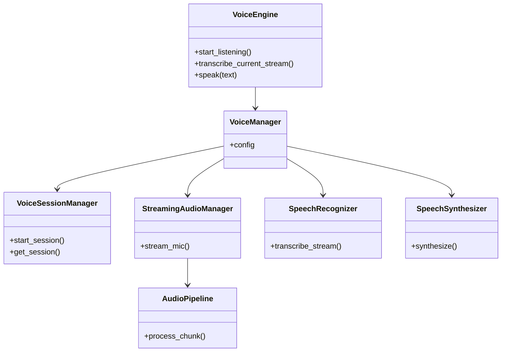
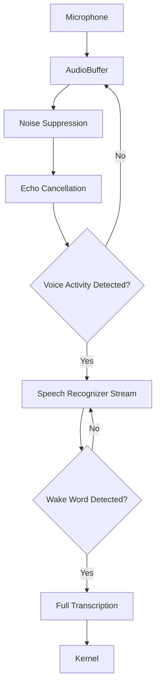
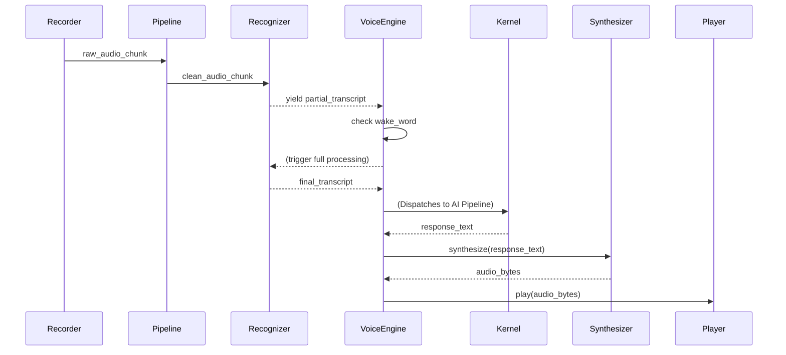
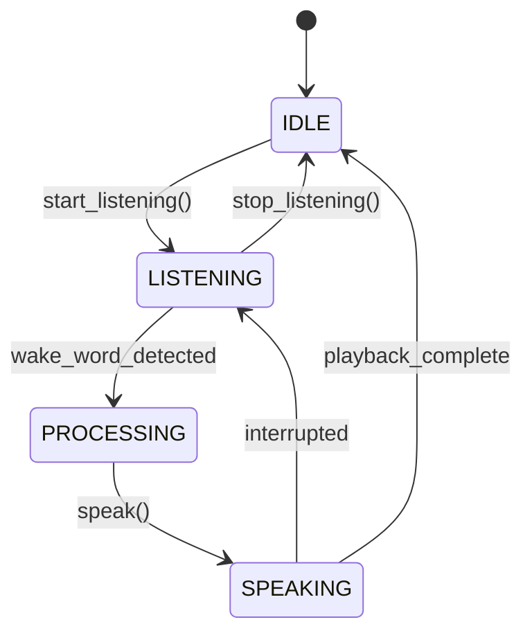

# NOVA Voice Engine Architecture

## 1. Overview
The NOVA Voice Engine is the exclusive subsystem for all audio interaction. It governs the microphone lifecycle, streaming audio pipelines, local wake-word processing, Speech-To-Text (STT) transcription, and Text-To-Speech (TTS) synthesis. No other component in the NOVA architecture interacts directly with audio hardware.

## 2. Responsibilities
- **Hardware Abstraction:** Wraps microphone (recording) and speaker (playback) functionality, decoupling the business logic from native OS audio APIs.
- **Audio Pipeline Processing:** Sanitizes raw microphone bytes through sequential filters (Echo Cancellation, Noise Suppression, Voice Activity Detection).
- **Wake Word Detection:** Continuously analyzes partial transcript streams for predefined triggers (e.g., "NOVA") to initiate full query processing, preventing false positives.
- **Provider Adapters (STT/TTS):** Interfaces with external or local models (Whisper, Edge-TTS, OpenAI STT) to convert audio <-> text.
- **Session Management:** Tracks the state (`LISTENING`, `PROCESSING`, `SPEAKING`) and metadata of the current voice interaction for accurate telemetry and UI feedback.
- **Interruption Handling (WIP):** Allows TTS playback to be halted mid-stream if the Wake Word is detected during speech.

## 3. Internal Components
- **VoiceEngine (Core):** The orchestrator and primary public API.
- **VoiceManager:** Wires together the hardware, pipelines, providers, and session states.
- **VoiceSessionManager:** Generates unique session IDs and tracks the current `VoiceState`.
- **AudioRecorder & AudioPlayer:** Hardware interfaces (currently simulating PCM byte streams).
- **AudioBuffer:** Async-safe ring buffer for staging raw bytes before processing.
- **AudioPipeline:** Sequentially runs bytes through processors (`NoiseSuppressor`, `EchoCanceller`, `VoiceActivityDetector`).
- **StreamingAudioManager:** The async generator loop that pulls from the Recorder and pushes through the Pipeline.
- **WakeWordDetector:** Analyzes partial transcript strings for wake triggers.
- **SpeechRecognizer (STT):** Transcribes audio. Supports full-chunk and streaming (yield) modes.
- **SpeechSynthesizer (TTS):** Generates audio from text. Supports streaming playback.
- **VoiceLogger & Metrics:** Tracks wake word hits, latency, and session states.

## 4. Folder Structure
```text
backend/voice/
├── schema.py        # VoiceSession, VoiceState, Configuration, Metrics
├── hardware.py      # AudioRecorder, AudioPlayer
├── audio_buffer.py  # AudioBuffer
├── processors.py    # AEC, Noise Suppression, VAD, WakeWordDetector
├── providers.py     # SpeechRecognizer, SpeechSynthesizer
├── pipeline.py      # AudioPipeline, StreamingAudioManager
├── core.py          # VoiceEngine, VoiceManager, VoiceLogger
```

## 5. Mermaid Class Diagram


## 6. Mermaid Flow Diagram


## 7. Mermaid Sequence Diagram


## 8. Mermaid State Diagram


## 9. Dependency Graph
- Depends on: `asyncio`. (Will depend on `pyaudio`, `webrtcvad`, etc. in production).
- Consumed by: NOVA Kernel (for input triggers and output execution).

## 10. Public API
- `VoiceEngine.start_listening()`
- `VoiceEngine.stop_listening()`
- `VoiceEngine.transcribe_current_stream() -> str`
- `VoiceEngine.speak(text: str)`
- `VoiceEngine.stop_speaking()`

## 11. Voice Session Lifecycle
1. Engine enters `LISTENING` state. Hardware buffers audio.
2. VAD isolates human speech; STT returns partial strings.
3. Wake Word triggers; state shifts to `PROCESSING`. Engine stops flushing buffer and locks in the query.
4. Final text is sent to the Orchestrator.
5. Engine receives text, shifts to `SPEAKING`, and streams TTS to speakers.
6. Returns to `IDLE` (or `LISTENING` if continuous mode is enabled).

## 12. Performance Considerations
- All audio processing is purely async to prevent event loop blocking.
- `AudioBuffer` enforces a strict memory ceiling (1MB) to prevent OOM errors if left listening indefinitely.

## 13. Future Improvements
- Implement Deepgram/Whisper streaming WebSockets.
- Implement true hardware integration via PyAudio.
- Implement barge-in (interruption) logic using Echo Cancellation to differentiate TTS playback from user speech.
